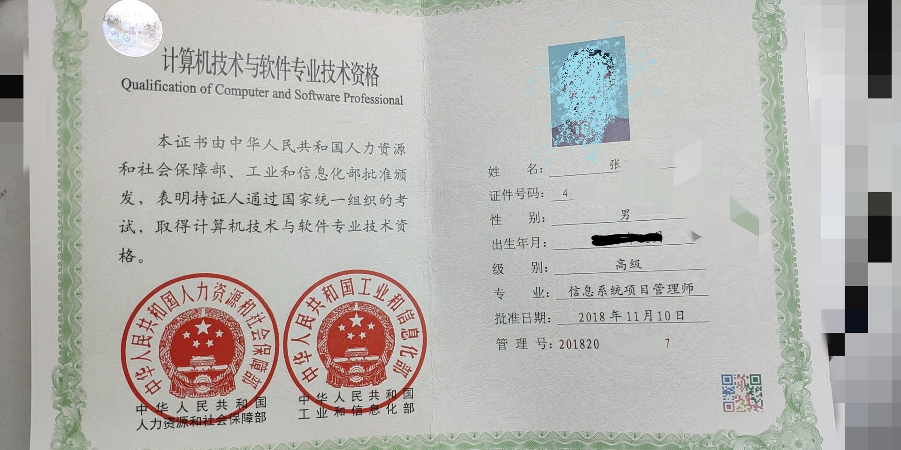

# 信管课程结束了，你的收获是？

不敢相信，说实话我自己都不敢相信，竟然完了整个 信息系统项目管理师 这一系列文章课程。一共 59 篇文章，一共数不清多少字。当然，大部分内容都是教材上的内容，但就像最开始我们说过的，可以将我的这一系列课程内容当做是一份辅导材料。如果你不是为了考试，也可以通过这一系列的课程内容学习到一些简单的项目管理知识。当然，更重要的是，对于做技术开发的同学来说，这个教材第一大章节的部分可以说是整个大学软件工程专业的一个浓缩。虽说很多东西都是点到为止，但并不妨碍你将它们当成是一次复习。特别是对于我这种半路出家的程序员来说，这就是一次整个软件开发技术的大汇总。对于有兴趣的内容我会再深入的学习下去。

如果你想考 PMP ，其实 信管师 中的这些项目管理内容已经过时了。但它们却是整个 PMP 体系从 4.0 到 6.0 的精髓。这些内容是完全值得你去学习的，甚至你可以尝试报名一下 PMP 试试，你会发现很多知识理论你都已经在 信管师 的教材中学习过了。

而如果你刚考完 PMP ，不好意思，PMP 的难度水平和 信管师 真的不在一个级别。相信通过之前的学习你也已经看出来了。难度是 N 个数量级以上的跨越。

对于拿证来说，这个证其实并没有 PMP 出名。毕竟 PMP 是全行业的，我的朋友中做工程机械的、做房产工地的，都有需要 PMP 这个证的。而 信管师 这个证则更偏向于软件行业，当然，更加重要的是它不用续证，不用额外交钱了。这个真的是棒棒哒。

最后，如果你还有兴趣的话，可以再挑战软考高级中其它的考试，比如我们最早提到过的 系统分析师、系统架构设计师、网络规划设计师、系统规划与管理师 之类的，它们更偏向于技术，甚至于论文也是纯写技术架构实现的，挑战性更大。软考高级三证齐全（分析、架构、信管），完全可以顶得上一个普通本科计算机专业毕业证的。这也是对许多半路出家的码农们的一个建议，有兴趣的同学要加油哦！

再来晒晒我的证怎么样？相信经过大家的努力，也一定可以获得这个证书的。

另外在学习的时候，特别是在背十大知识领域的输入输出时，可以考虑使用我开发的小程序来配合学习哦。

## 关于改名

本系列教程结束后，并且视频也录制完成后，就会将各个自媒体平台的名称改掉了。为什么呢？说是硬核项目经理，但其实自己本身没有什么项目经理的经验。当时想转行项目经理并且考了一堆证其实也只是一厢情愿。就像我写得最多的其实还是技术相关的文章，后面也不会再有很多项目管理方面的内容。因此，还是回归码农本质吧，也希望大家能够理解并继续支持。

【码农老张】期待与您的继续交流哦！