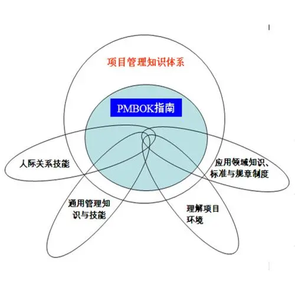
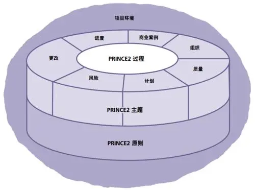
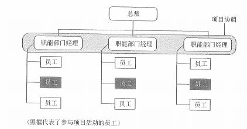
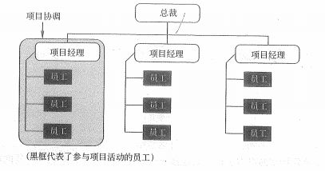
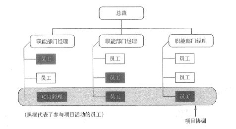
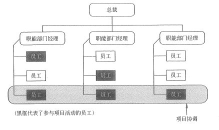
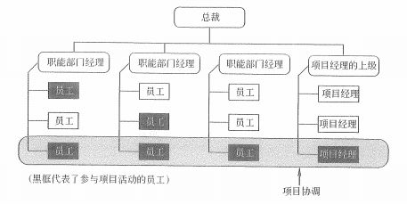
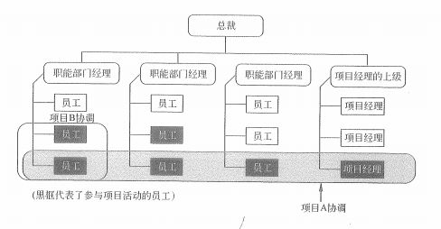
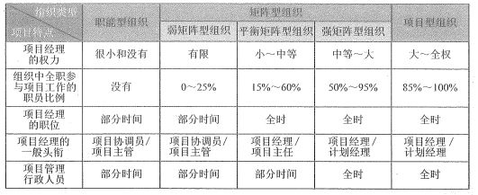

# 项目管理知识体系与组织结构

上一次课中，我们已经学过了项目以及项目管理的概念，这些内容帮我们认识到了项目到底是个什么东西，有什么特点，和运营有什么区别等等。今天我们就继续沿着项目这件事说下去，我们将一起探讨一下项目管理的知识体系以及我们的公司中都有哪些组织形式可以让我们的项目能够顺利进行。

## 项目管理知识体系

如果你想成为一名优秀的项目经理，或者组建一个优秀的项目团队，那么有一些专门的知识领域是我们必须要涉及的，包括：项目管理知识体系；应用领域的知识、标准和规定；项目环境知识；通用的管理知识和技能；软技能或人际关系技能。

### 项目经理

不管是信管师，还是 PMP 考试，我们都是为了成为一个职业，那就是项目经理。对于项目经理来说，以上内容必然是我们需要完全掌握的，同时项目经理也不应只限于是一个管理者，这里就要提到领导力的问题。现在的项目开发环境认为，管理只是促成项目成功的一方面，而更重要的是领导力在项目中的体现。管理是按计划执行并监控，而领导则是带领团队朝共同的目标努力。

作为管理者，项目经理要做到真正理解项目经理的角色；重视项目团队的管理，能够奖罚分明；计划、计划、再计划；真正理解“一把手工程”；切记注重用户参与。而作为领导者，我们应该具广博的知识；丰富的经历和经验；良好的协调与沟通能力；良好的职业道德；一定的领导和管理能力。

后面的课程中我们还会专门讨论一下项目经理这个角色。

### 项目干系人

项目干系人主要指的是与项目有关的利益相关者、利害关系人等。在 PMBOK 第六版直接改成了相关方，而在 PMBOK 第五版时则是将 相关方管理 从 沟通管理中抽离了出来正式成为了 项目管理十大领域 中的重要一环。下一节课我们将讲到项目管理十大领域。

项目干系人是积极参与项目或其利益可能受到项目实施或完成的积极或消极影响的人个或组织，包括任何直接和间接的与项目有关的人。我们主要面对的干系人包括：项目经理、项目管理团队、项目团队其他成员、客户（用户）、发起人、项目组合经理（项目组合评审委员会）、项目集经理、项目管理办公室、职能经理、运营经理、卖方（业务伙伴）等等。

我们的目的是管理好干系人从而让项目稳定地推进。项目干系人经常会有不同甚至是相互冲突的目标，项目管理团队必须识别项目干系人，确定其需求和期望，然后对这些期望进行管理并施加影响，以确保项目的成功。其实这就是我们要做的干系人管理，具体的内容我们在课程后期还会再说。

## PMP

提到项目经理和项目管理知识体系，不得不提到 PMP ，这家伙可以说是项目管理领域的事实标准。同时，它的配套教材， 《项目管理知识体系指南》 我们常说的 PMBOK ，也是项目管理领域的圣经。《信息系统项目管理师教程》中的项目管理领域的内容也基本全是取自于 PMBOK 第五版。

PMP 是由 PMI （美国项目管理学会）推出的一个资格认证。根据 IPMI（国际项目管理协会）制定的知识体系和经验，组织编写的 PMBOK 并在全世界范围内组织 PMP 认证考试。

根据 IPMI 的规定，项目管理资格证书包含四类，分别是 A级（高级项目经理）、B级（项目经理）、C级（项目管理专家）、D级（项目管理专业人员）。PMP 证书对应的是 C级 。

在本系列课程的开篇我们就介绍过 PMP 的考试情况，这里再说一次，它是一年 4 次考试，一次 4 个小时考完 200 道选择题。随机抽取 150 道评分，一般能做对110-120道题左右就可以通过。评分结果是以7个领域 的 A/B/C/D/E 等级给出的，一般 5A 都可以通过，7A 则是相当好的成绩。

PMP 考试自己报名比较麻烦，一般会通过培训机构来报名，因为 PMP 要求有项目经验和培训经验，因此它的报名表是需要填写英文的项目经验的。考试通过后，PMP 有一个续证周期也就是 3 年，这 3 年内你需要通过参加活动、发表论文或者通过继续教育的方式来积攒 pdus ，也就是行业积分。在达到 60 分后可以续证（这个一般培训机构会处理的）。

然后就是费用了，考试费用是 3900元人民币，补者费用是 2500元人民，续证费用是 150美元，一般培训费用是 2000-5000人民币不等。一大笔开支吧，之前我们说过，信息系统项目管理师是 200多块，而且是终身的证。感谢国家！

PMP 在外企比较认，国内的话，头部互联网企业对于 信息师 的证也是没问题的，这个不用担心，毕竟我们国内的民营企业还是比较认可国内的证书的。另外，也是我们一再会强调的，PMP 的考试难度和 信管师 完全不是一个级别。只要是正常人，跟着上课，通过 PMP 的难度不会太大。但是信管师，只能说一个是天堂一个是地狱。

## PRINCE2

PRINCE 是 PRoject IN Controlled Environment（受控环境下的项目管理）的简称，国际项目管理师认证，是英国商务部（OGC）1996年开始推广世界三大项目管理体系之一，在国际上被称为王者认证。PRINCE2 描述了如何以一种逻辑性的、有组织的方法，按照明确的步骤对项目进行管理。

PRINCE2 是一种基于流程的机构化项目管理方法，有助于降低所有类型和规模的项目中的风险，PRINCE2 的原则、主题和流程与 PMBOK 一致，但 PRINCE2 不包含 PMBOK 中所有知识点和细节。敢就是说，它是一个裁剪版的 PMP 。依据组织和项目和特殊性，PRINCE2 必须被裁剪，比如项目的大小、复杂性、类型、地理和文化差异。

PRINCE2 包括七个原则：持续业务验证；吸取经验教训；明确定义的角色和职责；按阶段管理；例外管理；关注产品；根据项目环境裁剪。

同时，它也包括七个主题，包括：商业论证；组织；质量；计划；风险；变更；进展。这些主题是项目经理所需关心的重要内容。

最后，它还包括七个流程，貌似 PRINCE2 很喜欢七啊。包括：项目准备流程；项目指导流程；项目启动流程；阶段控制流程；阶段边界管理；产品交付管理流程；项目收尾流程。

## 组织结构

只要有多人一起合作，就可以说这些人形成了一个组织。而公司，就是一个有规律，有制度的组织。在这个组织中，一定存在着某种组织结构，比如说我们最常见的按部分区分的的公司架构，我相信大部分程序员是不太可能和财务坐在一起办公的。这是我们最常见的组织形式，也叫做 职能型组织 。而另外面对一些重大项目，我们可能抽调很多精英，组织成一个专门的项目小组。这种小型的内部组织也被叫做 项目型组织 。

### 职能型组织

熟悉吧，不用我多说了吧，我相信大部分同学所在的公司都是这样一个组织架构。比方说，技术部主管系统开发，财务部主管公司账务，运营部主管业务运营。每个部门都有一个老大，大点的公司可能是总监，小点的公司可能是经理。反正是相似的同学都放到一堆成为一个部门，这就是职能型组织。

职能型组织的**优势**包括：强大的技术支持，便于知识、技能和经验的交流；清晰的职业生涯晋升跳线；直线沟通、简单、责任和权限很清晰；有利于重复性工作为主的过程管理。

职能型组织的**劣势**包括：职能利益优先于项目，具有狭隘性；组织横向之间的联系薄弱、部门间协调难度大；项目经理极少或缺少权利、权威；项目管理发展方向不明，缺少项目基准。

在职能型组织中，项目经理的权力比较弱，而职能经理的权限会比较大一些。

### 项目型组织

项目型组织可能参与过的同学会比较少，纯做项目为生的公司会采用这种组织形式，一般外包公司可能会见得多一些。这种组织形式就是很明显的项目经理负责制，当然，一般这样的公司也会存在人事、行政、财务之类的部门，但他们都只是起辅助作用的。在项目型组织中，团队成员以项目划分，各种技能的人才可能混杂集合在一个项目团队中。

项目型组织的**优势**包括：结构单一、责权分明、利于统一 指挥；目标明确单一、沟通简洁、方便；决策快。

项目型组织的**劣势**包括：管理成本高，如项目的工作量不足则资源配置效率低；项目环境比较封闭，不等于沟通、技术知识等共享；员工缺乏事业上的连续性和保障。

在项目型组织中，项目经理的权限高，而职能经理的权限比较低。

### 矩阵型组织

上面说的两种组织各有优劣，说实话，正常的公司运营还是职能型的好管理一些。但是，这样也会导致在做项目的过程中让项目经理无法得到足够的权限，于是，又有将它们结合起来的一种 矩阵型 组织结构。这也是我们通常的中大型公司进行项目开发的主要形式。

这种组织形式是不是很熟悉，平常我们属于某个部门，但当有一个新的项目时，项目经理会和职能经理商议协调把我们调到相应的的项目组。当然，从职能划分来说，我们还是属于职能部门的，工资也是职能部门来发，而项目部则会有项目分成（很理想的情况下）。

根据项目经理的权限大小，还有 弱矩阵型 和 强矩阵型 两种。

在弱矩阵型组织，项目经理的权限可能仅限于项目组织和协调。对于具体的调派规划可能还是需要以职能经理的安排为主。员工的主要工作也需要向职能经理汇报。

而在强矩阵型组织中，有专门的项目部，项目经理可以直接通过项目总监来和职能部门协调。项目组下的员工也以向项目经理汇报为主。

矩阵型组织的**优势**包括：项目经理负责制、有明确的项目目标；改善了项目经理对整体资源的控制；及时响应；获得职能组织更多的支持；最大限度的利用公司的稀缺资源；改善了跨职能部门间的协调合作，使质量、成本、时间等因素得到更好的平衡；团队成员有归属感，士气高，问题少；出现的冲突较少，且易处理解决。

矩阵型组织的**劣势**包括：管理成本增加；多头领导（多少都要和职能或者项目两边的领导打招呼）；难易检测和控制；资源分配与项目优先的问题产生 冲突；权利难保持平衡。

### 混合型组织

难啊难啊，没有万金油，我们只能以当前公司或组织中最合适的方式来组建我们的团队。于是，多层次的复合型组织出现了。一个完全职能型的组织内部建立一个完全的项目型组织，并且可以标准的正式报告机制以纯项目型的形式来进行项目开发。

### 项目管理办公室（PMO）

说了半天组织结构，如果说有一个部门来管理所有的项目的话，那必须是 PMO 。PMO 一般指项目管理办公室，你在招聘网站上一定能看到很多 PMO 总监发布的项目经理的招聘信息。PMO 主要是由 组织高层主管、项目经理、各类专项专家、项目协调人员 等 组成的。

对于组织来说，PMO 的战略性职能包括：项目组合管理 和 提高组织级项目管理能力 。而它的日常职能主要是 建立组织内项目管理的支撑环境、培养项目管理人员、提供项目管理的指导和咨询、组织内的多项目管理和监控 。

其实从 PMO 的职能可以看出，PMO 是比较偏向于一个服务型的管理组织，它是以组织利益为首要出发点的。这也是和项目经理目标的最大不同，项目经理的目标是关注特定项目的成功，而 PMO 则关注组织中所有的项目以及它们能够达到的优化水平。同时，PMO 会更关注项目整体的风险、机会等。

PMO 包括支持型、控制型和指令型三种，其实也就是对项目经理权限限制的级别。支持型以为项目经理提供支持为主，控制型会干涉项目的执行情况，而指令型则是项目经理必须听从 PMO 的指挥。

### 企业（组织）文化对项目的影响

最后，我们再来了解一下组织文化对项目产生影响，一个组织的文化对项目的影响体现在：

- 组织的共同价值观、行为准则、信仰和期望

- 组织的方针、办事程序

- 对于职责与权利管理的

- 众多其他的因素

## 总结

今天的内容不少吧？还好，上面的项目管理知识体系我们了解一下就好，重点很明显是在各种组织形式上，最重要的是 职能型、项目型 以及 矩阵型 三种组织结构的优缺点上。这是非常重要的内容，而且你也能马上根据这三种形式来思考一下自己目前所在的公司是什么样的一种组织形式。理论与实践的结合才是最好的学习。最后还有一个表格，也是需要我们重点关注的，展示的组织结构对项目各方面的影响。最后再强调一遍，这三个组织结构非常重点！

参考资料：

《信息系统项目管理师教程》

《某机构培训资料》

《项目管理知识体系指南 PMBOK》第六版