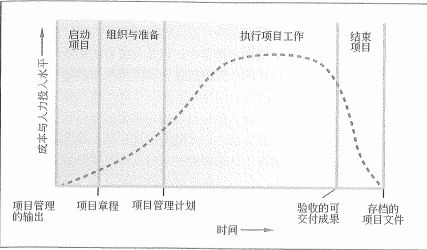
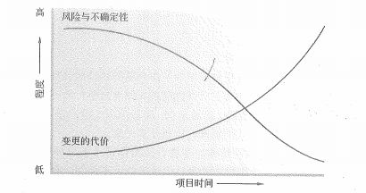
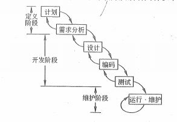
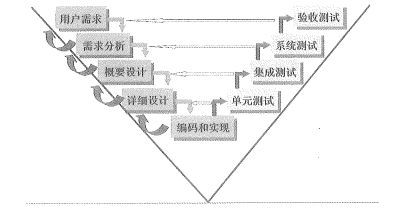
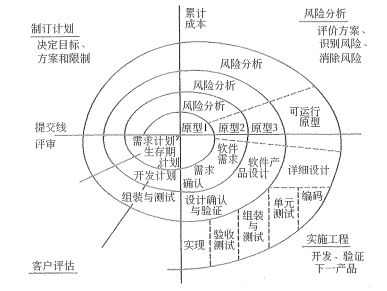
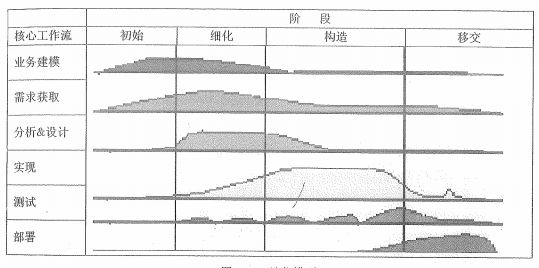
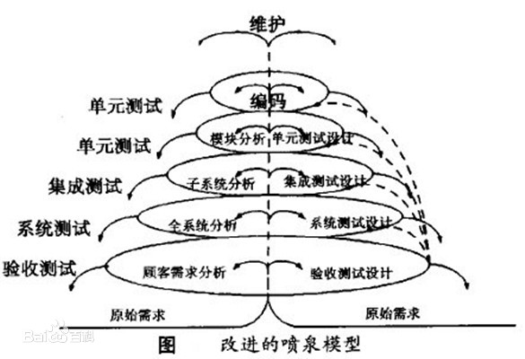
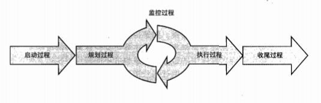
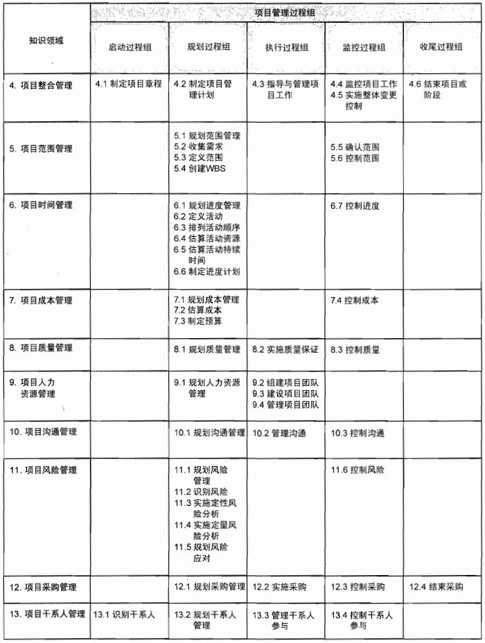
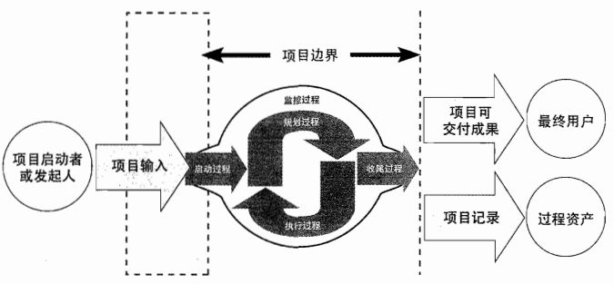

# 项目生命周期

上一篇文章内容有点多呀，消化完了吗？其实吧，最主要的就是那三种组织形式而已，别的真没什么，记住它们的优缺点和项目经理的权力大小就可以了。今天我们轻松点，虽说还是挺重要的，但要记住它们并不是在今天。我们要了解一下项目的生命周期，以及在 IT 项目开发中常用的典型生命周期。其实这些内容我们在技术相关的内容中都已经有涉及过，这里只是更详细的再说明一下。看到下面的内容你一定不会感到非常陌生的。最后，我们还提一下项目管理过程，也就是大家翘首以盼的 PMBOK 十大过程领域，当然，只是简单的介绍下，因为每个过程域我们在后面都会详细地学习。

## 项目生命周期

在技术相关的第一课，也就是 [信息系统与信息化]() 中，我们就提到过信息系统生命周期的概念。其实它本质上就是从项目生命周期演化产生的。项目生命周期指的项目从启动到收尾所经历的一系列阶段。阶段通常都有时间限制，有一个开始开始点、结束点或控制点。

从预测型（或计划驱动的）方法到适应型（或变更驱动的）方法，项目生命周期可以牌这个连续区间内的任何位置。在预测型生命周期中，在项目开始时就对产品和可交付成果进行定义，对任何范围变化都要进行仔细管理。而在适应型生命周期中，产品开发需要经过多次迭代，在每次迭代开始时才能定义该次迭代的详细范围。

在这个项目的生命周期图中，我们可以看到 启动项目、组织与准备、执行项目工作 以及 结束项目 这四个阶段，其实换个单词就是 启动、计划、执行、收尾 这个四个步骤。如果再加上一个全程的 监控 的话，其实就是完整的 PMBOK 的五大项目过程组。

不同的阶段其实并没有特别严格的划分方法，阶段通常是以一个或多个可交付成果的完成为结束的，通常这些阶段也需要遵循一些规定：

- 每个阶段要完成哪些技术工作

- 每个阶段的将会物何时及如何产生

- 每个阶段都有哪些人员参与

- 如何控制和批准每个阶段

在上面的图中，我们还看到了一条曲线，这条曲线代表的是成本与人力投入的水平。我们可以看到，成本与人力投入在开始时较低，在工作执行期间达到最高，并在项目快要结束时迅速回落。不过，成本和人力投入的这条曲线并不是适用于所有项目的，因为有的项目可能在生命周期早期支出较大，以确保所有的资源到位，也就是说，给予的资源投入从一开始就是顶峰。

除了成本和人力外，项目的风险不确定性和变更代价也会随着项目的进展而产生变化。

从图中我们可以看到两条曲线。其中风险与不确定性在项目开始时最大，并在项目的整个生命周期中随着决策的制定与可将会成果的验收而逐步降低。另一条变更的代价则是反过来的，在不显著影响成本的前提下，改变项目产品最终特性的能力在项目开始时最大，并随项目进展而减弱。其实就是说，在项目开始阶段，变更不需要付出太多的代价，而越接近项目结束，所要付出的代价也就越来越大。

项目生命周期通常是产品生命周期的一部分，并且是被包含于产品生命周期的。这个我们在最早的那一课中也看到过。

## 信息系统的项目典型生命周期模型

项目生命周期还是比较好理解的吧，毕竟这是我们第二次学习了。接下来的内容其实也是跟我们之前讲过的，而且是紧接着第一课的内容，也就是 [信息系统开发方法]() 中提到的内容。我们将学习与之对应的信息系统开发方法时同步回顾之前的内容。以下内容非常经典，是所有软件工程教材中必有的内容，重点哦！

### 瀑布模型

最最经典的，不提他就没法说软件工程和软件项目管理。重要到什么程度呢？后面所有要讲的东西，只是翻来覆去对它的变形优化，本质上没有特别的不同。

估计不少同学可能现在在公司都是这样的开始模式吧。我们从可行性分析（计划）开始，依次经历需求分析、软件设计（概要设计、详细设计）、编码（含单元测试）、测试、运行维护等几个阶段一步步地走下来。它对应的就是我们之前学习过的 **结构化方法** 。

也就是说它的特点和优劣势和 结构化方法 是一样的，只不过 结构化方法 更偏方法论。而瀑布模型我们可以用更具体的项目化的术语总结一下：

- 优点：具有检查点；关注后续阶段；在迭代中可以使用；模板化的开发可以实现共同指导。

- 缺点：阶段划分相对固定，严格区分阶段，并且包含大量的文档；线性化的开发，到末期才能看到结果；不适应变化。

你可以再回顾一下我们在学习结构化方法时总结的优缺点，不管是简答还是选择题，这两个概念有很多内容都是相通的，也是可以拿分的。 

### V模型

如果你的项目很注重质量，也就是交付的成果对质量的要求非常高，那么 V模型 就是不可或缺的神器。

熟悉吗？惊讶吗？这不就是在 瀑布模型 的基础上为对应的阶段增加了对应的测试。它的重要意义在于，非常明确地表明了测试过程中也是一样存在不同的级别的，并且可以对应到我们 瀑布模型 的开发流程中。V模型体现的主要思想就是开发和测试是同等重要的。相信右边的这些测试是什么意思不用多解释了吧。如果有不记得的小伙伴可以回去再复习一下哦。[软件工程（四）软件测试与质量保证]()

对了，我们在之前的课程中没有提到过验收测试，其实验收测试就是最后在正式的线上环境中的演示，演示对象嘛，很明显就是我们的客户或者用户。

### 螺旋模型

刚刚说完了如果看重质量，那么你应该选择 V模型 ，而如果项目很注重风险，有很大的风险隐患，那么你的最佳选择就应该是螺旋模型了。

这一圈的看不懂吧？我第一次看的时候也是一脸的懵圈的。其实，你可以从左上角的 制订计划 看起，然后顺时针依次看到 风险分析、 实施工程 和 客户评估 。然后不停的这样顺时针旋转进行项目的开发。是的，我估计你猜到了，计划、执行、收尾，中间加了一个 风险分析 。

螺旋模型是一种深化软件的过程模型，将迭代增量的方式与线性顺序（瀑布）中控制的和系统化的方面结合起来，使得软件的增量版本的快速开发成为可能。更重要的是，它在其中增加的 风险分析 ，当发现项目产品有问题的时候，我们可以马上终止开发。

综上所述，螺旋模型特别适用于复杂的、高风险、不成熟的项目。

### 迭代模型

迭代这个词其实是在敏捷开发中发扬光大的，在之前的敏捷学习中，我们知道迭代就是在一个固定的时间内去交付某些有价值的成果。真正的迭代模型其实是早于敏捷的，是敏捷采用了这一模型。

一次迭代就可以看成是一次小瀑布，整个迭代开发过程就是不断重复的小瀑布循环。

从这个表中，我们看出迭代模式也是包含不同的阶段，初始、细化、构造、移交 这四个阶段中的小瀑布又有着不同的工作量占比。比如说，在初始阶段，需求工作就是非常重要的部分，而在构造阶段实现就占了非常大的比重。

我们教材上的这个迭代模型的图示，在网上被广泛用于另一个经典模式的解释 统一过程RUP 。

统一过程（RUP/UP，Rational Unified Process）是一种以用例驱动、以体系结构为核心、迭代及增量的软件过程模型，由UML方法和工具支持，广泛应用于各类面向对象项目。它本身也是迭代模型的一种，可以归类为迭代模型之下。

除此之外，螺旋模型，很明显的也可以看出是迭代模型一类的模型。还有一种面向对象的迭代模型，称为 喷泉模型 。

### 原型化模型

原型化模型的第一步就是创建一个快捷原型，能够满足项目干系人与未来 的用户可以与原型交互，再通过与相关干系人进行充分的讨论和分析，最终型 清楚当前系统的需求，进行了充分的了解之后，在原型的基础上开发出用户满意 的产品。

在螺旋模式中，我们就提到过原型化开发，其实它就是为了弥补瀑布的变更代价高昂的缺点。在开发前，我们用最小的代价来产出一个原型用于确认需求。

原型可以不用写代码，线框图、低保真、高保真原型几乎已经成为了 产品经理 的工具。使用 Axure 的高手做出来的动态高保真原型是真的能够达到以假乱真的地步的。

因此，原型模式其实现在已经被 产品经理 广泛使用了。而我们技术可以快速实现的类似原型的一种开发形式为 MVP ，也就是敏捷中的 最小可行性 产品。大家可以在之前的敏捷课程回顾一下。

原型根据使用的结果可以分为两类：

- 抛弃型原型：此类原型在系统真正实现以后就放弃不用了。

- 进化型原型：此类原型的构造从目标系统的一个或几个基本需求出发，通过修改和追加功能的过程逐渐丰富，深化成最终系统。

### 敏捷开发模型

敏捷开发，额，之前已经写过太多了，有兴趣的小伙伴去看看吧！

好吧，说下重点，了解一下敏捷开发在这边的重点关注的内容就好了。它适合小团队、小规模的项目，小步快跑模式。其实实现的就是 增量迭代 的方式来进行开发。

剩下的希望大家还是去看下我之前的 PMI-ACP 相关课程吧。

### 逆向工程

逆向工程用从技术的角度来说就是通过反编译等手段，将一个软件进行解构分析。比如说在十多年前，反编译 Android 应用来参考别人的代码实现是非常常见的情况。

逆向工程包括 设计模型（实现级）的逆向，也就是完全恢复之前的系统；程序数据结构信息（结构级）恢复数据及算法；对象模型、数据和控制流模型（功能级）恢复设计内容文档 以及 UML状态图和部署图（领域级）恢复设计流。

逆向工程这一块，了解一下就好啦。

## 项目过程组与知识域

项目管理从实现上来说，其实就是将知识、技能、工具和技术应用于项目活动之中，以满足项目的要求。它是通过利用项目管理知识、技能、工具和技术的过程实现的，这些过程凭借每个过程的输入条件创造出成果。也就是说，每个过程都会有自己的 输入、输出 以及相应的 工具、技术、方法 。

过程就是一组为了完成一系列事先指定的产品、成果或服务而需执行的互相联系的行动和活动。在项目管理过程中，我们其实最主要关心的就是项目生命周期的那五大过程：启动、计划、执行、控制 和 收尾。之前也已经说过了，这五方面的内容也就构成了 PMBOK 理论体系中的 五大过程组 。

- 启动过程组：定义并批准项目或项目阶段。

- 计划过程组：定义和细化目标，并为实现项目而要达到的目标和完成项目要解决的问题范围而规划必要的行动路线。

- 执行过程组：整合人员和其他资源，在项目的生命期或某个阶段执行项目管理计划。

- 监督与控制过程组：定期测量和监控项目绩效情况，识别与项目管理计划的偏差，以便在必要时采取纠正措施，确保项目或阶段目标达成。

- 收尾过程组：正式验收产品、服务或工作成果，有序的结束项目或项目阶段。

在这五个过程组中分别穿插着 PMBOK 知识体系中的十大知识域。知识域中的每个过程的成果一般会成为另一个过程的依据或成为项目的可交付的成果。如果是依据的话，那么也就是另一个过程的输入。它们之间相互影响、相互作用。

上面这张图相信学过 PMP 的同学简直是再熟悉不过了。在 信管师 的考试中，和 PMP 是一样的要求，这张图中的表格，必须背下来。没有为什么，考试考的就是它！！信息师考试下午的简答、论文都和它有关。当然，现在就要你背下来还是有点强人所难的，因为你还不知道这一堆东西是干嘛的，因此，在我们讲完所有的课程之后，请你回过头来，把它背下来。这张表格的重要程度 10000% 。

如果你希望有表格形式或者更清晰的版本，可以去搜索 PMBOK 第五版的电子书，因为我们 信管师 教程中项目管理知识体系是以 PMBOK 第五版为基础的。当然，你也可以使用我的小程序 PMP知识域 来进行背诵。在这个小程序中，我们主要是背诵 PMP 的 ITTO （Input、Output、Tools and ） ，也就是每个工程的 输入、输出、工具的技术 这三部分内容。信管师对这个要求还好，但我建议你最好也能背下来。

pmp知识域

表格中的十大知识领域，用一句顺口溜来说的话，可以记成：范围时间成本质量是核心，人力沟通风险采购干系人是辅助，整体管理来归一。

项目的整个开发过程其实就是上图所展示的，注意中间那个环。其实它就是根据大名鼎鼎的 戴明环 演变而来，也就是我们在敏捷中说过的 PDCA 循环。这四个字母分别代表的是 Plan、Do、Check、Act 。虽说它叫做 戴明环 但其实它是由 瓦特 提出，戴明 进行完善的。更多具体的内容大家可以自行查阅相关的资料文档，或者去之前我们敏捷的课程中找找哦。

## 总结

今天的重点内容是什么呢？不用我说大家也能看出来，项目过程管理组和知识域的那张大表格，不过幸好，今天你还不需要去把它背下来，但它，是我们整个课程的超级重点。等你学完全部的项目管理知识后，再背它也会变得很容易。另外项目生命周期中的重点是信息系统项目典型生命周期这部分的内容，也不需要完全的记忆，我们只要看到名字就能知识这些模型的特点就可以了。

参考资料：

《信息系统项目管理师教程》

《某机构培训资料》

《项目管理知识体系指南 PMBOK》第六版