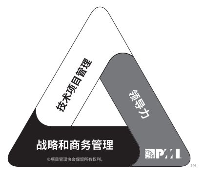

# 项目运行环境与项目经理

加餐加餐来了哦，今天的内容在 《信息系统项目管理师教程》 这本教材里是没有的，而且在 PMBOK 第五版中也是没有的。这部分内容是 PMBOK 第六版中新加的两个独立章节，不过内容不多，非常轻松，重点很少，大部分全是了解的内容，开心高兴吧，那么我们就一起来学习一下吧。

## 项目运行环境

项目所处的环境可能对项目的开发产生有利或不利的影响。这些影响的两大主要来源为 **事业环境因素** 和 **组织过程资产** 。

事业环境因素源于项目 **外部（往往是企业外部）的环境**，事业环境因素可能对整个企业、项目组织、项目集或项目产生影响。

组织过程资产源于 **组织内部** ，可能来自组织自身、项目组合、项目集、其他项目或这些的组合。

### 事件环境因素

事业环境因素（EEFs）是指项目团队 **不能控制** 的，将对项目产生影响、限制或指令作用的各种条件。虽说外部环境的因素更多，但组织内部也会有各种事业环境因素，因此，事业环境因素可以分为两类。

- 组织内部的事业环境因素：组织文化、结构、治理；设施和资源的地理分布；基础设施；信息技术软件；资源可用性；员工能力。

- 组织外部的事业环境因素：市场条件；社会和文化影响与问题；法律限制；商业数据库；学术研究；政府或行业标准；财务考虑因素；物理环境要素。

区分事业环境因素的关键就在于记住它是 **不能控制** 的 **外部** 因素居多，比如说 法律、文化、行业标准、软件资源 这些。而且事业环境因素会是我们后面学习到的过程知识域中很多过程的输入。

### 组织过程资产

组织过程资产是执行组织所特有并使用的计划、过程、政策、程序和知识库，会影响对具体项目的管理。组织过程资产多数存在于组织 **内部** ，并且项目团队可以对组织过程资产进行 **更新和增补** 。组织过程资产也可以分为两类：

- 过程、政策和程序：指南和标准；特定的组织标准；产品和项目生命周期；模板；预先批准的供应商清单和各种合同协议类型；变更控制程序；跟踪矩阵；财务控制程序；问题与缺陷管理程序；资源的可用性控制和分配管理；组织对沟通的要求；确定工作优先顺序；标准化的指南、工作指示、建议书评价准则和绩效测量准则；产品、服务或成果的核实和确认程序。

- 组织知识库：配置管理知识库；财务数据库；历史信息与经验教训知识库；问题与缺陷管理数据库；测量指标数据库；以往项目的项目档案。

组织过程资产的关键就是记住 **内部** 的，可以 **更新和增补** 的内容，比如各种数据知识库、模板、标准、程序 等。组织过程资产也是大部分过程的输入，不过因为它可以更新和增补，所以很过多程的输出也有它。

### 项目治理框架

治理是在组织各个层级上的组织性或结构性安排，旨在决定和影响组织成员的行为。治理是一个多维度的概念，需要：

- 包括考虑人员、角色、结构和政策；

- 要求通过数据和反馈提供指导和监督。

治理是在组织内行使职权的框架，包括但不限于：规则；政策；程序；规范；关系；系统；过程。这个框架会影响：组织目标的设定和实现方式；风险监控和评估方式；绩效优化方式。

## 项目经理角色

之前我们就说过，我们学习这个课程，想拿到 信息系统项目管理师 这个证，或者说你去考 PMP 证书，最终的目的都只为了成为一个角色，那就是 项目经理 。

项目经理在领导团队达成目标方面发挥着至关重要的作用。很多项目经理从项目启动时就参与项目，直到项目结束。有时候，项目经理可能会在项目启动之前就参与评估和分析活动，也有些组织可能还要求项目经理管理或协助项目商业分析、商业论证以及项目组合管理事宜。项目经理还有可能参与后续跟进活动，以实现项目的商业收益。项目经理在团队中的职责包括审查组织的愿景、使命和目标，确保成果与之保持一致。然后解释与成功完成成果相关的愿景、使命和目标。最后向团队沟通自己的想法，激励团队成功完成目标。项目经理无须承担项目中的每个角色，但应具备项目管理知识、技术知识、理解和经验。

说了半天，我们还没有给项目经理一个完整的定义。

项目经理是由执行组织委派，领导团队实现项目目标的个人。

## 项目经理的影响力范围

项目经理在其影响力范围内担任多种角色，这些角色反映了项目经理的能力，体现了项目经理这一职业的价值和作用。

### 项目

项目经理领导项目团队实现项目目标和相关方的期望。项目经理利用可用资源，以平衡相互竞争的项目制约因素。

项目经理还充当项目发起人、团队成员与其他相关方之间的沟通者，包括提供指导和展示项目成功的愿景。项目经理使用软技能（例如人际关系技能和人员管理技能）来平衡项目相关方之间相互冲突和竞争的目标，以达成共识。

### 组织

项目经理需要积极地与其他项目经理互动。其他独立项目或同一项目集的其他项目可能会对项目造成影响，原因包括但不限于：对相同资源的需求；资金分配的优先顺序；可交付成果的接受或发布；项目与组织的目的和目标的一致性。

与其他项目经理互动有助于产生积极的影响，以满足项目的各种需求。项目经理需要寻求各种方法来培养人际关系，从而帮助团队实现项目目的和目标。

项目经理在组织内部充当着扮演强有力的领导者角色。项目经理还致力于：展现项目的价值；提高组织对项目管理的接受度；提高组织内现有 PMO 的效率。

### 行业

项目经理应时刻关注行业的最新发展趋势，获得并思考这一信息对当前项目是否有影响或可用，这些趋势包括但不限于：产品和技术开发；新兴且正在变化的市场空间；标准；技术支持工具；影响当前项目的经济力量；影响项目管理学科的各种力量；过程改进和可持续发展战略。

### 专业与跨学科

对项目经理而言，持续的知识传递和整合非常重要。此外，专业的项目经理可以选择指导和教育其他专业人员了解项目管理方法对组织的价值。

## 项目经理的胜任力

PMI 有一个人才三角的概念，主要重点关注三个关键技能的组合。

技术项目管理技能指有效运用项目管理知识实现项目集或项目的预期或成果的能力。顶尖的项目经理会具备几种关键技能，包括但不限于：

- 重点关注所管理的各个项目的关键技术、项目管理要素，主要包括：项目成功的关键因素；进度计划；指定的财务报告；问题日志。

- 针对每个项目裁剪传统和敏捷工具、技术和方法。

- 制定完整的计划并谨慎排定优先顺序。

- 管理项目要素，包括但不限于进度、成本、资源和风险。

战略和商务管理技能包括纵览组织概况并有效协商和执行有利于战略调整和创新的决策和行动的能力。为关于项目成功交付的最佳决策，项目经理应咨询具备关于组织运营的专业知识的运营经理。战略和商业技能有助于项目经理确定应为其项目考虑哪些商业因素。

### 领导力

领导力技能包括指导、激励和带领团队的能力。包括协商、抗压、沟通、解决问题、批判性思考和人际关系技能等基本能力。

项目经理应该研究人的行为和动机。需要运用领导力技能和品质与所有项目相关方合作，包括项目团队、团队指导和项目发起人。

领导和管理的最终目的是办好事情。很多技能和品质归根结底就是处理政治的能力。政治涉及影响、谈判、自主和权力。政治及其相关要素不局限于“好”与“不好”以及“正面”与“负面”之分。

权力往往需要人们对领导者的看法来配合。借助人际关系可以让项目相关事项得到落实。在权力方面，顶尖的项目经理积极主动且目的明确，并且会在组织政策、协议和程序许可的范围内主动寻求所需的权力和职权，而不是坐等组织授权。

### 领导者的品质和技能

研究显示，领导者的品质和技能包括但不限于：

- 有远见（例如帮助描述项目的产品、目的和目标；能够构建梦想并向他人诠释愿景）

- 积极乐观

- 乐于合作

- 通过建立信任；解决顾虑；寻求共识；平衡相互竞争和对立的目标；运用说服、协商、妥协和解决冲突的技能；发展和培养个人及专业网络；以长远的眼光把人际关系看成与项目本身同样重要；持续发展和运用政治敏锐性 来管理关系的冲突

- 通过花大量的时间；管理期望；诚恳地授受反馈；提出建设性的反馈；询问和倾听 来进行沟通

- 尊重他人（帮助他人保持独立自主），谦恭有礼，友善待人，诚实可信，忠诚可靠，遵守职业道德

- 展现出诚信正直和文化敏感性，果断、勇敢，能够解决问题

- 适时地称赞他人

- 终身学习，以结果和行动为导向

- 关注重要的事情，包括：通过必要的审查和调整，不断调整工作优先级；寻求并采用适用于团队和项目的优先级排序方法；区分高层战略优先级，尤其是与项目成功的关键因素相关的事项；对项目的主要制约因素保持警惕；在战术优先级上保持灵活；能够从大量信息中筛选出最重要的信息

- 以整体和系统的角度来看待项目，同等对待内部和外部因素

- 能够运用批判性思维（例如运用分析方法来制定决策）并将自己视为变革推动者

- 能够创建高效的团队，以服务为导向，展现出幽默的一面，与团队成员有效地分享乐趣

### 领导力和管理

“管理”更接近于指挥一个人采取已知的预期行动从一个位置到另一个位置。而“领导力”指通过讨论或辩论与他人合作，带领他们从一个位置到另一个位置。项目经理必须同时采用领导力和管理力这两种方式。技巧在于如何针对各种情况找到恰当的平衡点。管理与领导力的比较可以参考下面的表格。

|  管理   | 领导  |
|  ----  | ----  |
| 直接利用职位权利  | 利用关系权力来指导、影响和合作 |
| 维护  | 发展 |
| 管理  | 创新 |
| 关注系统和架构  | 关注人际关系 |
| 依赖控制  | 激发信任 |
| 关注近期目标  | 关注长期愿景 |
| 了解方式和时间  | 了解情况和原因 |
| 关注赢利  | 关注前景 |
| 接受现状  | 挑战现状 |
| 正确地做事  | 做正确的事情 |
| 关注操作层面的问题及其解决  | 关注愿景、一致性、动力和激励 |

## 执行整合

执行项目整合时，项目经理承担双重角色：

- 项目经理是重要的角色，与项目发起人携手合作，来理解战略目标，并确保项目目标和成果与项目组合、项目集以及业务领域保持一致。项目经理以这种方式帮助实现战略层面的整合与执行。

- 在项目层面上，项目经理负责指导团队关注真正重要的事务并协同工作。为此，项目经理需要整合过程、知识和人员。

在整个项目期间实施整体变更控制过程是为了整合变更请求。项目经理需要整合项目管理知识领域所涵盖的过程才有可能实现预期的项目结果。项目经理还需要充分认识项目背景和新的各种因素，然后决定如何在项目中最好地利用这些新环境因素，以获得项目成功。

## 总结

之前我们说过，今天的内容是在 PMBOK 中的内容，我们主要关注的是项目的运行环境和项目经理相关的内容。虽说这些不是考试的内容，但是如果你是期望成为一名项目经理的话，这些内容还是非常有必要了解的。更主要的是，它对我们理解之后的项目管理方面的内容也是非常有用的。总之，多学一点不会让你吃亏上当啦！

参考资料：

《项目管理知识体系指南 PMBOK》第六版