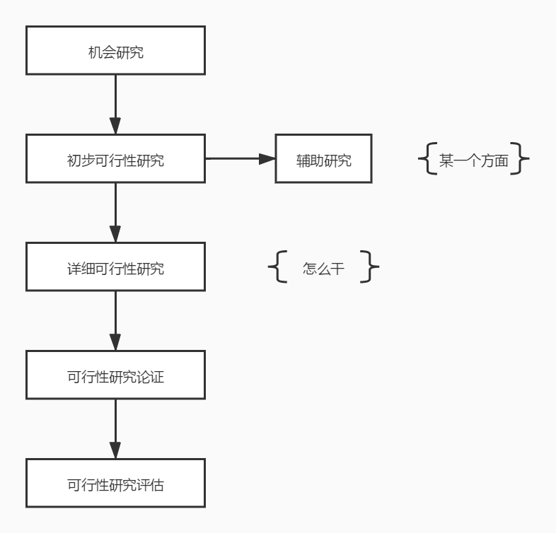
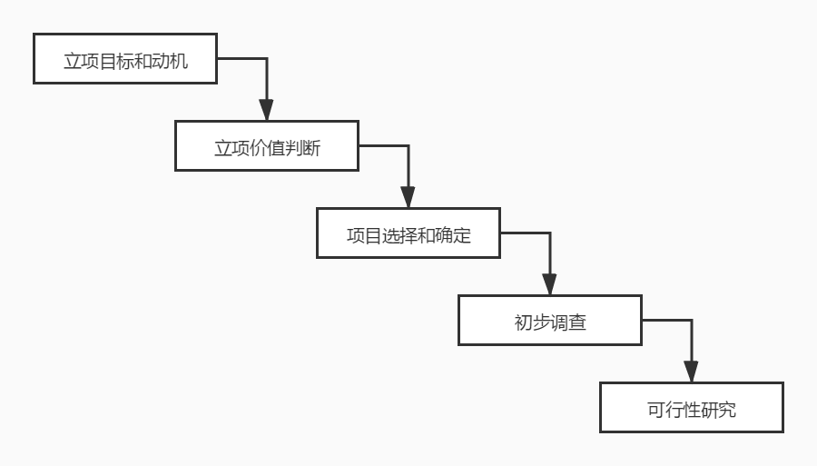

# 项目可研（一）立项和可行性研究

对于一个项目来说，最开始的步骤就是这个项目的立项过程。在这个过程中，我们要做的工作主要就是可行性研究。也就是说，这个项目值不值得我们来做，就需要对项目所涉及的领域、投资的额度、投资的效益、采用的技术、所处的环境、融资的措施、产生的社会效益等多方面进行全面的评价，以便能够对技术、经济和社会可行性进行研究，确定出项目的投资价值。因此，项目管理立项这部分，我们主要研究的就是 可行性研究 这部分的内容。

## 可行性研究的内容

对于信息系统项目来说，可行性一般包括了 可能性、效益性和必要性 三个方面。可能性包括了技术、物资、资金和人员支持的可行性；效益性包括了实施项目所能带来的经济效益和社会效益；必要性则比较复杂，包括社会环境、领导意愿、人员素质、认知水平等方面的因素。

因此，可行性研究的主要内容总结起来就是四个大的方面：

- 经济可行性

- 技术可行性

- 运行环境可行性（包括管理体制、工作习惯、人员素质等）

- 其他方面的可行性（法律可行性、社会可行性）

这一块还是记关键词：经济的、技术的、社会的（环境的），这样就比较好记了。

## 可行性研究的步骤

可行性研究的步骤主要包括：

- 1）确定项目规模和目标。

- 2）研究正在运行的系统。

- 3）建立新系统的逻辑模型。

- 4）导出和评价各种方案。

- 5）推荐可行性方案。

- 6）编写可行性研究报告。

- 7）递交可行行研究报告。

在第 4 和第 5 步，也就是 导出和评价各种方案 和 推荐可行性方案 时，我们会总结出 候选系统方案矩阵 和 可行性分析矩阵 ，当然，更重要的是第 6 步，我们要输出一份 可行性研究报告 。这个报告是我们项目是否可以正式立项开发的一个关键文档，后面我们会再详细说明。

## 可行性研究的整体过程 

紧接着，我们来看一下整个项目立项过程中，可行性研究的整体过程。

对于一般的可行性研究来说，我们要依次经历上图中的各个过程：

- 机会研究：寻找目标、动机，初步的价值判断和调查。

- 初步可行性研究：在对市场或者客户情况进行调查后，对项目进行的初步评估。如果是高新项目，或是团队从未接触过的项目，也可能要进行一些辅助研究。一般研究可能包括项目的一个或几个方面，但不是所有方面。

- 详细可行性研究：在项目决策前对项目有关的技术、经济等各方面进行详尽的、系统的、全面的调查、研究、分析、对各种可能的技术方案进行详细的论证比较，将最终的结果形成可行性研究报告。

- 可行性研究论证：对项目进行财务、经济、环境、社会影响等方面的评价。

- 可行性研究评估：由第三方对拟建项目进行评价，审核项目可靠性真实性，以及资源、贷款、决策方面的审批。

对于一些小的项目来说，机会研究和初步可行性研究可以省略或者合二为一。而初步可研与详细可研的内容其实大部分是相同的，只是详细研究会通过定量或定性的方式来获得更为详细的内容。依据项目的初步可行性研究报告可以形成项目建议书，通过审查项目建议书决定项目的取舍。这一步也就是我们的立项决策。不过，在论证和评估完成之前，一般来说，项目都有被否决的可能性。

## 机会研究

对于机会研究来说，其实我们主要做的就是要找到需求、目标，并且初步形成对价值的一个粗略的判断。机会选择的步骤可以参考下图。

我们就一个一个来说说这些步骤，主要都是在干什么。

立项目标其实就是我们想让做出来的项目解决什么问题，进行基础研究？还是进行应用研发？或者是提供技术服务，又或是为某些产品的使用者提供更好的服务。而立项的动机就更好理解了，主要就是我们的市场需求、政策导向、技术发展、营运需要以及客户的要求。

立项价值判断就是从最简单的、最直观的方向上先对项目的基础价值做一个粗略的判断。这个判断可能没有详细的定性和定量数据支撑，但是要先给一个总体的印象判断。

我们的项目需要选择有核心价值的项目，并根据这个来评估所选择的项目，评估项目的多种实施方式，平衡地选择各种合适的方案。

初步调查就是进行初步的需求分析，分析企业的基本状况、管理方式和基础数据管理的状况以及现在系统状况。

机会研究完成之后，我们就进入了正式的可行性研究步骤中。

## 初步可行性研究

初步可行性研究一般是在对市场或者客户情况进行调查后，对项目进行的初步评估。目的主要包括：

- 分析项目的前途，从而决定是否应该继续深入调查研究。

- 初步估计和确定项目中的关键技术及核心问题，以确定是否需要解决。

- 初步估计必须进行的辅助研究，以解决项目的核心问题，并判断是否具备必要的技术、实验、人力条件作为支持。

初步可行性研究的内容包括：

- 市场和生产能力。主要就是进行市场需求分析预测。

- 设备与材料投入分析，包括从需求、设计、开发、安装实施到运营的所有设备与材料的投入分析。

- 网络规则、物理布局方案的选择。

- 项目设计包括项目总体规划、信息系统设计和设备计划、网络工程规划等。

- 项目进度安排。

- 项目投资与成本估算，包括投资估算、成本估算、筹集资金的渠道及初步筹集方案。

初步可行性研究一般会有四种结果：

- 肯定，对于比较小的项目甚至可以直接“上马”。

- 肯定，转入详细可行性研究，进行更深入的分析研究。

- 展开专题研究，如市场考察、实验室实验、中间工厂实验等。

- 否定，项目应该“下马”。

初步可行性研究形成初步可行性研究报告，这个报告可以作为正式的文献供决策参考。其实，通过初步可行性研究报告和前面的机会研究，我们就可以生成一个非常重要而且正式的文档，那就是项目建议书。

## 项目建议书

项目建议书（又称立项申请）是项目建设单位向上级主管部门提交项目申请时所必须的文件，是该项目建设筹建单位或法人，根据国民经济的发展、国家和地方中长期规划、产业政策、生产力布局、国内外市场、所在地的内外部条件、本单位的发展战略等等，提出的某一具体项目的建议文件，是对拟建项目提出的框架性的总体设想。

项目建议书是项目发展周期的初始阶段，是国家或上级主管部门选择项目的依据，也是可行性研究的证据，涉及利用外资的项目，在项目建议书批准后，方可开展对外工作。也就是说，项目建议书会是电子政务项目（国企外包）的必须品。

项目建议书的核心内容包括：

- 项目的必要性。

- 项目的市场预测。

- 产品方案或服务的市场预测。

- 项目建设必需的条件。

项目建议书的这四个内容我们可以用“必要市场方案条件”八个字来方便记忆。这是一个重点的内容哦。

对于不同的项目来说，项目建议书的编制也是不同的，比如说跨地区、跨行业的项目及对国际名声有重大影响的项目、国内合资项目，这些类型的项目都是由有关部门与地区联合提出的；中外合资、合作经营，在中外投资者达成意向性协议之后，再根据国内有关投资政策与产业政策来编制；大中型和限额以上拟建项目上报建议书时应附初步可行性研究报告，该报告由有资格的设计单位或工程咨询公司编制。

由此也可以看出，项目建议书的编制一般是由第三方咨询机构进行编制的。当然，这也是针对上述这些非常大型的项目。如果是中小型公司的内部项目，由项目经理或团队产品负责人提出编制也是没问题的。

## 总结

今天我们学习的内容主要是可行性研究报告的说明以及立项相关的内容。在这里，我们先接触了可行性研究的前两步，也就是机会研究和初步研究，这两块内容相对来说比较简单好理解。接下来，我们就要用一整节课来学习可研中最重要的详细可行性研究。

参考资料：

《信息系统项目管理师教程》

《某机构培训资料》

《项目管理知识体系指南 PMBOK》第六版
