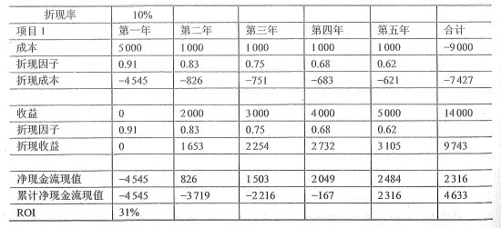
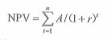

# 项目可研（二）详细可行性研究

在实际的整个项目可研的过程中，机会研究和初步可行性研究有可能不会出现，但详细可行性研究这个步骤确是不缺少的。比如说一些升级改造的项目可能需要初步和详细的可行性研究，而一些小项目可能只需要一个详细的可行性研究就可以了。在小项目中，往往机会研究和初步都可以直接合并到详细可研中。

详细可行性研究是在项目决策前对项目有关的技术、经济、法律、社会环境等方面的枪手和情况进行 **详尽的、系统的、**全面的调查、研究、分析，对各种可能的技术方案进行详细的论证、比较，并对项目建设完成后可能取得的经济、社会效益进行预测和评价，最终递交的可行性研究报告将成为进行项目评估和决策的依据。

## 依据与原则

进行详细可行性研究时，必须在国家有关法律、法规、政策、规划的前提下进行，同时还应当具备一些必须的技术资料。进行可行性研究的主依据包括如下因素：

- 国家经济和社会发展的长期规划，部门与地区的发展规划，以及国家和地方的相关政策、法律、法规和制度。

- 项目主管部门对项目设计开发建设要求请求的批复。

- 项目建议书或者项目建议书批准后签订的意向性协议。

- 国家、地区、企业的信息化规划和标准。

- 市场调研分析报告。

- 技术、产品或工具的有关资料。

- 国家有关经济法规、规定。如中外合资企业法、税收、外资、贷款等规定；国家关于信息化建设方面的标准、规范、定额资料；市场调查报告等。

依据是项目能够启动的第一步内容，在确定依据之后，我们还要在一定的原则框架中进行项目的：

- 科学性原则：即要求按客观规律办事，要做到运用科学的方法和认真的态度来收集、分析和鉴别原始的数据和资料，要求每一项技术与经济的决定要有科学的依据。

- 客观性原则：坚持从实际出发、实事求是的原则。认识客观条件、运用客观的资料、报告和结论必须是分析研究过程合乎逻辑的结果。

- 公正性原则：站在公正的立场上，不偏不倚，综合考虑项目干系人的各方利益，不弄虚作假。

## 内容与方法

详细可行性研究所涉及的内容很多，每一方面都有其处理问题的方法，信息系统项目可行性研究的内容，一般可以归纳如下：

- 概述：提出项目开发的背景、必要性和经济意义，研究项目工作的依据和范围，产品将会的形式、种类、数量。

- 需求确定：调查研究国内外客户的需求情况，对国内外的技术趋势进行分析，确定项目的规模、目标、产品、方案和发展方向。需求预测的方法包括时间序列预测法、因果回归预测模型、消费水平法、最终用途（消费系数法）等。具体内容大家可以自己了解一下。

- 现有资源、设施情况分析：调查现有的资源（包括软硬件资源、数据、规章制度等种类与数量，以及这些资源的使用情况和可能的更新情况）。

- 设计（初步）技术方案：确定项目的总体和详细目标、范围，总体的结构和组成，核心技术和关键问题、产品的功能与性能。

- 项目实施进度计划建议。

- 投资估算和资金筹措计划。

- 项目组织、人力资源、技术培训计划：包括现有的人员规模、组织人员层次、个人技术能力、人员技术培训计划等。

- 经济和社会效益分析（效果评价）。

- 合作/协作方式。

## 详细可行性研究方法

详细可行性研究的方法有很多，包括财务评价和国民经济评价两种。

财务评价，主要是直接的效益和直接的费用，也就是项目的内部效果。主要包括：

- 静态评价法：包括静态投资回收期、静态投资收益率两种。

- 动态评价法：包括折现率、净现值、内部收益率、外部收益率、动态投资回收期、动态投资收益率、收益/成本比值。

这些内容都是管理学中比较经典的一些财务评价方法。后面我们在成本效益分析中也会着重讲其中的几个方法。

国民经济评价，主要是间接效益和间接的费用，也就是项目的外部效果。主要包括：

- 经济评价法

- 市场预测法

- 投资估算法：在投资估算法中主要有 指数估算法、因子估算法、单位能力投资估算法

- 增量净效益法

## 成本效益分析

在对于成本效益的分析中，我们最主要的是需要了解两个算法的实现，也就是净现值 NPV 分析和投资回收期这两种计算内容。不过在此之前，我们先要了解一下成本效益的概念。

### 成本

首先说成本，在现实生活中，你以为的成本就是我们出的钱，投资了多少钱。大方向没错，确实是这样，成本就是我们出的钱，要把这些钱变成更多的钱就是我们后面要讲的收益。对于成本来说，还有许多不同的分类，这个才是我们主要需要了解的内容。

- 固定成本：是指其总额在一定时期或一定产量范围内，不直接受产量变动的影响而保持固定不变的成本。比如我们谈好的总价合同，一签订之后就不能变动了；比如设备的折旧、房屋的租金等等。

- 变动成本：是指在一定期间和一定业务量范围内其总额随着业务量的变动而成正比例变动的成本。比如原材料、工资，之类的，一般业务量越大这类成本也越大。

- 混合成本：指那些“混合”了固定成本和变动成本的成本。

- 直接成本：费用的发生与特定的产品或服务有直接的关联。就拿我们做项目来说，只要是与项目开发有关的成本就是直接成本，像是开发人员的工资、办公设备的损耗、服务器的租用等。

- 间接成本：费用的发生与产品或服务存有关联，但不是直接的关联。比如我们支付给办公室清洁的费用，水电费，停工损失等等。

- 沉没成本：是指以往发生的，但与当前决策无关的费用。说白了，就是我们已经花掉的钱，没有办法再改变了，也就是支出之后不可变的成本。就像我们组织了团建活动，玩完回来了，这部分费用就是沉没成本了。另外像是中途弃用的设备、无法再使用的零部件、需求变更后无法再使用的代码，甚至包括时间、精力，都是沉没成本。

- 机会成本：是指企业为从事某项经营活动而放弃另一项经营活动的机会，或利用一定资源获得某种收入时所放弃的另一种收入。其实它就是一个选择，比如说有两个项目 A 和 B 只能选其一，那么如果选择了 A ，你也就会获得 A 的收入，但 B 的收入和你就没有关系了，这个 B 的收入就是你的机会成本。另外还有一个最典型的例子，几份 offer 同时放在面前，你只能选择一个，那么其它的 offer 就是你的机会成本。

- 质量成本：是为了确保产品（或服务）满足规定要求的费用以及没有满足规定要求引起损失，是企业生产 总成本的一个组成部分。这个怎么理解呢？其实就是我们有可能返工、维修等因为质量问题而增加的成本。代码刚上线产生了重大的 BUG ，不管是损失的金额还是修补 BUG 需要付出的时间精力人力成本，都是质量成本。

怎么样？是不是又大开眼界了，其实这些都是管理学的基础，而且是非常非常基础的内容。在这里，我们只要简单地了解一下就好了。

### 收益

除了成本之外，我们还要了解一下收益，收益不就是我们赚到的钱吗？没错，但和成本一样，收益也是有不同的分类的。

- 有形收益：可以通过直观看得到或感觉得到，项目为社会提供的产品是最明显的有形收益。有形收益越多，说明项目的经济效益越高。当前项目投资分析中主要是以可计量的有形效益的大小作为项目投资决策的依据。

- 无形收益：是指不能用货币或实物计量的效益。为有形收益的对称。投资项目或某一经济活动为国民经济所提供的难以或无法用某一计量单位进行计量的收益。

除了上面两种外，收益还可以分为经济收益和社会收益、近期收益和远期收益、显性收益和隐性收益、微观收益和宏观收益等。

对于收益来说，我们可以通过 函数求解法、相关关系法、模糊数学法、专家判断法（德尔菲法）、成本降低法、利润增加法 来进行量化和计算，当然，这些都不是重点，我们重点要学习的是马止要讲到的净现值分析与投资回收期的计算。

## 净现值 NPV 

净现值是财务管理中的术语。其实它很好理解，10 年前的 100块 和现在的 100块 ，虽然在字面上还是 100块，但它的价值是相同的吗？或许最近几年我们的经济放缓了，如果再向前推 20年 呢？那时我上学的生活费一个月是 300块 。

因此，我们可以总结出，货币是有时间价值的，也就说，在目前我们的通涨大环境下，货币会不断贬值，未来 100块 所能购买的价值会比现在少。同样，在企业财务管理和项目投资的评估方面，也会考虑投资与回报的未来价值，这就是净现值。

净现值分析指把所有预期的未来现金流入与流出都折算成再会，以计算一个项目预期的净货币收益与损失。

我们以书中的例子来看，不过考试的时候也经常会有这样的情况，直接给你一个表格让你填上缺少的部分。既然要填，那么我们就要了解每一行代表什么意思。我们一个一个来看。

- 折现率，如果在现实中，我们可以以银行的标准利率为参考，不过例子中一般都会给个 10% 这样的好计算处理。这个折现率是我们后面许多计算的基础。

- 成本也就是我们的支出，项目在第一年支出 5000 ，然后每年还要支出 1000 ，一共要支出 9000 。

- 折现因子，也就是以 10% 的折现率来进行计算，每年都以这个 10% 为基础进行利率的折现。公式其实就是 1/（1+R）n 。其中 R 就是上面那个 10% 的折现率。

- 折现成本，也就是成本乘以折现因子。计算出来的就是我们付出的成本的现值。

- 收益，有成本当然对应的也会有收益，收益就是我们赚到了钱了。第一年可能刚投产还没有收益，后面的每一年则会有不断增长的收益。

- 折现收益，通过收益乘以折现因子计算出来的收益的现值。

- 有了折现的成本和收益之后，我们接下来就可以计算净现金流现值了。它就是 收益 减去 成本 的结果。这个值如果用字符来表示的话就是 P 。什么 P 呢？就是 NPV 中间的那个 P ，全名就是 PV 也就是现值。它表示的其实就是未来的收益减成本之后我们的利润在现在的价值。

- 接下来的这一行，是我们最核心的内容，它就是 累计净现金流现值，也就是我们的 NPV 净现值。从表格中你可以看出它的计算方式吗？没错，就是上一行净现金流现值，也就是 PV 的逐年累加。

- 最后的 ROI ，代表的是投资收益率。将净收入除以投资额的所得值。它的计算公式是 （总的折现收益 - 总的折现成本） / 折现成本 。在这个例子中，就是 (9734-7427)/7427 = 31% 。

这个表格中，最后两行的 PV 和 NPV 计算比较重要，大部分考试情况可能都会基于这个表格来出题目。比如说给出了利率和时间之后，要你计算某一年的净现值，或者 ROI 。NPV 还有一个公式是我们需要记住的。

其实这个公式的意思就是我们上面说过的内容，t 表示现金流的持续时间，也就是几年。A表示每年的现金流量，也就是收益和成本的差值。(1+r)n 就是折现因子的公式。完全都是我们上面表格中的内容，只是在表格中，我们会看得更加清晰。

## 投资回收期

投资回收期就是以净现金流入补偿投资所用的时间。换句话说，就是要确定经过多长时间累计收益就可以超过累计成本以及后续成本。当这个时间点达到之后，我们就可以正式进入盈利的状态了。

从上面的表格中，我们可以看到，从第五年开始，我们实现了 NPV 的由负转正。但其实真正转正的时间应该是第 4 年的某一个月。这个就需要使用一个公式来计算了。

投资回收期有两种算法，我们主要关心的是静态投资回收期的算法。它的公式是 (累计净现金流量现值开始出现正值的年份数-1) + （上年累计净现金流量现值的绝对值/当年净瑞金流量现值），根据表中的数据，我们可以得到 （5-1）+ |（-4545+826+1503+2049）| / 2484 = 4.07 年。其实，就是表格中第四年的累计净现金流现值 -167 的绝对值 167 去除以 2484 。其实从这个结果来说，我们在第 4 年的开头没多久，就已经实现了由负转正的过程。

这时，如果另外有一个项目只需要 3 年多的的话，那么明显那个项目会更优于当前这个项目。毕竟，投资回收期越长的项目可能带来的风险也就越大。

## 总结

今天的内容非常多，我们学习到了详细可行性研究的依据、原则、内容、方法等，然后学习了成本与收益相关的内容，特别是 净现值 这一块，主要就是要搞清楚那一个表格中各行的意义以及最后现值和净现值的算法。

内容很多，也很杂乱，大家还是需要更加深入地消化理解一下。当然，下篇文章我们也会相对轻松一些。

参考资料：

《信息系统项目管理师教程》

《某机构培训资料》

《项目管理知识体系指南 PMBOK》第六版
