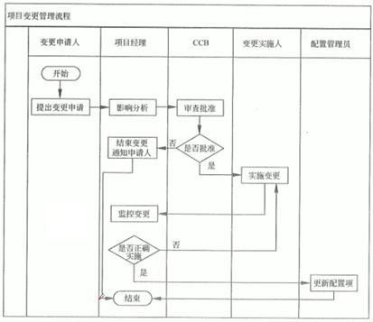

# 项目执行、监控与收尾

经过前一章的学习，我们已经了解到了项目整体管理相关的概念，项目整体管理的主要过程以及前两个非常重要的过程，那就是制订项目章程和制订项目管理计划。

今天我们将学习后面剩下的几个整体管理的过程。内容不是算多，而且也都是以理解记忆为主的内容。

## 指导与管理项目执行

指导与管理项目执行过程要求项目经理和项目团队采取多种行动执行项目管理计划，完成项目范围说明书中明确的工作。这些行动包括：

- 开展活动实现项目目标

- 付出努力与资金，实现项目目标

- 配备、培训并管理分派到本项目上的项目团队成员

- 根据具体情况取得报价、标书、要约或建议书

- 在潜在的卖方中间进行比较，选定卖方

- 取得、管理并使用资源，包括材料、工具、设备与设施

- 实施已列入计划的方法和标准

- 创造、控制、核实并确认项目可交付成果

- 管理风险并实施风险应对活动

- 管理卖方

- 将批准的变更纳入项目的范围、计划和环境

- 建立并管理项目团队内外的项目沟通渠道

- 收集项目数据并报告费用、进度、技术与质量绩效，以及有助于预测的状态信息

- 收集与记载吸取的教训，并实施批准的过程改进活动

其实这个过程，就是我们的项目的执行过程。也就是根据各种计划去实施的过程。在这个过程结束后，我们会有一个 可交付的成果 ，这个就是我们的项目成果。之前在讲项目的概念时就清晰地定义过，这个成果可以是实物，也可以是某种服务、技术、方案等。

注意，执行过程往往是我们在项目周期中执行最长并且是所有管理计划的最终落脚点。但是，在项目管理理论中，这一块却并不是非常重点的内容。毕竟，执行是贯穿始终的。

在指导与管井项目执行时，还要求实施：

- 批准的纠正措施：为使项目工作绩效重新与项目管理计划致而进行的有目的的活动，让项目的绩效与项目计划保持一致而对项目执行工作下达的书面命令。

- 批准的预防措施：为确保项目工作的未来绩效符合项目管理计划而进行的有目的的活动，用于降低项目风险消极后果的可能性的书面文件。

- 批准的缺陷补救请求：为了修正不一致的产品或产品组件而进行的有目的的活动，对于在质量检查和审计中发现的产品缺陷进行纠正的书面文件。

这三项工作一般是通过变更请求产生，变更有可能是范围，也有可能是进度、成本带来的，不管怎样，有变更就要有行动。后面我们马上就会讲到整体变更控制的问题。不过我们先要来看一下项目的监控。

## 监控项目工作

监控项目工作就是让计划与实际的情况进行对比，根据对比的结果，采取纠正或预防措施控制项目的实施效果。监控项目工作过程的对象是：

- 对照项目管理计划比较项目的实际表现。

- 评价项目的绩效，判断是否出现了需要采取纠正或预防措施的迹象，并在必要时提出采取行动的建议。

- 分析、跟踪并监视项目风险，确保及时识别风险，报告其状态，执行适当的风险应对计划。

- 建立有关项目产品以及有关文件的准确和及时的信息库，并保持到项目完成。

- 为状态报告、绩效测量和预测提供信息支持。

- 为更新当前的成本和进度信息提供预测。

- 在实施批准的变更时进行监视。

在项目管理中，根据可能的项目或环境变量的变化，以及它们与其他变量之间的关系，采用分析技术来预测潜在的后果。例如，可用于项目的分析技术包括：回归分析；分组方法；因果分析；根本原因分析；预测方法（如时间序列、情景构建、模拟等）；失效模式与影响分析；故障树分析；储备分析；趋势分析；挣值管理；差异分析等。

## 实施整体变更控制

整体变更控制过程贯穿于项目的始终。它是对项目基线的变更进行标识、记载、批准或拒绝，并对此变更加以控制。因此，这个过程其实是就是以监控项目工作的输出为依据，作为输入，在通过变更之后，再交由项目执行过程来进行执行。

对于变更来说，我们可以从不同的维度进行分类。比如：

- 按变更性质：可分为重大变更、重要变更和一般变更。通过不同审批权限控制。

- 按变更的迫切性：可分为紧急变更和非紧急变更，通过不同变更处理流程进行。

- 按变更所发生的领域和阶段，可分为进度变更、成本变更、质量变更、设计变更、实施变更和工作（产品）范围变更。

- 按变更所发生的空间，可分为内部环境变更和外部环境变更。

- 按变更的内容，IT行业的变更更进一步可细分为多个子行业（如弱电工作、应用开发、集成和IT咨询等）的变更。

### 实施整体变更控制的原因和内容

对于一个项目，或者一个功能来说，我们不能说完全无理由的就去变更修改它，变更一定会是某些原因引起的。比如说：

- 产品范围（成果）定义的过失或者疏忽

- 项目范围（工作）定义的过失或者疏忽

- 增值变更

- 应对风险的紧急计划或回避计划

- 项目执行过程与项目基准要求不一致带来的被动调整

- 外部事件

其实这些原因，我们可以总结成几个方面，那就是跟团队成员、客户、法律、运营、技术有关的内容，都非常容易引起变更。还有另一个非常经典的形容变更原因的，就是通过五个字“人财物法环”。引起变更的原因无外乎就是这五个方面，和人有关的、和成本收益有关的、和物料资源有关的、和法律规则有关的、和当前环境有关的。变更的内容具体包括：

- 识别可能发生和已经发生的变更

- 影响整体变更控制的相关因素，确保只有已批准的变更才能够被实施

- 评审并批准变更申请

- 管理基线的完备性

- 评审并审批所有书面的纠正措施和预防措施

- 根据已批准的变更，更新范围、成本、预算、进度和质量要求，协调整个项目内的变更

- 要记录变更申请的所有影响

- 验证缺陷修复的正确性

- 基于质量报告控制项目质量使其符合标准

当然，变更来源是需要通过清晰的工作绩效报告，包括资源可用情况、进度和成本数据、挣值管理（EMV）报告、燃烧图或燃尽图以及相关的变更请求作为依据。经过专家判断、变更控制会议或CCB变更控制委员会批准后实施。最后要在变更的结果中对变更日志进行记录。

### 变更控制原则与流程

变更控制的原则主要包括：

- 基准管理：基准是变更的依据（成本、进度、范围基准）

- 变更控制流程化，所有变更都必须遵循

- 明确组织分工

- 评估变更的可能影响

- 妥善保存变更产生的相关文档

在这里，我们要注意的也是我们一直在说的，那就是“基准很重要，流程要遵循，变更要评估，结果要存档”。其实，根据这个原则，我们也能够推测出变更控制程序的流程是怎样的。

- 1）产生变更想法（申请）

- 2）PM 和团队分析影响（评估）

- 3）将评估结果通知变更发起人

- 4）CCB审批（审批）

- 5）执行变更（实施）

- 6）验证变更后的效果（验证）

- 7）记录变更实施情况（存档）

- 8）分发新文档（通知干系人）

只要是变更出现，就应该有这样一套完善的流程。我们不要害怕流程的繁琐，因为变更往往是项目失败的一个非常重要且常见的原因，频繁的变更对项目带来的影响非常大。

### CCB 变更控制委员会

在上文中，我们反复得到过一个组织，那就是 变更控制控制委员会（CCB），这是一个什么样的组织。一般来说，CCB 是项目的所有者权益代表，负责裁定接受哪些变更。CCB 由项目所涉及的多方人员共同组成，通常包括用户和实施方的决策人员。主要是项目的 关键干系人 ，包括但不限于投资方、甲方代表、项目经理、客户代理、技术/业务/运营负责人、专家等。如果有监理总监的话，那么最好由监理总监来作为 CCB 的主席。

看出来了吧，CCB 的主要组成其实就是一堆不“干活”的人。当然，这里打了引号表示的就是他们一般不会是一线员工，一线的项目团队是主要的 执行方 ，而 CCB 则是面对变更的主要 决策方 。CCB 的工作一般包括：

- 批准配置项的标识，以及信息系统基线的建立

- 制定访问控制策略

- 建立、更改基线的设置，审核变更申请

- 根据配置管理员的报告决定相应的对策

很明显， CCB 不是作业机构，通常的工作是通过评审手段来决定项目是否能变更，但不提出变更的具体方案。具体方案当然还是项目团队或相关的负责来提。

那么项目经理或项目发起人有变更审批的权力吗？有，但是不多，只能是小问题。记住，不管是 信管师 考试还是 PMP 抑或是现实的项目管理中，只要有 CCB 存在的话，那么 重大的、基准的 变更，一定是走 CCB 的。

### 与配置管理的关系

如果把项目整体的交付成果视作项目的配置项，配置管理可视为对项目完整性管理的一套系统，当用于项目基准调整时，变更管理可视为其一部分。也就是说，可以把它们看作是相关联的两套机制，变更管理由项目交付或基准配置调整时，由配置管理系统调用，变更管理最终应将对项目的调整结果反馈给配置管理系统，以确保项目执行与对项目的账目相一致。

整体变更控制过程中的配置管理活动一般包括：

- 配置识别：确定与核实产品配置、标记产品与文档、管理变更，以及保持信息公开的基础。

- 配置状态记录：当提交配置项的适当数据时，应记录与报告该信息。这个信息包括批准的配置识别一个列表、建议变更的状态，以及被批准的变更的执行状态。

- 配置核实审计：配置核实和配置审计保证一个项目的配置项的组成，相应的变更被记录、评估、批准、追踪以及正确地执行。这保证了在配置文件中确定的功能已被满足。

## 结束项目或阶段

结束项目或阶段是完结所有项目管理过程组的所有活动，以正式结束项目或阶段的过程。它是确认项目或阶段是否已满足所有投资人、客户以及其他项目干系人需求的行动和活动；确认已满足项目阶段（或整个项目）的完成标准或退出标准的行动和活动；当需要时，把项目产品或者服务转移到下一个阶段，或者移交到生产和/或运营的行动和活动；收集项目或者项目阶段记录、检查项目成功或者失败、收集教训、归档项目信息，以方便组织未来的项目管理。从这些结束活动中，不知道大家有没有发现一个有趣的地方。那就是有正常结束活动，也有退出的结束活动。也就是说，即使是项目失败，中途退出，也是要有一个结束的流程的，这是不可缺少的。

在结束项目或阶段的过程中，我们主要关心的是两种收尾：

- 合同收尾：主要是比对合同内的项目内容是否完成，对产品进行验证，实施合同管理的收尾过程，最核心的就是对文档的验证。

- 行政收尾：也可以叫做管理收尾。收集项目或项目阶段的记录、收集教训、归档项目信息，回顾、评价、文档，最终获得更新的组织过程资产，以方便组织未来的项目管理。

在收尾的时候，我们要做到四件事：移交成果、总结经验、项目归档、团队解散。最后一个可能很多人会很诧异，不就是做完项目了嘛，团队为啥还要解散？这主要是针对矩阵型组织而言的，毕竟大家在结束项目之后还是要回到自己的职能型部门的。另外，小型的临时外包组织也可能经常会出现有项目时组建团队，项目结束后解散团队的情况。即使是运营型的项目，但如果项目或者阶段结果了，团队成员也有可能会被调到其他的项目中。因此，解散团队还是一个比较普遍的情况。

对于信息系统集成项目的验收工作来说，我们要通过系统测试、系统试运行、系统的文档验收并获得项目的最终验收报告之后，才可以说完成了项目的收尾工作。

### 项目总结会

前文中已经说过，不管项目是正常完成，还是中途退出，结束流程都是必不可少的。而在结束流程中，最最重要的就是要对项目进行总结反思。通常情况下，这是通过项目总结会来完成的。项目总结会，就是要回答我们在这次项目经历中，做对了什么，做错了什么，下次怎么做的问题，或者就是俗话说的“干的咋样，有啥问题”。一般讨论的内容包括：

- 项目、技术、成本、进度计划绩效

- 项目的沟通

- 识别问题与解决问题

- 意见和建议

其实核心的就两点，**绩效** 与 **问题** 。项目总结会可以帮助我们了解项目全过程情况以及相关成员的情况，能够了解出现的问题并总结改进措施，了解值得吸取的教训和经验并总结，最后我们还要对总结后的文档进行归档，也就是最终的纳入 组织过程资产 。

### 结束流程

综上所述，我们可以总结出项目或阶段的结束流程：
·
产品核实（合同、行政收尾） -> 财务收尾 -> 更新记录 -> 总结经验 -> 更新组织 -> 解散团队 。

## 总结

今天内容中的重点是 项目变更请求的那三种措施、变更控制的概念和分类以及原因、变更控制的程序流程、变更委员会CCB的概念和职责、结束的两种重要的收尾以及项目总结会的内容。虽说写了不少东西，但其实上述的每一点其实并没有太多的内容，都是一点点的条目直接记就可以。

通过两篇文章，我们就结束了项目整体管理的学习，第一个重要的知识领域就结束了，各位很开心吧？貌似项目管理方面的知识很简单呀？不要大意哦，这只是开始，好戏还在后头呢！

参考资料：

《信息系统项目管理师教程》

《某机构培训资料》

《项目管理知识体系指南 PMBOK》第六版