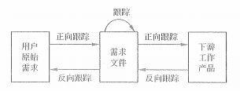
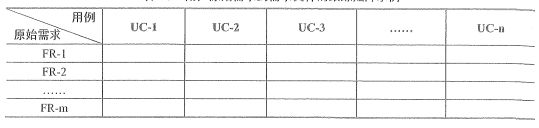
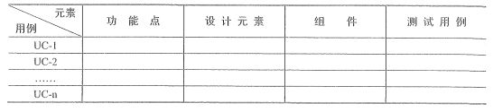

# 范围与需求

范围其实说白了就是我们要做的东西都包括哪些内容，这些内容的边界在哪里，范围其实从另一个角度来说的话，也可以看成是一个产品的约束。为什么要有一个约束呢？你见过一个即是电商，又是社交，还能兼顾全网搜索、短视频、智能推荐，甚至买火车票、在线电影、游戏棋牌都能玩。这样一个应用你觉得怎么样？相信我，谁做谁 Over 。

虽说可能在巨头的应用中，你有可能看到这些功能的影子，但是，它们或许真的只是影子。对于我们日常的项目开发来说，不要跟巨头去拼，即使是他们这样兼容并包的软件，也是在多次的项目迭代开发后才成型的。单独一个的项目所提供的功能肯定都是有限的。如果你的范围太大，必然会带来的问题就是在有限的时间内很难做完，而如果确实又想要在有限的时间内完成，那么就需要很高的成本，招人、软件硬件配置等。

在软件开发领域，我们有一个非常经典的笑话，那就是给你2000 块，做一个淘宝出来。这反应的是什么？一是客户对技术一无所知，二是他对范围也同样一无所知。

## 项目范围管理

项目范围是为了达到项目目标，交付具有某种特质的产品和服务，项目所规定要做的工作。项目范围管理就是要确定哪些工作是项目应该做的，哪些不应该包括在项目中。项目范围管理需要做三个方面的工作：

- 明确项目边界

- 对项目执行工作进行监控

- 防止项目范围发生蔓延

### 产品范围与项目范围

在项目中，实际上存在两个相互关联的范围，分别是产品范围和项目范围。

- **产品范围**：是指产品或者服务所应该包含的功能和特性，如何确定信息系统的范围在软件工程中也称为 需求分析 。

- **项目范围**：是指为了能够交付产品和服务，项目所必须完成的工作。

从这个两范围的定义可以看出，产品范围是项目范围的基础，项目范围要实现的就是产品范围内的所有特性。同时项目范围可能会宽泛一些，因为我们的项目管理不仅限于产品的功能特性，还有许多其它的管理计划也属于项目范围内。

判断项目范围是否完成，要以项目管理计划、范围说明书、WBS 和 WBS字典 来衡量。判断产品或服务是否完成，要根据产品或服务是否满足 **需求规格说明书**</sapn> 。

项目的 **范围基准**</sapn>（Scope Baseline）是经过批准的项目范围说明书、WBS 和 WBS字典。

还记得在项目整体管理中我们讲过的整体管理计划中的三大基准吗？这里就是第一个范围基准的内容。

项目范围管理不仅仅是让项目管理和实施人员知道为达到预期目标需要完成哪些具体的工作，还要确认清楚项目相关各方在每项工作中清晰的分工界面和责任。

### 范围管理的重要性

详细、清楚地界定分工界面和责任，不但有利于项目实施中的变更控制和推进项目发展，减少责任不清的事情发生，也便于项目结束时对项目范围的核实。

范围管理能够提高对项目成本、进度和资源估算的准确性。

### 发展趋势和新兴实践

项目范围管理的发展趋势和新兴实践包括但不限于注重与商业分析专业人士的合作，以便于：

- 确定问题并识别商业需要

- 识别并推荐能够满足这些需要的可行解决方案

- 收集、记录并管理相关方需求，以满足商业和项目目标

- 推动项目集成或项目的产品、服务或最终成果的成功应用

## 项目范围管理过程

项目的范围管理主要是通过以下表格中的六个过程来实现的。

<table>
    <tr>
        <th>所属过程组</th>
        <th>管理过程</th>
        <th>解释</th>
    </tr>
    <tr>
    <td rowspan="4">规划过程组</td>
        <td>规划范围管理</td>
        <td>编制范围管理计划，书面描述将如何定义、确认和控制项目范围的过程</td>
    </tr>
    <tr>
        <td>收集需求</td>
        <td>为实现项目目标而确定、记录并管理十系人的需要和需求和过程</td>
    </tr>
    <tr>
        <td>定义范围</td>
        <td>制定项目和产品详细描述的过程</td>
    </tr>
    <tr>
        <td>创建 WBS</td>
        <td>将项目可将会成果和项目工作分解为较小的、更易于管理的组件的过程</td>
    </tr>
    <tr>
    <td rowspan="2">监控过程组</td>
        <td>确认范围 </td>
        <td>正式验收已完成的项目可交付成果的过程</td>
    </tr>
    <tr>
        <td>控制范围</td>
        <td>监督项目和产品的范围状态，管理范围基准变更的过程</td>
    </tr>
</table>

范围管理是非常重要的，所以这六大过程都要熟记在心。如果能完全地记下所有的输入、输出和技术与工具的话那就更好了。我们还是通过理解的方式一个一个的先讲解完了，再回过头来好好的背吧。

## 规划范围管理

就像上面表格中所说的，规划范围管理主要的工作就是制订范围管理计划。

范围管理计划 是项目或项目集管理计划的组成部分，描述将如何定义、制订、监督、控制和确认项目范围。它是制订项目计划过程和其他范围管井过程的主要输入，要对将用于下列工作的管理过程做出规定。

- 如何制订项目范围说明书。

- 如何根据范围说明书创建 WBS 。

- 如何维护和批准 WBS 。

- 如何确认和正式验收已完成的项目项目可交付成果。

- 如何处理项目范围说明书的变更，该工作与实施整体变更控制过程直接相联。

需要注意的是，初学者很容易做错的一道题就是会把 范围管理计划 当成是 **范围基准** 。再三强调，范围管理计划 和 范围基准 不是一个东西哦，范围基准 的定义在上面已经清晰地说明了，这里就不再赘述了。

除了范围管理计划之外，在规划范围管理过程中，我们还会输出一个 需求管理计划 。需求管理计划 描述在整体项目生命周期内如何分析、记录和管理需求。主要包括以下的内容：

- 如何规划、跟踪和汇报各种需求活动。

- 需求管理需要使用的资源。

- 培训计划。

- 项目干系人参与需求管理的策略。

- 判断项目范围与需求不一致的准则与纠正规程。

- 需求跟踪结构，即哪些需求属性将列入跟踪距阵，并可在其他哪些项目文件中追踪到这些需求。

- 配置管理活动，例如，如何启动产品、服务或成果的变更，如何分析其影响，如何进行跟踪和汇报，以及谁有权批准变更。

## 收集需求

收集需求是为实现项目目标而确定、记录并管理干系人的需要和需求的过程，其作用是为定义和管理项目范围（包括产品范围）奠定基础。其实需求相关的内容我们在之前的软件工程中已经详细的讲解过了，这里我们就再补充一些之前没有讲到的内容。

首先是需求的分类，大家还记得软件工程中的需求层次吗？包括有 业务需求、用户需求、系统需求、功能需求、非功能需求、设计约束 这六种。这种需求层次的划分其实更偏软件工程方面，而在项目管理领域，我们的需求分类会更加地宽泛一些。

- 业务需求：整体组织的高层级需要，例如，解决业务问题或抓住业务机会，以及实施项目的原因。

- 干系人需求：是指干系人或干系人群体的需要。

- 解决方案需求：是为满足业务需求和干系人需求，产品、服务或成果必须具备的特性、功能和特征。在这里就包含了功能需求和非功能需求。

- 过渡需求：从当前状态过渡到将来状态所需的临时能力，例如数据转换和培训需求。

- 项目需求：项目需要满足的行动、过程或其他条件。

- 质量需求：用于确认项目可交付成果的成功完成或其他项目需求的实现的任何条件或标准。

是不是这里的需求范围会更广泛一些。接下来我们来看一下收集需求的一些技术和工具。

### 收集需求的技术与工具

|  工具与技术   | 解释  |
|  ----  | ----  |
| 访谈 | 通过与干系人的直接交谈，来获得信息的正式或非正式方法。访谈的典型做法是向被访者提出预设和即兴的问题，并记录他们的回答。通常采取“一对一”的形式，但也可以有多个被访者和/或多个访问者共同参与。 |
| 焦点小组会议 | 是把预先选定的干系人和主题专家集中在一起，了解他们对所提议产品、服务或成果的期望和态度。 |
| 引导式研讨会 | 邀请主要的跨职能干系人一起参加会议，对产品需求进行集中讨论与定义。研讨会是快速定义跨职能需求和协调干系人差异的重要技术。 |
| 群体创新技术 | 组织一些群体活动来识别项目和产品需求：头脑风暴法、名义小组技术、德尔菲技术、概念/思维导图、亲和图。 |
| 群体决策技术 | 为达成某种期望结构而对多个未来行动方案进行评估。可用来开发产品需求、以及对产品需求进行归类和优先排序：一致同意、相对多数原则、独裁。 |
| 问卷调查 | 通过设计书面问题，向为数众多的受访者快速收集信息。 |
| 观察 | 直接观察个人在各自的环境中如何开展工作和实施流程。 |
| 原型法 | 在实际开发之前，先造出该产品的实用模型，并据此征求需求的反馈意见。 |

在这里我们要注意以上几个工具的一些特点，以及一些小工具的概念。

- **访谈** 的特点是 **直接**、**深入** ，但是需要取得 **对方的信任** ，当然，相比于其它工具来说访谈法会略 **真实** 一点，当然这个真实也只是相对的，毕竟人们也有可能在访谈的时候随口乱说，但比起问卷之类的瞎填来说，这个真实情况还是要好很多。

- 访谈中还有一种方法叫做 **观察与交谈** ，是指直接观察看个人在各自的环境中如何执行工作（或任务）和实施流程。观察，也可以称为 “工作跟随” 。

- **焦点小组** 其实是一种多人访谈技术，访谈的对象是项目和重要干系人和专家。

- 适合 **引导式研讨会** 中的引导技能的情境包括： 联合应用设计开发（JAD） 业务专家和技术团队一起收集需求改进软件；质量功能展开（QFD） 确定新产品的关键特征；用户故事 ，对所需功能的简要描述。

- 头脑风暴是一种产生新想法和新点子的会议工具，所以它是一种创新工具。优势是能够面对面地进行交流，而且能够快速地产生许多想法，缺点则是不会很客观，也不太适合专家。头脑风暴要注意的是要以扩散思维为主，所以产生的想法都只是初步的想法。

- 名义小组技术是用于促进头脑风暴的一种技术，通过投票排列最有用的创意，以便进一步那个头脑风暴或优先排序。

- 德尔菲技术是一种组织专家就某一主题达成一致意见的一种信息收集技术。德尔菲是一种 **背靠背** 的技术。

- 亲和图是针对某一问题，充分收集各种经验、知识、想法和意见等语言、文字资料，通过图解方式进行汇总，并按其相互亲和性归纳整理这些资料，使问题明确起来。亲和图的核心是头脑风暴。

- 群体决策技术相对民主的方式是通过投票来进行的，根据投票的情况，可以有 **一致同意（全体）、大多数同意（超50%同意）、相对多数同意（两个或两个以上选项） 等。另外还有一种独裁方案，就是由某一个人做决定，独裁的特点是决策快，但可能会导致执行慢**。

- 问卷调查可以快速收集许多问题，相信大家肯定多少填过一些网络问题，但是，它的缺点也非常明显，问题决定答案，出题者的水平决定着问卷的质量，同时，真实性很差，假设性的问题大部分人的回答并不会很客观。

### 需求管理计划

还记得我们在 项目管理计划 中提过的 十一计划 吗？其中有一个 需求管理计划 就是出自这里了。需求管理计划主要包括：

- 如何规划、跟踪和汇报各种需求活动

- 需求管理需要使用的资源

- 培训计划

- 项目干系人参与需求管理的策略

- 判断项目范围与需求不一对待的准则和纠正规程

- 需求跟踪结构

- 配置管理活动

### 需求跟踪

需求跟踪是为了使计划、产品和活动与需求保持一致。需求跟踪包括 正向跟踪 和 反向跟踪 。正向跟踪是指检查需求文件中的每个需求是否都能在后继工作产品（成果）中找到对应点；反射跟踪也称为逆向跟踪，是指检查设计文档、产品构件、测试文档等工作成果是否都能在需求文件中找到出处。

不论采用何种跟踪方式，都要建立与维护一个非常重要的需求文档，那就是 需求跟踪矩阵 。从 原始的用户需求 到 需求文件 之间的跟踪，我们可能采用下面这样的跟踪矩阵表格。

而从 需求文件 更进一步，也就是到下游真正的产出的 工作产品 之间，可以通过另一个跟踪矩阵表格来记录。

这两个需求跟踪矩阵表格，大家记住它们大概的样子就可以了，看到了知道是 需求跟踪矩阵 就可以了。如果能在你的实际工作中运用上的话，那当然是更好啦！

## 总结

今天是范围管理的第一篇文章，我们了解到了范围的概念，知道了 产品范围 和 项目范围 的区别，另外还有 范围基准 的定义又重新复习了一遍。这些都是一些小的记忆点。接着，我们了解了范围管理的主要过程，它们大概的含义最好能记住，现在记不住那也可以在学习完范围管理所有的课程内容之后再回过来学习一下。最后，我们学习了 规划范围管理 和 收集需求 这两个过程中的内容。重点同样还是在 收集需求 这个过程中，特别是我们在这里顺带着讲了很多 工具与技术 ，这些内容在后面很多其它的过程中也有可能出现，到时候我们就不会再这样详细的说明了。

最低的要求是，提到这些工具与技术的名称，你要能知道它大概是干什么的，有什么特点。下一课，我们将学习 定义范围 和 创建WBS 这两个过程，其中 WBS 是整个范围管理的学习中最最核心的内容，同时，这两个过程的输出，也就是产出物，就是我们的 范围基准 ，所以做好准备，千万不要错过哦。

参考资料：

《信息系统项目管理师教程》

《某机构培训资料》

《项目管理知识体系指南 PMBOK》第六版