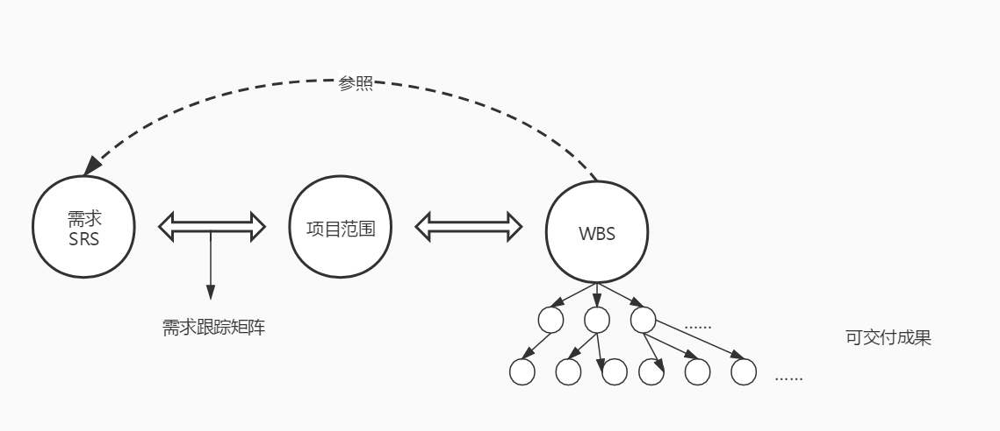

# 定义范围与WBS

上次课程已经说过，今天的内容是非常重要的，可以说是整个范围管理的核心内容。因此，也请各位打醒十二分精神，一起来学习这两个非常重要的过程吧。

## 定义范围

定义范围， 是指定项目和产品详细描述的过程，其主要作用是明确所收集的需求哪些将包含在项目范围内，哪些将排除在项目范围外，从而明确产品、服务或成果的边界。

其实这个过程就是为我们的产品划定边界的过程。在我们的项目开发中，其实有很多需求都不是最核心的，就像 28 法则说的，最核心的功能其实大多数情况下只有那 20% 。因此，如果将识别和收集需求中获取到的需求进行筛选，就是这个过程的主要步骤。

### 工具与技术

通过上面的说明，我们就可以推断出定义范围的工具与技术很大可能性是与范围边界有关。既然要确定边界，那么必然就是要对产品进行详细的分析。

产品分析，对于那些以产品为可交付成果的项目，产品分析是一种有效的工具，产品分析技术包括但不限于：产品分解、系统分析、需求分析、系统工程、价值工程和价值分析等。

除了产品分析之外，备选方案生成也是一种根据数据来进行分析的工具。它是一种用来指定尽可能多的潜在可选方案的技术，用于识别执行项目工作的不同方法。许多通用的管理技术都可用于生成备选方案，例如，头脑风暴、横向思维、备选方案分析等。

### 项目范围说明书

经过定义范围这个过程之后，主要输出的也就是我们的 项目范围说明书 。这里我们就详细地说明一个这个范围说明书。

项目范围说明书代表着项目相关方之间就项目范围所达成的共识。或者说就是一个确定了的需求方案。它包括的内容有：

- 产品范围描述

- 验收标准

- 可交付成果

- 项目的除外责任

- 制约因素

- 假设条件：假设条件是制订计划时，不需验证即可视为正确、真实或确定的因素。

项目范围说明书的内容还是比较清晰的，同样地，它的作用也非常明确。

- 确定范围，描述了可交付成果和所要完成的工作。

- 沟通基础，表明项目干系人之间就项目范围所达成的共识。

- 规划和控制依据，使项目团队能开展更详细的规划，并可在执行过程中指导项目团队的工作。

- 变更基础，为评价变更请求或额外工作是否超出项目边界提供基准。

- 规划基础，其它计划和滚动式规划的基础。

 最后我们再来了解一下 项目章程 和 项目范围说明书 之前的关系。项目章程包括高层级的信息，而项目范围说明书则是对项目范围的详细描述。项目范围需要在项目过程中渐进明细，而项目章程一般保持不变。

## 创建 WBS

创建 WBS 是将项目可将会成果和项目工作分解成较小的、更易于管理的组件的过程，其主要作用是对所要交付的内容提供一个结构化的视图。WBS 是以可交付成果为导向的工作层级分解，其分解的对象是项目团队为实现项目目标、提供所需可将会成果而实施的工作。WBS 组织并定义项目的总范围，代表着现行项目范围说明书所规定的工作。

我们可以通过下面这个图来了解到 WBS 和 需求 与 项目范围说明书 之间的关系。

这个图也可以叫做三圈映射图，三个圈分别代表着 需求规格说明书、项目范围说明书 以及 WBS 这三部分之间的关系。WBS 是以 需求 为参照的，真正的产品需求就可以看做是 WBS 的一个个工作，但我们真正计划要完成的工作包含在 WBS 的最底层，被称为 工作包 。可以对象工作包安排进度、估算成本和实施监控。在 “工作分解结构” 这个词语中，“工作” 是指作为活动结果的 工作产品 或 可交付成果 ，而不是 活动 本身。

如果准确无误地分解出 WBS ，并且这样的 WBS 得到了客户等项目干系人的认可，那么凡是出现在 WBS 中的工作都应该属于项目的范围，都是应该完成的。凡是没有出现在 WBS 中的工作，则不属于项目的范围，要想完成这样的工作，要遵循变更控制流程并需经过变更控制委员会的批准。

### WBS 的层次

WBS 将项目整体或者主要的可交付成果分解成容易管理、方便控制的若干个子项目或者工作包，子项目需要继续分解为工作包，持续这个过程，直到整个项目都分解为可管理的工作包，这些工作包的总和是项目的所有范围。

这样分层的特点有：

- 1）每层中的所有要素之和是下一层的工作之和

- 2）每个工作要素应该具体指派一个层次，而不应该指派给多个层次

- 3）WBS 需要有投入工作的范围描述，这样才能使所有人对要完成的工作有全面的了解

在这其中，每个结点可以区分不同的层次内容，包括：

- 里程碑，表示重要的时点或事件，标志着某个可交付成果或者阶段的正式完成。

- 工作包，位于 WBS 每条分支最底层的可交付成果或项目工作组成部分。工作包的大小也是需要考虑的细节，如果工作包太大，则难以达到可管理和可控制的目标；如果工作包太小，则创建 WBS 需要消耗项目管理人员和项目团队成员的大量时间和精力，同时，由于工作包过多，会造成逻辑结构复杂。作为一种经验法则，8/80 规则（80小时规则）建议工作包的大小应该至少需要8小时来完成，而总完成时间也不应该大于 80 小时。

- 控制帐户，是一种管理控制点。在该 控制点上，将范围、预算（资源计划）、实际成本和进度加以整合，并将它们与挣值进行比较，以测量绩效。控制帐户是 WBS 某个层次上的要素，既可以是工作包，也可以是比工作包更高层次上的一个要素。一个控制帐户中就包括若干个工作包，但一个工作包仅属于一个控制帐户。

- 规划包，在控制帐户之下，工作内容已知但尚缺详细进度活动的 WBS 组成部分。

- WBS 词典。也称为 WBS 词汇表，它是描述 WBS 各组成部分的文件。可能包括账户编码标识、工作描述、假设条件和制约因素、负责人或组织单元、进度里程碑、相关的进度活动、所需资源、成本估算、质量要求、验收标准、技术参考文献、协议信息等。

## 分解

要将整个项目分解为工作包，需要开发以下几个活动：

- 识别和分析可将会成果及相关工作

- 确定 WBS 的结构和编排方法

- 自上而下逐层细化分解

- 为 WBS 组件制定和分配标识编码

- 核实可交付成果分解的程度是恰当的

其中，在最后的核实过程中，我们要确定几个问题。

- 最底层要素对项目分解来说是必须而且充分的么？

- 每个组成要素的定义是否清晰完整？

- 每个组成要素是否都能恰当地编制进度和预算？是否能分配到具体的组织单元？

### 分解结构

在项目管理实践中，我们可以按照下面的方式来进行分解。

- 1）项目生命周期和各阶段作为分解的第二层，产品和项目可交付成果放在第三层。

2）主要可交付成果作为分解的第二层。

3）整合可能由项目团队以外的组织来实施的各种组件，然后作为外包工作的一部分，卖方需编制相应的合同WBS。

### 分解表现形式

WBS 的表现形式主要有分组的树型结构（组织结构图式）和表格形式（列表式）。

上面我们在讲 WBS 层次时的截图就是列表式的，而在分解结构时的那两种图就是树型结构图。

**树型结构的 WBS 层次清晰、直观、结构性很强，但不是很容易修改，对于大的、复杂的项目也很难表现出项目的全景。**在一些中小型的应用中用的比较多。大型项目的 WBS 要首先分解为子项目，然后各子项目进一步分解出自己的 WBS 。

**列表形式，最好是能带上缩进，这样会更直观。它能反映出项目所有的工作要素，但直观性较差。**常用在一些大型、复杂的项目中，因为有些项目分解后，内容分类较多、容量较大，用缩进图标的形式表示比较方便，也可以装订成册。在项目管理工具软件中，也会采用列表形式的 WBS 。

## 分解原则（注意事项）

WBS 的分解原则和注意事项是非常重点的内容，但也就是几条很短的小知识点而已，大家务必要记下来。

- 在各层次上保持项目的完整性，避免遗漏必要的组成部分。（100%规则）

- 一个工作单元只能从属于某个上层单元，避免交叉从属。

- 相同层次的工作单元应有相同性质。

- 工作单元应能分开不同的责任者和不同工作内容，每个工作单元有且仅有一个人负责（工作负责矩阵）

- 便于项目管理进行计划和控制的管理需要。

- 最底层工作应该具有可比性，是可管理的，可定量检查的（8/80规则）

- 应包括项目管理工作（因为管理是项目具体工作的一部分），包括分包出去的工作

- WBS 的最底层次的工作单元是工作包。一个项目的 WBS 是否分解到工作包，要跟项目的阶段、复杂程度和规模有关，一般来说早期、或复杂、或大规模的项目，其 WBS 的分解颗粒要大一些、粗一些。

### WBS 的作用

当一个项目的 WBS 分解完成后，项目干系人对完成的 WBS 应该给予确认，并对此达成共识，然后才能据此进行时间估算和成本估算。WBS 的目的和用途主要体现在以下几个方面：

- 明确和准确说明项目范围，项目团队成员能够清楚地理解任务的性质和需要努力的方向。

- 清楚地定义项目的边界，它提供了项目管理人员、项目产品或服务的用户、项目发起人、项目团队成员等其他项目干系人一致认可的项目需要做的工作和不需要做的工作。

- 为各独立单元分派人员，规定这些人员的职责，可以确定完成项目所需要的技术和人力资源。

- 针对独立单元，进行时间、成本和资源需求量的估算，提高估算的准确性。

- 为计划、预算、进度安排和费用控制奠定共同基础，确定项目进度和控制的基准。

- 将项目工作和项目的财务账目联系起来。

- 确定工作内容和工作顺序，将项目分解成具体的工作任务，就可以按照工作任务的逻辑顺序来实施项目。

- 有肋于防止需求蔓延。

## 总结

今天学习的内容，如果用一个词来说明的话，那就是 **范围基准** ，定义范围会产生 范围说明书 ，而创建 WBS 则会生成 WBS 和 WBS 字典，它们一起就形成了 范围基准 。今天的内容中，范围说明书的内容可以了解一下，然后整个 WBS 部分都是重点内容。是的，你没看错，后面所有的部分都是重点。

不过相对来说，WBS 这块的内容其实不难理解，如果你所在的团队的项目经理或者部门领导做过 甘特图 的话，那么 WBS 你就绝对不会陌生。甘特图的内容我们将在下一节课先大概看一眼，然后再到 进度管理 的学习时进行详细深入的学习。

参考资料：

《信息系统项目管理师教程》

《某机构培训资料》

《项目管理知识体系指南 PMBOK》第六版