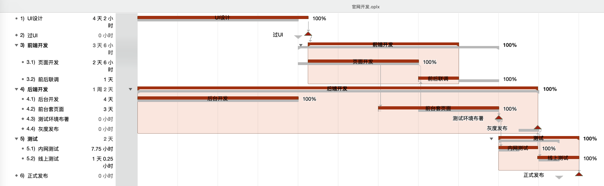

# 确认与控制范围

在范围管理中，我们已经讲完了 4 个管理过程，剩下的两个过程就是对范围的确认以及在整个项目执行过程中进行范围的监控管理。这两个过程的内容都不多，所以今天的内容还是非常轻松的，在正式学习之前，我们先来看看 甘特图 是长什么样子的。

## 先睹为快 甘特图

这是我之前做一个小官网开发时画的一张 甘特图 ，从这张图中可以看出，左边的那个列表其实就是一个 列表式 的 WBS 。而右边的内容其实是我们的开发周期也就是加上了进度时间所形成的一种横向的柱状图。也就是说，我们把 范围 和 进度 结合起来，就可以画出 甘特图 。当然，成本、资源等也可以在 甘特图 中体现出来。不过这些都是后话了。

大家可以看看，这个分解出来的工作结构有什么问题吗？其实问题还是挺多的，比如说有点太粗了，没有正式的功能范围的划分，因为粗所以很难监控，而且很明显，这是我一个人画出来的，真正的 WBS 应该是各重要相关干系人一起制定的。在学习了上节课的内容之后，大家可不要像我一样再画出这样的甘特图来了。

关于甘特图的内容，后面我们还会再说到，这里就是简单的先看一下。

## 确认范围

确认范围其实也是 **贯穿项目始终** 的一个过程，它也可以叫做是范围核实或者核实范围。它包括与客户或发起人一起审查可交付成果，确保可交付成果已圆满完成，并获得客户或发起人的正式验收。

在信息系统集成项目中，确认范围并不是容易的事情，这个不容易主要体现在与用户的沟通上。项目团队倾向于让用户确认范围以尽快开始后续的工作，而用户则可能认为自己什么也没有看到，怎么可以确认呢？因此，项目团队的沟通能力在确认项目范围这里具有非常重要的作用。

项目干系人进行范围确认时，一般要检查以下几个方面的问题：

- 可交付成果是否是确定的、可确认的。

- 每个可交付成果是否有明确的里程碑，里程碑是否有明确的、可辨别的事件。

- 是否有明确的质量标准。

- 审核和承诺是否有清晰的表达。

- 项目范围是否覆盖了需要完成的产品或服务进行的所有活动，有没有遗漏或者错误。

- 项目的风险是否太高，管理层是否能够降低可预见的风险发生时对项目的冲击。

确认范围中最主要的是项目的干系人（例如客户、发起人）对项目的范围进行确认和接受的工作，每个人对项目范围所关注的方面也是不同的，这也就是我们的所有干系人需要关注的不同点，主要包括：

- 管理层所关注的是项目范围，是指范围对项目的进度、资金和资源的影响。

- 客户主要关心的是产品的范围，关心项目的可交付成果是否足够满足产品或服务。

- 项目管理人员主要关注可交付成果是否满足需求和必须完成，时间、资金和资源是否足够。

- 项目团队成员主要关心项目范围中自己参与的元素和负责的元素，检查自己的工作时间是否足够。

如果在确认范围工作中发现项目范围说明书、WBS 中有遗漏或者错误，需要向项目团队明确指出错误的内容，并给出修正的意见。项目团队需要根据修改意见重新修改项目范围说明书和 WBS 。在确认范围工作过程中也可能会出现范围变更请求，如果这些范围变更请求得到了批准，那么也要重新修改项目范围说明书和 WBS 。

确认项目过程中有个工具叫做检查，是指开展测量、审查与确认等活动，来判断工作和可交付成果是否符合需求和产品验收标准。检查有时也被称为审查、产品审查和巡检等。而确认范围的输出则是 验收的可交付成果 ，说白了，就是我们要正式交付的产品、服务等，它是所有结束项目阶段或过程的重要输入。如果项目在早期被终止，确认范围过程也要记录它的完成情况。记住，项目只要有开始，就一定要有结束，在整体管理中讲过的结束项目或阶段工作是必不可少的，即使是失败和提前结束的项目，它们的资料也会成为组织过程资产。

最后，我们再看看一下确认范围与几个术语之间的比较。

- 确认范围与核实产品：核实产品是针对产品是否完成，强调产品是否完整；确认范围则是针对项目可交付成果，由客户或发起人在阶段末确认验收的过程。

- 确认范围与质量控制：确认范围是有关工作结果的接受问题，而质量控制是关注交付成果的正确性；质量控制一般在确认范围前进行，当然同时进行也是可以的；确认范围体现在 “多少” ，也就是范围的大小，多是由外部来验收，而质量控制更多的地体现 “好坏” ，多属于内部检查。

- 确认范围与项目收尾：确认范围强调的是核实与接受，而项目收尾强调的是结束项目（或阶段）所要做的流程性工作。

## 控制范围

控制范围是监督项目和产品的范围状态、管理范围基准变更的过程。在这个过程中，我们要确保所有请求的变更、推荐的纠正措施或预防措施都经过实施整体变更控制过程的处理。

在控制范围的过程中，我们要重点关注的焦点问题包括：对造成范围变更的因素施加影响，以确保这些变更得到一致的认可；确定范围变更是否已经发生；当范围变更发生时，对实际的变更进行管理。既然我们要关注这么多问题，那么项目的范围一般会在什么情况下发生变更呢？

- 政府政策的问题。同时也可以看成是项目外部 "环境" 发生了变化。

- 项目的范围计划编制不周密详细，有一定的错误或遗漏。这一点大多数可以归结为 "人" 的原因。

- 市场上出现了或是设计人员提出了新 “技术” 、新手段或新方案。

- 项目执行组织本身发生了变化。这是内部 “环境” 发生了变化。

- 客户对项目、项目产品或服务的要求发生变化。这还是 “人” 的问题。

还记得我们在 项目整体管理 的 实施整体变更控制 的原因中讲过的 “人财物法环” 吗，这里其实也是类似的。可以说，大部分的变更，不管是范围、成本、进度还是什么，基本都和这五个元素相关。控制范围确保所有的变更请求、推荐的纠正措施或预防措施，都会通过 实施整体变更控制 过程进行处理。

未经控制的产品或项目范围的扩大（未对时间、成本和资源做相应调整）被称为 **范围蔓延** 。除了 范围蔓延 外，还有一个名词叫做 **“镀金”** 。它的意思是团队成员内部主动发起的范围扩大的问题，没有经过正式的变更流程处理，从而导致整体项目范围的扩大。比如说，程序员主动为一个功能添加了一些额外的辅助功能，这叫 镀金 。而客户直接找到程序员并且要求马上添加的额外功能就是 需求蔓延 。它们都是失控的变更，都没有经历正规的变更过程，都应该是在项目过程中极力避免的。

最后，我们再一起看一下在整个项目周期内，范围变更控制的主要工作，包括但不限于：

- 影响导致范围变更的因素，并尽量使这些因素向有利的方面发展。

- 判断范围变更是否已经发生。

- 范围变更发生时管理实际的变更，确保所有被请求的变更按照项目整体变更控制过程处理。

## 总结

今天的内容不多吧，很轻松吧。虽说内容少，但确认范围的概念、与质量控制的区别，控制范围产生的原因，以及 范围蔓延 和 镀金 的概念这些内容都是需要我们去深入理解及记忆的。

到此为止，项目范围管理的内容我们就学习完了。项目管理十大知识领域我们已经学习完了两个，不知道大家有没有感觉到貌似项目管理部分的内容还是比较轻松的。确实，相比不是计算机相关专业的人员去学习网络和系统知识来说，项目管理方面的知识其实更通用一些，而且也更加的好理解一些。既然如此的话，大家就多多加油吧。当然，难点也还是有的，比如说我们马上要进入的 项目进度管理 的学习，以及后面的 项目成本管理 都会比范围管理的难度要高一些。

参考资料：

《信息系统项目管理师教程》

《某机构培训资料》

《项目管理知识体系指南 PMBOK》第六版