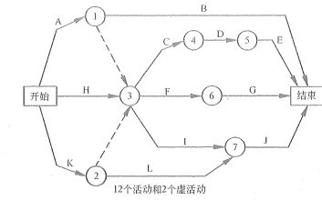

# 进度管理规划与活动

进度这个东西，相信在不少老板眼里就是你加班的基础。进度赶不上了怎么办？加班呀，进度赶上了呢？再多做点东西呀！反正加班这件事是少不了的，当你学习完我们的项目管理知识之后，特别是之前已经介绍的项目管理铁三角的知识掌握清晰之后，相信你是可以说服老板解决加班问题的。

进度，更多的其实是对我们项目的时间进行规划的，所以也可以叫做 项目时间管理 。在这个知识领域中，知识点非常多，而且都很重要，是我们学习过程中的一个重点章节。

## 项目进度管理

项目进度管理是指在项目实施过程中，对各阶段的进展程序和项目最终完成的期限所进行的管理，是保证项目能在满足其时间约束条件的前提下实现其总体目标的过程。

总的来说，项目管理计划主要都是基于项目进度管理计划编制的。在项目的进度管理计划的基础上编制项目成本管理计划、设备和设施采购计划、人力资源配置计划、风险管理计划和配置管理计划等。可以看出，项目进度管理计划是非常核心的一个计划。当然，它也有一个上家是需要提前准备好的，那就范围基准，没有范围，进度自然也就无从编制，毕竟你连做什么都不知道。并且，进度计划的许多图表工具，其实都是针对的范围中的 WBS 来进行制作的。

有关项目进度计划方法的新兴实践（包括但不限于）：

- 具有未完项的迭代型进度计划。（敏捷）

- 按需进度计划。经常用于此类项目：在运营或持续环境中以增量方式研发产品，且任务的规模或范围相对类似，或者，可以按照规模或范围对任务进行组合的项目。

## 项目进度管理过程

项目进度管理过程比较多，有七个过程。

<table>
    <tr>
        <th>所属过程组</th>
        <th>管理过程</th>
        <th>解释</th>
    </tr>
    <tr>
    <td rowspan="6">规划过程组</td>
        <td>规划项目进度管理</td>
        <td>为规划、编制、管理、执行和控制项目进度而制定政策、程序和文档的过程</td>
    </tr>
    <tr>
        <td>定义活动</td>
        <td>识别和记录为完成项目可交付成果而需采取的具体行动的过程</td>
    </tr>
    <tr>
        <td>排列活动顺序</td>
        <td>识别和记录项目活动间逻辑关系的过程</td>
    </tr>
    <tr>
        <td>估算活动资源</td>
        <td>估算各项活动所需材料、人员、区别和用品的种类和数量的过程</td>
    </tr>
    <tr>
        <td>估算活动持续时间</td>
        <td>根据资源估算的结果，估算完成单项活动所需工作时段数的过程</td>
    </tr>
    <tr>
        <td>制订进度计划</td>
        <td>分析活动顺序、持续时间、资源需求和进度制约因素，创建项目进度模型的过程</td>
    </tr>
    <tr>
    <td >监控过程组</td>
        <td>控制进度 </td>
        <td>监督项目活动状态、更新项目进展、管理进度基准变更，以实现计划的过程</td>
    </tr>
</table>

在某些小项目中，定义活动、排列活动顺序、估算活动资源、估算活动持续时间及制订进度计划等过程之间的联系非常密切，以至于可视为一个过程，由一个人在较短时间内完成。但是对于我们的学习来说，那还是要一个一个的分开来看。

## 规划进度管理

规划项目进度管理是为实施项目进度管理制定政策、程序，并形成文档化的项目进度管理计划的过程。本过程的主要作用是，如何在整个项目过程中管理、执行和控制项目进度提供指南和方向。

它的一个重要输出就是项目进度管理计划。它是整个项目管理计划的组成部分，为编制、监督和控制进度建立准则和明确活动。根据项目需要，进度管理计划可以是正式或非正式的，非常详细或高度概括的，其中应包括合适的控制临界值。

## 定义活动

我们在项目范围管理的 创建WBS 活动中已经可以识别出最底层的可交付成果，即工作包。但为了更好地规划项目，工作包通常还应进一步细分为更小的组成部分，即 “活动” 。

活动，就是为完成工作包所需进行的工作，是开展估算、编制进度计划以及执行和监控项目工作的基础。而定义活动过程就是识别和记录为完成项目可交付成果而需采取的所有活动。

在定义活动中，我们有一个工具是 滚动式规划 ，这也是我们之前就提到过的一种规划技术。它也是一种迭代式的规划技术，即详细规划近期要完成的工作，同时在较高层级上粗略规划远期工作。这种规划技术也是现代项目管理的特征之一。

在定义活动的输出中，有几个输出内容是我们非常关心的，包括：

- 活动清单：一份包含项目所需的全部活动的综合清单，还包括每个活动的标识及工作范围详述，使项目团队成员知道需要完成什么工作。

- 活动属性：是活动清单中活动描述的扩展，随时间演进。在项目初始阶段，活动属性包括活动标识、WBS标识和活动标签或名称；在活动属性编制完成时，可能还包括活动编码、活动描述、紧前活动、紧后活动、逻辑关系、提前量与滞后量、资源需求、强制日期、制约因素和假设条件。

- 里程碑清单：里程碑是项目中的重要时点或事件，是完成阶段性工作的标志，不同类型的项目里程碑不同。

- 检查点：指在规定的时间间隔内对项目进行检查，比较实际与计划之间的差异，并根据差异进行调整。

- 基线：指定一个（或一组）配置项在项目生命周期的不同时间点上，通过正式详审而进入正式受控的一种状态。基线是一个重要的里程碑，但相关交付成果要通过正式详审，并作为后续工作的基准和出发点。基线一旦建立后其变化需要受控制。除了进度外，范围、成本、质量都有其相应的基线，并且都遵循基线的特点：签字确认，变化受控。

## 排列活动顺序

排列活动顺序是识别和记录项目活动之间的关系的过程。除了首尾两项活动外，每项活动和每个里程碑都至少有一项紧前活动和一项紧后活动。可以按逻辑关系将活动排序来创建一个切实的项目进度计划。排序可以由项目管理软件、手动或自动化工具来完成。

在排列活动顺序这个过程中，我们要接触到一个非常重要的工具，那就是 **PDM 紧前关系图法** 。它也可以叫做 **前导图法、活动依赖关系图** 等。

像上图这样只有节点编号的 **PDM 图**，也可以称为 **单代号网络图** 或 **活动节点图（AON）**，这种图式为大多数项目管理软件所采用。从图中我们可以看出，方框代表的节点就是我们的 活动 ，而箭头则是活动之间的关系，活动与活动之间的关系被称为逻辑关系。比如在图上我们写了有 23 个逻辑依赖关系，表示是这些活动之间有 23 个箭头线段，而真正的活动逻辑类型其实只有四种。

### 逻辑关系

紧前活动，这四个字的意思其实就是表明了一种逻辑关系，表示这个活动是在某一个活动之前的，也就是紧挨着当前这个活动之前的活动。同理，还有紧后活动这一说。在上面那个 PDM 图中，其实我们看到的都是从某一活动开始然后指向下一个活动直到最后全部指向结束。这样就形成了一个不断向后的 紧后关系图 。

一般来说，图形的标示都是一路向后的，但逻辑关系并不只是单一的前后两个方向而已，它还有更复杂的概念。我们在 PDM 图中一般会有 4 种类型的逻辑关系图。

- 结束-开始的关系（F-S型）。前序活动结束后，后续活动才能开始。比如先要搭好测试环境，才能开始测试。

- 结束-结束的关系（F-F型）。前序活动结束后，后续活动才能结束。比如网络设备的安装与调试同步穿插进行，那么只有两个都完成了整个网络设备工作才算是完成了。

- 开始-开始的关系（S-S型）。前序活动开始后，后续活动才能开始。比如主从数据开始同步了，那么负载均衡导量也可以开始了。

- 开始-结束的关系（S-F型）。前序活动开始后，后续活动才能结束。比如新系统完成上线后，才能关闭老的旧系统。

通常来说，FS 是最常见的，SF 是最少见的，毕竟 SF 这个概念很绕，如果把新系统当成紧前活动，那么其实这个 SF 的例子就是个 FS 的例子。另外，FS 代表着一种 线性 工作方式，而 SS 则代表一种 并行 的工作方式。用技术的话来说，一个单线程，一个多线程。

在 PDM 图中，每项活动有唯一的活动号，每项活动都注明了预计工期（活动的持续时间）。通常，每个节点的活动会有如下几个时间：

- 最早开始时间（ES），某项活动能够开始的最早时间。

- 最早结束时间（EF），某项活动能够完成的最早时间。EF = ES + 工期。

- 最迟结束时间（LF），为使项目按时完成，某项活动必须完成的最迟时间。

- 最迟开始时间（LS），为使项目按时完成，某项活动必须开始的最迟时间。LS = LF - 工期。

这个结点图后面我们在学习关键路径法的时候会详细地再进行更加深入的学习。每一块的位置和英文代表的意义都在这里给出了，后面我们也不会再详细去说明。这一块的内容非常非常重要，所以这里大家一定要记住上面这个节点图每个位置的作用与样式。有了这个节点之后，整个项目的进度情况我们都可以根据由这些结点组成的网络图计算出来了。

先放张图吊吊胃口，后面我们在学 制定进度计划 的 **关键路径法** 时，会再进行深入的学习，千万不要错过哦，再次强调，重点中的重点之一。

上述这些逻辑依赖关系和工期图示的这些内容在 MS Project 、Omni Plan 以及各类项目管理软件中都会有对应的实现并且对于我们后面的进度计算也非常重要，第三次强调：**重点中的重点**。除了这种逻辑上的依赖关系外，活动与项目情况本身还有各种依赖。

### 依赖关系

活动与活动，以及活动与项目或环境之间的依赖关系可能是强制的或选择的，内部的或外部的这四种。它们互相组合又可以组合成强制性外部依赖关系、强制性内部依赖关系、选择性外部依赖关系或选择性内部依赖关系。不过归根结底，我们还是要以上面四种基础的依赖关系为标准进行学习，那么我们就一个一个来看下。

- **强制性依赖关系**：是法律或合同要求的或工作的内在性质决定的依赖关系，往往与客观限制有关，强制性依赖关系又称为 **硬逻辑关系** 或 **硬依赖关系** 。

- **选择性依赖关系**：有时又称 **首选逻辑关系**、**优先逻辑关系** 或 **软逻辑关系** 。它通常是基于具体应用领域的最佳实践或者是基于项目的某些特殊性质而设定，即便还有其他顺序可以选用，但项目团队仍缺省按照此种特殊的顺序安排活动。

- **外部依赖关系**：是项目活动与非项目活动之间的依赖关系。这些依赖关系往往不在项目团队的控制范围内。例如，软件项目的测试活动取决于外部硬件的到货；建筑项目的现场准备，可能要在政府的环境听证会之后才能开始。

- **内部依赖关系**：是项目活动之间的紧前关系，通常在项目团队的控制之中。

### 箭线图法

与前导图不同，箭线图法（ADM）是用箭线表示活动、节点表示事件的一种网络图绘制法。就像下面这个图一样，通常它也可以称为 **双代号网络图（节点和箭线都要编号）** 或 **活动箭线图（AOA）** 。注意它和上面 PDM 中的 单代号网络图 以及 活动节点图（AON） 的区别，这四个名词很接近，也是很容易混淆的题型。

从这个图中，你可以看出，箭线上也是标了一个字母的，和我们在 PDM 的节点中间的活动编号或者名称很类似。在这样的绘图法中，**箭线** 就是具体的活动，它们是 **占用时间并消耗资源** 的。同时，图中还有一些 **虚线** ，这种虚线标示的活动叫做 **虚活动**，这些活动 **不消耗时间也不消耗资源** 只是为了弥补箭线图在表达活动依赖关系方面的不足，可以更清楚地表达活动之间的关系。最后 **节点** 标示的是 1、2... 这些，其实代表的是前后工作的 **交接点** ，也表示工作之间的逻辑。

在箭线图法中，有三个基本原则：

- 图中每一活动和每一事件都必须有唯一的一个代号，即网络图中不会有相同的代号。

- 任意两项活动的紧前事件和紧后事件代号至少有一个不相同，节点代号沿箭线方向越来越大。

- 流入（流出）同一节点的活动，均有共同的紧后活动（或紧前活动）。

根据这三个原则，你就知道为什么要加入 虚活动 了，目的就是为了保持 **完整的逻辑关系** ，比如一个节点可能有多个紧前活动事件。另外，箭线图法 **严禁有环路** ，箭线只能 **自左向右** 延伸，节点也同样只能 **从小到大不重复** 。因此，一项工作对应一条箭线和一对节点编号。最后，箭线法还要 **避免箭线交叉** 。

这一堆内容，想必你也知道了，箭线图法也是我们的重点内容，不过相对来说比 PDM 稍好一点，重点的程度没有那个高。只是有很多概念要记住，也就是上文中加粗的部分。

### 提前量与滞后量

在活动之间加入时间提前量与滞后量，可以更准确地表达活动之间的逻辑关系。

提前量是相对于紧前活动、紧后活动可以提前的时间量。提前量往往表示为负数。

滞后量是相对于紧前活动、紧后活动需要推迟的时间量。滞后量往往表示为正数。

图中，F 到 G 活动中间的 FS+15 表示的就是 从 F 完成到 G 开始有 15 的滞后量。注意，后面我们学习估算活动持续时间时，在那里计算的活动时间不应包括滞后量。

## 总结

今天我们主要学习的是关于项目进度管理的概念，过程，以及详细了解了制订项目进度计划、定义活动和排列活动顺序三部分的内容。很明显，排列活动顺序中的 PDM 图、逻辑关系、依赖关系、箭线图法都是我们需要重点关注的内容。进度管理的七个过程也同样是需要我们记下来的，对于我们的论文和简答非常重要。

参考资料：

《信息系统项目管理师教程》

《某机构培训资料》

《项目管理知识体系指南 PMBOK》第六版