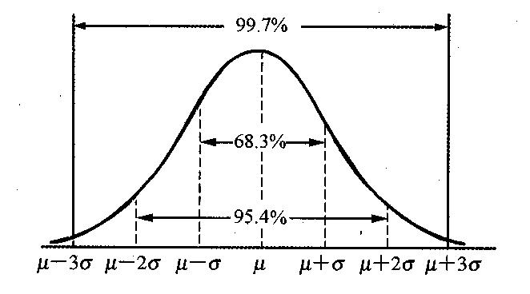

# 估算活动资源与持续时间

在经过上次课程的学习后，我们已经了解到了进度、活动的概念及定义，并且简单地学习了下活动顺序如何排列的一些工具技术。今天，我们学习的主要方向是估算活动资源与估算活动持续时间这两个过程，另外我们还会将进度管理的最后一个过程 控制进度 一起放到今天的内容中一起学习。原因其实很简单，因为进度管理的重点，或者说是重中之中是在 制定进度计划 这个过程中，在这个过程中我们要学习的内容比较多，所以我们放到最后再去学它。

当然，今天的内容也不会很轻松，进度是非常重要的一个知识领域，它的每一个过程相比范围来说都会多很多内容，大家一定要跟上我们的脚步哦！

## 估算活动资源

估算活动资源是估算执行各项活动所需的材料、人员、设备或用品的种类和数量的过程。这个过程的主要作用是，完成活动所需的资源种类、数量和特性，以便做出更准确的成本和持续时间估算。

在这里我们要重点关注的是 **估算活动资源过程与估算成本过程紧密相关** 。估算成本的过程是在 项目成本管理 中我们会学习到的内容。

在估算活动资源的输入中，有两个工具是我们需要关注的。

- 项目日历：编排开展计划活动的工作日或轮流班次，以及不开展计划活动的非工作日的日历。项目日历影响到所有的活动。项目日历是开展项目工作的基准日历，不包括节假日。

- 资源日历：记录了确定使用某种资源（如人员或物资）日期的工作日，或不使用某种具体资源日期的非工作日。项目资源日历一般根据资源的种类标识各自的节假日，以及可以使用资源的时间，资源日历影响到与某种具体资源或资源种类相关的活动。其实就是资源的可用工作日或班次日历，是客观存在的日历。

估算活动资源的工具与技术可以参考下面表格中的内容。

|  工具与技术   | 解释  |
|  ----  | ----  |
| 专家判断  | 通过借鉴历史信息，专家判断能对项目环境进行有价值的分析，并提供以往类似项目的相关信息，专家判断也可用来决定是否联合使用多种估算方法。 |
| 备选方案分析  | 很多进度活动都有若干种可选的实施方案，如使用能力或技能水平不同的资源，使用不同规模或类型的机器，使用不同的工具（手工或自动化），以及决定是自制还是购买相关资源。|
| 出版的估算数据  | 一些公司会定期发布最新的生产率与资源单价。这些信息涉及门类众多的劳务、材料和设备，并覆盖许多国家及其所属地区。|
| 自下而上估算  | 对工作组成部分进行估算的一种方法。如果无法以合理的可信度对活动进行估算，则应将活动进一步细分，然后估算资源需求，接着再把这些资源需求汇总，得到每一个活动的资源需求，准确性取决于单个活动或工作包的规模和复杂程度。|
| 项目管理软件  | 项目管理软件有助于规划、组织与管理可用资源，以及编制资源估算，利用先进的软件，可以确定资源分解结构、资源可用性、资源费率和各种资源日历，从而有助于优化资源使用。|

估算活动资源的输出有两个比较重要的内容。

- 活动资源需求：明确了工作包中每个活动所需的资源类型和数量。然后，把这些需求汇总成每个工作包和每个工作时段的资源估算。在每个活动的资源需求文件中，都应说明每种资源的估算依据，以及为确定资源类型、可用性和所需数量所做的假设。

- 资源分解结构（RBS）：资源依类别和类型的层级展现。资源类别包括人力、材料、设备和用品。

在 PMP 第六版中，估算活动资源被移动到了 项目资源管理 这个知识域中。其实就是将原来的 PMP 第五版的 项目人力资源管理 给改了一下，将人力资源的概念扩展到了整个 资源 的概念。不管 人力、物力、活动 都成为了 资源 。当然，在 信息系统项目管理师 中，我们学习到的估算活动资源依然还是在 项目进度管理 中的。

## 估算活动持续时间

估算活动持续时间是根据资源估算的结果，估算完成单项活动所需工作时段数的过程。本过程的主要作用是，确定完成每个活动所需花费的时间量，为制订进度计划的过程提供主要输入。

估算活动持续时间依据的信息包括：活动工作范围、所需资源类型、估算的资源数量和资源日历。这些信息来自于项目团队最熟悉具体活动工作内容和性质的个人或集体。对持续时间的估算应该渐进明细，估算过程要考虑数据依据的有无与质量。

估算完成计划活动所需工时单位数目，有时必须考虑因具体类型工作的要求而流逝的时间。项目总持续时间在制定进度计划过程中计算，是制定进度计划过程的成果。在这里要注意的是，在实际的应用中，估算一定是估计的，不要说死时间，给自己留后路，预留好储备时间非常重要。

在估算活动持续时间这个过程中，我们主要关心并且要重点学习的内容是它的一些工具技术。这些内容在成本相关的一些过程中也会出现，意思都是一样的，只是服务的范围不同而已。在这里我们就先来学一遍。

### 软件工作量估算

软件开发项目通常用 LOC（Line of Code）衡量项目规模，LOC 指所有的可执行的源代码行数，包括可交付的工作控制语言（Job Control Language，JCL）语句，数据定义、数据类型声明、等价声明、输入/输出格式声明等。

### Delphi法

这个其实就是我们在收集需求时讲过的 德尔菲 技术。当时我们提到过 德尔菲 是一种背靠背的专家型技术。那么今天我们就来看一看它的过程，从而明白这个过程为什么被称为“背靠背”。它的过程是：

- 1）协调人向各专家提供 项目规格 和 估计表格 。

- 2）协调人召集小组会与各专家讨论与规模相关的因素。

- 3）各专家匿名填写迭代表格。

- 4）协调人整理出一个估计总结，以迭代表的形式返回给专家。

- 5）协调人召集小组会，讨论较大的估计差异。

- 6）专家复查估计总结并在迭代表上提交另一个匿名估计。

- 7）重复 4 - 6 ，直到达到一个最低和最高估计的一致。

现在你明白背靠背是什么意思了吧？就是说专家在进行估计判断的时候都是自己进行独立判断的，互相之间不是面对面的交流意见，所有的差异是通过协调人进行中间传达的。

德尔菲 适用于评定过去与将来，新技术与特定程序之间的差别，但专家的水平及对项目的理解程度是工作的难点。

### 类比估算法

类比估算法适合评估一些与历史项目在应用领域、环境和复杂度等方面相似的项目，通过 新项目 与 历史项目 的比较得到规模估计。由于类比估算法估计结果的精度取决于历史项目数据的完整性和准确度，因此，用好类比估算法的前提条件之一就是组织建立起较好的项目后评价与分析机制，对历史项目的数据分析是可信赖的。

类比估算法的基本步骤如下：

- 整理出项目功能列表和实现每个功能的代码行。

- 标识出每个功能列表与历史项目的相同点与不同点，特别注意历史项目做得不够的地方。

- 通过 1 和 2 得出各个功能的估计值。

- 产生规模估计。

其实类比估算就是通过过去类似项目的参数值（如持续时间、预算、规格、重量和复杂性等）为基础，来估算未来项目的同类参数或指标。因此，这种估算方式比较 **粗略** ，但是 **成本低** ， **耗时少** ，另外它 **准确性也比较低** ，比较适合项目 **前期** 使用。

软件项目中用类比估算，往往还要解决可重用代码的估算问题。估算出新项目可重用的代码需要：重新设计的代码百分比；需要重新编码或修改的代码百分比；需要重新测试的代码百分比。通过这三个百分比，可以用一个公式来计算等价新代码行：

等价代码行 = [(重新设计百分比+重新编码百分比+重新测试百分比)/3]*已有代码行。

如果以往活动是本质上而不是表面上类似，并且从事估算的项目团队成员具备必要的知识，那么类比估算就最为可靠。

### 参数估算法

参数估算是一种基于 **历史数据** 和 **项目参数** ，使用某种算法来计算成本或工期的估算技术。参数估算是利用历史数据之间的统计关系和其他变量（如代码行）， 来估算诸如成本、预算和持续时间等活动参数。

比如我们团队一天可以写出 1000 行代码，那么完成 10000 行代码就需要 10 天。

参数估算的准确性取决于参数模型的 **成熟度** 和 **基础数据** 的 **可靠性**。参数估算可以针对整个项目或项目中的某个部分，并可与其他估算方法联合使用。

参数估算与类比估算最大的不同就是它是基于模型的一种估算，也就是有一个算法对应的。而且一定有具体的数值。

参数估算适合于机械重复类的项目。像是工业流水线或者传统工程之类的项目。

### 储备分析

在进行工作量或者工期估算时，需考虑 **应急储备**（有时称为时间储备或缓冲时间），并将其纳入项目进度计划中，用来应对 **进度方面的不确定性** 。应急储备是包含在进度基准中的一段持续时间，与“已知-未知”的风险相关，是项目经理可以使用的挣值计算的一部分。

除了应急储备之外，还有一种 **管理储备** ，它是为管理控制的目的而特别留出的项目时段，用来应对项目范围中不可预见的工作。它对应的是“未知-未知”的风险。管理储备不包括在进度基准中，项目经理无法直接使用，只能通过上级的批准之后能能使用。

### 三点估算

通过考虑估算中的不确定性和风险，可以提高持续时间估算的准确性。使用三点估算有助于界定活动持续时间的近似区间。三点估算主要是针对三个数据的计算，它们分别是：

- 最可能时间（tM, OM）。基于最可能获得的资源、最可能取得的资源生产率、对资源可用时间的现实预计、资源对其他参与者的可能依赖关系及可能发生的各种干扰等，所估算的活动持续时间。

- 最乐观时间（tO, OT）。基于活动的最好情况所估算的活动持续时间。

- 最悲观时间（tP, OP）。基于活动的最差情况所估算的持续时间。

通过这三个时间的预估，可以计算它们的假定分布情况，可计算期望持续时间 tE, OE 一个常用公式为三角分布：

tE = (tO + tM + tP) / 3 

历史数据不充分或使用判断数据时，使用三角分布，基于三点的假定分布估算出期望持续时间，并说明期望持续时间的不确定区间。其实说白了就是估算出整个项目在某个时间内完成的概率。上面的公式只是它的一部分，真正的三点估算我们继续向下看。

三点估算还有一个名称就是大名鼎鼎的 计划评审技术 （Program Evaluation and Review Technique，PERT），除了上面的三角分布计算外，我们还可以实现 β分布（ti） 的计算。

ti = (tO + 4 * tM + tP) / 6

别问我为什么最可能要乘4最后再除6，公式就是这样的啦，这是统计学概率论相关的知识，有兴趣的同学可以再深入地研究一下 β分布 。一般考试的时候，如果问分布的话，用的是这个 β分布 的公式来计算。它也代表我们的 最期望工期 。

根据 β分布 我们继续推导它的 方差 与 标准差 公式。

σi2 = (tP - tO)2 / 62

σi = (tP - tO) / 6

上面的两个公式，σi2 表示就是方差的公式，σi 则是标准差的公式。

讲了一堆公式，来一个简单的题目试一下。假设我们要开发一个电商项目，预计最乐观时间是 30 天，最悲观时间是 60 天，最可能时间是 42 天，那么我们依次来计算上面的各个公式的结果。

tE = (30+42+60)/3 = 44

ti = (30+4*42+60)/6 = 43

σi2 = (60-30)2/36 = 25

σi = (60-30)/6 = 5

好了，有了上面的这一推数据之后，我们可以做什么呢？通过上面的数据我们可以通过一个公式来计算得到项目完成的大致概率。比如说我们要计算在 51 天完成的概率，那么：

P = φ（51 - 43 / 5） = 0.9452

这又是个什么东西？φ是什么鬼？还好还好，考试中不会出现这个东西，这部分内容是书上的例子，在第 282页下面计算出来的结果和我们这里计算的过程是类似。只不过 φ 这个东西的公式非常复杂，是正态分布中的公式，还需要查正态表，所以大家可以用在线的工具来验证结果，比如 [http://www.99cankao.com/statistics/normal-distribution-calculator.php](http://www.99cankao.com/statistics/normal-distribution-calculator.php) 这个链接，或者搜索正态分布计算器都可以进行计算。

书上的例子我们也可以代入获得计算结果，和书上的应该是一样的。

具体的 φ 的计算有兴趣的同学大家可以自己搜索一下，在 信管师 以及 PMP 的考试中，我们更关心的是下面这样一个正态分布图。

在这个正态分布图中，中间最高点的 μ 代表是的我们的贝塔平均数，也就是 ti  ，每一个 σ 则代表的是一个标准差，也就是 σi 。在这里，考试的重点就是我们要记住这张图中的几个标准差的范围。

- 1σ 的范围在 68.3% 

- 2σ 的范围在 95.5%

- 3σ 的范围在 99.7%

这是什么意思呢？在我们上面的例子中，通过公式来说 51 天完成的概率在 94% ，而 51 天其实是距离贝塔平均数 43 天有 2 个 σ ，也就是大于 5 小于 10 的范围内，所以它的概率是在 95.5% 以内的。通常来说，考试基本不会去手算精确的概率，而是给出大概的数值去计算标准差的范围。比如说：

> A任务持续时间悲观估算为 36 天，最大可能估计为 21 天，乐观估计为 6 天。那么 A 任务在 16-26 天之间完成的概率有多大？

这个其实就是先计算标准差，非常简单，（36-6）/6=5 ，然后计算平均数，（6+21+36）/3=21。好了，21-5=16，21+5=26，这下我们就知道 16-26 的范围就是 1 个 σ 的范围，那么在这个时间段内完成任务的概率就是 68.3% ，不管是计算还是选择题，你都可以放心大胆地写出这个数字了。

简单地了解完了三点估算之后，相信大家可能已经建立起了一个关于三点估算大致的概念。更多的题型还是需要通过做真题来进行练习的，信息系统项目管理师 也是有不少参考辅材资料的，大家可以选择一到两本进行练习，推荐的是近年的真题练习。

## 控制进度

控制进度是监督项目活动状态，更新项目进展，管理进度基准变更，以实现计划的过程。有效项目进度控制的关键是监控项目的实际进度，及时、定期地将它与计划进度进行比较，并立即采取必要的纠偏措施。

控制进度的内容主要包括：确定项目进度的当前状态；对引起进度变更的因素施加影响，以保证这种变化朝着有利的方向发展；确定项目进度已经变更；当变更发生时管理实际的变更。

控制进度的步骤包括：分析进度，找出哪些地方需要采取纠正措施；确定应采取哪种具体纠正措施；修改计划，将纠正措施列入计划；重新计算进度，估计计划采取纠正措施的效果。

在这里，我们主要关注两个控制进度的工具与技术，一个是 分析进度偏差 ，另一个是 项目进度计划的调整 。这两个工具是有一个前后关系的，我们需要先分析完偏差之后，再根据分析后的结果来对进度计划进行调整。

### 分析进度偏差

当项目进度出现偏差时，应该分析偏差对后续工作及总工期的影响。主要从以下几个方面进行分析：

- 分析产生进度偏差的工作是否为关键活动。若出现偏差的工作是关键活动，则无论其偏差的大小，对后续工作及总工期都会产生影响，必须进行进度计划更新；若出现偏差的工作为非关键活动，则需根据偏差值与总时差和自由时差的大小关系，确定其对后续工作和总工期的影响程度。（是不是关键活动，是的话有没有影响，不是的话有没有超过总时差和自由时差）

- 分析进度偏差是否大于 总时差 。如果工作的进度偏差大于总时差，则必将影响后续工作和总工期，应采取相应的调整措施；若工作的进度偏差小于或等于该工作的总时差，则表明对总工期无影响；但其对后续工作有影响，需要将其偏差与其自由时差相比才能做出判断。（是否大于总时差）

- 分析进度偏差是否大于 自由时差 。如果工作的进度偏差大于该工作的自由时差，则会对后续工作产生影响，如何调整，应根据对后续工作影响程度而定；若工作的进度偏差小于或等于该工作的自由时差，则对后续工作无影响，进度计划可不进行调整更新。（是否大于自由时差）

上面我们学习到的 总时差、自由时差 这些内容会在下一课进行学习，这里大家先了解一下即可。而对于进度产生偏差的原因，其实也可以归结到 “人财物法环” ：人员因素；工具、设备因素；方法、技术因素；资金因素；环境因素。

### 项目进度计划的调整

项目进度计划的调整往往是一个持续的过程，一般有以下几种方法：

- 关键活动调整法

    - 关键活动的实际进度较计划进度提前，也就是我们的进度超前了，这是好事，所以可以降低资源强度及费用，选择后续关键活动中资源消耗量大或直接费用高的予以适当延长。

    - 关键活动的实际计划进度落后。主要是缩短后续关键活动的持续时间。

- 非关键活动调整法。因为它不影响关键活动，所以对总工期不会有太大影响，因此在必要时可以在总时差范围内延长非关键活动的持续时间、缩短工作的持续时间、调整工作的开始或完成时间。

- 增减工作项目法。直接修改项目范围，增加或者减少要做的内容，从而达到修正进度时间的效果。一旦进行了调整，就需要重新计算所有的网络时间参数。

- 资源调整法。若资源供应发生异常时，可以通过资源优化来进行调整。

在这些操作中，最常见最重要的其实就是缩短工期的操作，我们再次根据上述方法来专门探讨在缩短工期的操作中的一些工具技术应用。

- 关键活动调整：**快速跟进**，通过调整自由时差并且将能够并行的工作进行并行操作来实现快速跟进，可能会导致平行活动的相互干扰、资源冲突，甚至返工。用写代码的语言来说就是单进程变多线程。

- 非关键活动调整：和上面的类似，不再多说。

- 投入更多资源加速：主要是通过 **赶工** 来实现的，说白了就是加班。既然是加班，那么就会增加各种成本，比如人力成本（上班时间）、资源成本（加班工资、电费等），所以它是花钱来赶进度。

- 指派更有经验的人：利用人才的经验，这个比较适合于之前有做过相同项目经验的人。

- 减少活动范围或降低要求：没错，项目管理的铁三角，要变一个其它两个也要跟着变，想要速度快？好的，减少范围、降低质量，速度自然就快起来了。

- 改进方法或技术，提高生产效率：前提是对于新方法或者技术有一定的了解和经验，避免做到一半发现很多功能无法实现最后又要返工。

## 总结

今天我们学习到的主要是估算活动资源和估算活动持续时间，最后还简单地提前介绍了一下控制进度相关的内容。在估算活动持续时间中的那些工具要明白它们的意思，能够分清 类比 和 参数 估算的区别。当然，更重要的是对于 计划评审技术（PERT） 也就是三点估算的这几个公式的了解以及它们的应用。

接下来，我们就要进入进度管理中最重要的一个过程的学习，那就是制定进度计划，重点也是在于计算。

参考资料：

《信息系统项目管理师教程》

《某机构培训资料》

《项目管理知识体系指南 PMBOK》第六版