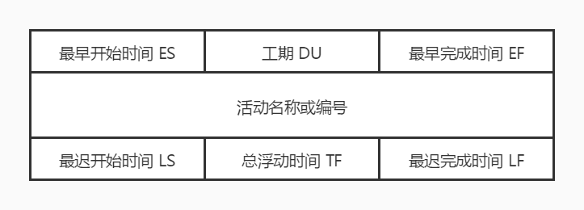

# 制定进度计划

在学习完项目进度管理其它的过程之后，我们最后再来学习制订项目进度计划这个过程。主要的原因也是在这个过程中有非常多的工具和技术牵涉到计算相关的内容。同时也和我们之前学习过的许多内容有关联，所以就将它放到了最后再来进行学习。

## 制定进度计划的概念

制定进度计划是分析活动顺序、持续时间、资源需求和进度制约因素，创建项目进度模型的过程。制定项目进度计划是一个反复多次的过程，这里同时也体现了项目的渐进明细的特点，这一过程确定项目活动计划的开始与完成。

制定进度计划可能要求对历时估算与资源估算进行审查与修改，以便进度计划在批准之后能够当作跟踪项目绩效的基准使用。制订进度计划过程随着工作的绩效、项目管理计划的改变，以及预期的风险结果，发生或消失，或识别出新的风险而贯穿于项目的始终。

对于项目的进度计划来说，有几个时间制约因素是我们需要关注的。这些制约因素会对项目有强制性的制约，比如说老板说哪天要上线！

- 活动开始或结束的强制性日期——用来约束项目的开始时间不早于开始日期或者项目结束的时间不晚于结束日期。

- 项目发起人、客户或者其他干系人经常指定关键事件或里程碑，他们都会影响在指定日期内完成项目交付物。

其它需要关注的进度计划数据与信息还包括：里程碑、计划活动、活动属性、假设与约束因素、按时间段提出的资源需求、其他可供选择的进度计划、进度应急储备。

## 制订进度计划输出

首先就是进度基准，这个东西就是经过批准的项目进度计划。到此，我们已经知道了 范围基准 和 进度基准 。那么 项目进度计划 都包含什么呢？

项目进度计划是进度模型的输出，展示活动之间的相互关联，以及计划日期、持续时间、里程碑和所需资源。具体包括三种：

- 里程碑进度计划，也叫里程碑图。只标示出主要可交付成果和关键外部接口的计划开始或完成日期。

- 横道图。也就是我们常说的甘特图，活动列于纵轴，日期排于横轴。 常用于向管理层汇报情况使用。甘特图简单明了，直观并且易于编制，但是不能表示复杂关系，难以定量计算和分析。

- 项目进度网络图。这个是我们后面马上要学习到的重点内容，也就是关键路径法绘制的网络图。

教材上的里程碑图和甘特图的示例。相信不少同学应该早就见过甘特图了，不管是在 Windows 下使用的微软 Project 还是在 Mac 下使用的 Omni Plan ，核心的功能都是绘制这样的甘特图。在这种图中，横条表示任务跨越的时间，菱形一般就表示为 里程碑 。连线就是表示 任务活动 之间的 逻辑关系 ，也就是我们上节课中讲过的 FS 、FF 那些。

关于制订进度计划的概念与输出的内容就是这些，下面就是整个进度管理中最为核心的内容，也就是关于项目进度网络图相关的内容。

## 关键路径法

关键路径法（CPM）是借助网络图和各活动所需时间（估计值），计算每一项活动的最早或最迟开始和结束时间。CPM算法的核心思想是将工作分解结构（WBS）分解的活动按逻辑关系加以整合，统筹计算出整个项目的工期和关键路径。

关键路径法沿着项目进度网络路线进行正向与反向分析，从而计划出所有计划活动理论上的最早开始与完成日期、最迟开始与完成日期，不考虑任何资源限制。

还记得我们在进度管理第一篇文章中看到的那个网络图吗？

在这张图中，有几个箭头线条加粗了，你能看出来这是什么意思吗？其实这加粗的线段内容就是我们所说的关键路径。对了，你还记得这个网络图每个结点的意思吗？

你可以尝试将上图各个结点路径的工期加起来，就会发现加粗的这一条路径是工期最长的。

- ABFGH：2+18+10+170+35=235

- ACFGH：2+13+10+170+35=230

- ABDEH：2+18+8+15+35=78

很明显，ABFGH 就是这条加粗的路径，这条路径在我们的网络图中表示的就是 **“关键路径”** 。 在项目管理领域，关键路径是非常重要的一条路径，其实你可以看出，关键路径决定着我们的项目的最终工期。如果关键路径上的任务延期了，那么我们的项目也极大可能会要延期。同时，我们这个网络图比较简单，关键路径是有可能不止一条的。但，反过来说，每个项目又必须要有一条关键路径。

### 关键路径法正推工期

好了，你已经清楚工期的作用了，接下来我们来看进度网络图结点中的四个角，也就是最早开始时间ES、最早完成时间EF、最迟开始时间LS和最迟完成时间LF。

最早开始时间就是我们这个活动最早可以什么时候开始。A 结点的 ES 自然是 0 ，它是整个任务的开始结点，所以我们从零开始。那么对应的它的最早完成时间 EF 就是 ES + 工期，也就是 2 。

接下来我们看结点 B 。它的最早开始时间是上一个任务的最晚完成时间，也就是 A 的 LF 。毕竟要等到 A 结束了我们才能开始 B 。在网络图中，默认都是走的 FS ，也就是完成到开始这种逻辑关系。所以 B 结点的最早开始时间是 2 ，最早完成时间是 2+18=20 。

同样地方式，我们计算出 C 结点，它的最早开始时间和 B 结点是一样的，都是从 2 开始，但是它的工期短，所以它的最早完成时间是 15 。从这里，我们就可以看到，在 B 和 C 结点中，B 结点的工期更长，C 的工期较短，如果 C 出现延误的话，对于总工期的影响不大，或者说在一定的范围内不会影响总工期。这个范围其实就是 C 比 B 少的那几天，也就是 C 最多可以晚个 5 天再开始也不会对总的工期产生影响。但如果 C 超过 5 天了，那么它的工期就超过 B 了，这样的话，它就会因为延期而成为关键路径。

按照这样的方式，我们就可以依次地推算出整个项目全部任务的 ES 和 EF ，直到最后的任务 H ，并且可以确定出我们的关键路径就是 ABFGH 这条路径。其中 F 和 H 结点是比较特殊的两个任务结点，因为它们有两个上级（紧前活动），那么 F 和 H 的 ES 怎么确定呢？这种情况下的 ES 的公式是 最大的紧前活动的 EF 就是当前这个活动的 ES 。比如 F 的紧前是 B 和 C ，最大的 EF 是 B 的 EF 20 ，那么 F 的 ES 就是 20 。

上述过程其实就是我们通过正向的方式去推算 ES 和 EF ，通过这样的步骤我们可以确定出关键路径 CPM 以及整体项目完工时间。

### 关键路径法逆推最晚完工时间

好了，剩下的 LS 、LF 和 TF 是什么呢？我们先来看 LS 和 LF 如何推算。一般来说，我们在完成了正向推算后，最后一个活动也就是 H 活动的 EF 就是总工期的完成时间，那么它的 LF 其实也是这个时间，所以我们可以确定 H 的 LF 是 235 ，而它的 LS 就是 LF-DU 也就是 200 。活动 H 的 EF=LF，ES=LS。

然后我们向前逆推，H 的前面有两个结点，分别是 E 和 G ，我们随便看一个就可以，就拿 E 为例。E 的 LF 应该是 H 的 LS ，也就是它的最晚结束时间是 H 的是最晚开始时间，E 的 LS 同样为 LF-DU ，所以 E 的 LS 最后计算的结果是 185 。

单个结点好说，我们来看一下 B 结点和 A 结点，它们都有两个后继，而逆推回来的话，它们的 LF 要怎么确定呢？LF 是最晚结束时间，也就是说，这个活动最晚结束的时候一定是要早于后续所有的最晚开始时间的。这样的话，其实 LF 的终极公式应该是 紧后活动最小的那个LS 。比如 B 结点的紧后是 D 和 F ，最小的 LS 是 F 的 20 ，那么 B 的 LF 就是 20 。

逆推完成之后，仔细看图，有没有发现一个特点，**关键路径上的 EF=LF，ES=LS** 。

### 正向与逆向步骤总结

通过正向计算，推算最早完工时间的步骤：

- 从网络图始端向终端计算

- 第一活动的项目开始，第一个活动的 ES 为 0

- 活动开始时间加持续时间

- 后续活动的开始时间根据前置活动的时间和搭接时间而定

- 多个前置活动存在时，根据最迟活动时间来定

通过反向计算，来推算出最晚完工时间：

- 从网络图终端向始端计算

- 最后一个活动的完成时间为项目完成时间

- 活动开始时间为完成时间减持续时间

- 前置活动的完成时间根据后续活动的时间和搭接时间而定

- 多个后续活动存在时，根据最早活动时间来定

### 总浮动时间与自由浮动时间

总浮动时间，也可以叫做总时差，也就是我们活动结点图中下方中间的 TF 。它表示的是在不延误项目完工时间且不违反进度制约因素前提下，活动可以从最早开始时间推迟或拖延的时间量，也就是该活动的进度灵活性。它的计算方法是本活动的最迟完成时间减去本活动的最早完成时间，或本活动的最迟开始时间减去本活动的最早开始时间。LS-ES 或 LF-EF 。很明显，**关键路径的 TF 都是 0** ，而C、D、E这三个非关键路径上结点都是有 TF 的。比较直白的说，就是这些非关键路径活动可以延误的时间，比如 C 延误在 5 天的话不会影响最后的总工期 235 天，这个 5 天就是 C 的总浮动时间（总时差）。

除了总浮动时间外，还有一个自由浮动时间的概念，它指的是在不延误任何紧后活动的最早开始时间且不违反进度制约因素的前提下，活动可以从最早开始时间推迟或拖延的时间量。自由浮动时间也可以叫做自由时差，计算方式是紧后活动最早开始时间的最小值减去本活动的最早完成时间。还是拿 C 来看，它的紧后只有一个 F ，那么它的自由时差就是 F 的 ES 20 ，减去它自己的 EF 15 ，结果是 5 。一般来说，自由时差是会小于总时差的，并且自由时差的计算也会比较少。它关注的是前后两个活动一对多的情况。自由时差一般不会在活动结点中展示出来，它的缩写是 FF .

### 公式总结

经过上面的讲解，其实我们就可以得到活动节点各个开始结束时间以及总时差和自由时差的公式。在这里我们总结一下。

- ES = max(紧前活动的EF)，也就是当前这个节点的最早开始时间是这个节点之前所有活动中最大的那个 EF 

- EF = ES + DU

- LF = min(紧后活动的LS)，这个指的是最迟完成时间的确定应该是这个节点后续的所有节点中最小的那个 LS 的值

- LS = LF - DU

- TF = LS - ES 或 LF - EF

- FF = min(紧后活动的ES) - EF 

这几个缩写代表的意思一定要明白，这几个公式也一定要熟记于心。**重点中的重点，或者说是整个信管师学习的超级重点之一。**另一个超级重点就是我们下一章节要学习的成本管理中的挣值管理的计算。每次考试的案例计算题这两种必出其一，甚至是一道题中融合这两种计算。（比如先让你算工期，也就是计算进度，然后再问你成本、进度情况，这是挣值计算的内容）。**再次提醒，每次考试必有其一！！**

## 关键链法

关键链法（CCM）是一种进度规划方法，允许项目团队在任何项目进度路径上设置缓冲，以应对资源限制和项目的不确定性。这种方法建立在关键路径法之上，考虑了资源分配、资源优化、资源平衡和活动历时不确定性对关键路径的影响。

关键链法引入了缓冲和缓冲管理的概念。

- **项目缓冲** 一般放置在关键链末端，用来保证项目不因关键链的延误而延误。

- **接驳缓冲** 一般放置在非关键链与关键链的接合点，用来保护关键链不受非关键链延误的影响。

一旦确定了“缓冲活动”，就可以按可能的最迟开始与最迟完成日期来安排计划活动。这样一来，关键链法不再管理网络路径的总浮动时间，而是重点管理剩余的缓冲持续时间与剩余的活动链持续时间之间的匹配关系。

## 资源优化技术

资源优化技术是根据资源供需情况，来调整进度模型的技术，包括（但不限于）：

- 资源平衡（Resource Leveling）。为了在资源需求与资源供给之间取得平衡，根据资源制约对开始日期和结束日期进行调整的一种技术。**资源平衡往往导致关键路径改变，通常是延长。**

- 资源平滑（Resource Smoothing）。对进度模型中的活动进行调整，从而使项目资源需求不超过预定的资源限制的一种技术。**资源平滑不会改变项目关键路径，完工日期也不会延迟。**活动只在其自由浮动时间和总浮动时间内延迟。资源平滑技术可能无法实现所有资源的优化。

## 进度压缩技术

进度压缩技术是指在不缩减项目范围的前提下，缩短进度工期，以满足进度制约因素、强制日期或其他进度目标。进度压缩技术包括（但不限于）：

- 赶工。通过增加资源，以最小的成本增加来压缩进度工期的一种技术。赶工的例子包括：批准**加班**、增加额外资源或支付加急费用，来加快关键路径上的活动。**赶工可能导致风险和/或成本的增加。**

- 快速跟进。将正常情况下按顺序进行的活动或阶段改为至少是部分并行开展。**快速跟进可能造成返工和风险增加。**

## 例题

上面讲了那么多，如果你是没有 PMP 的基础或者第一次看的话，那么相信你和我第一次看到这里应该是一样的感觉，那就是两个字：懵逼。不要怕，不要急，光说不练假把式，我们用一个例题来说就会非常清楚了。

某项目细分为 A、B、C、D、E、F、G、H 共八个模块，而且各个模块之间的依赖关系和持续时间如下表所示：

|  活动代码   | 紧前活动  | 活动持续时间（天） |
|  ----  | ----  | ----  |
| A  | - | 5  |
| B  | A | 3  |
| C  | A | 6  |
| D  | A | 4 |
| E  | B、C | 8  |
| F  | C、D | 5  |
| G  | D | 6  |
| H  | E、F、G | 9  |

【问题1】（4分） 计算该活动的关键路径和项目的总工期 

【问题2】（8分）
（1）计算活动 B、C、D 的总体时差 
（2）计算活动 B、C、D 的自由时差 
（3）计算活动 D、G 的最迟开始时间 

【问题3】（5分）如果活动 G 今早开始，但工期拖延了5天，则该项目的工期会拖延多少天？请说明理由。 

【问题4】（5分）请简要说明什么是接驳缓冲和项目缓冲。如果采取关键链法对该项目进行进度管理，则接驳缓冲应该设置在哪里？

看到没有，在这一道题中考察了我们多少知识点。一是要画出这个网络图，要不你不知道工期，二是自由时差、总时差的计算，三是关键链法中两个缓冲的理论知识。

首先，我们要进行网络图的绘制，也就是使用关键路径法获得那样一个完整的网络图表。这样关键路径，自由时差、总时差就全出来了。问题1-3就全都解决了。

第一步，我们根据表格画出大概的网络流程图。

第二步，下向推算出 ES 、EF ，从而得到关键路径和总工期。

第三步，逆向推算出 LS、LF 和 总时差，当然也可以轻松计算自由时差了。至此，前三个问题全部解决。

上面的手绘图可能看不太清，我再用电脑画一个详细的图。

好了，现在说下答案吧。

- 问题一：关键路径：A-C-E-H，总工期28天。

- 问题二：
    - （1）B的总时差为3，C的总时差为0，D的总时差为4
    - （2）B的自由时差为3，C的自由时差为0，D的自由时差为0
    - （3）活动D的最迟开始时间为28-9-6-4+1=10，第10天早上必须开始。活动G的最迟开始时间为28-9-6+1=14，即第14天早上必须开始。**（注意，如果问到从哪天开始的话，ES 或者 LS 都要加一天。为什么呢？因为我们为了方便计算第一个节点是从 0 开始的，这个 0 代表的是第 0 天，但其实真正项目开发我们是从第一天开始的。所以，有的网络图会将第一个节点的 ES 定为 1 ，这样的话就不用加 1 了，而我比较习惯的是从 0 开始，这种就需要加 1 了。）**

- 问题三：工期会延误一天，理由是：G 的总时差为4，延误了5天，它的 DU 会变成 9 天，从而导致 G 成为关键路径节点，关键路径变为 A-C-G-H 所以，工期变为 29 天，所以工期会延误1天。

- 问题四：上面我们讲过的 关键链法 中的内容，背下来，写在这里。

以上例题来源于 信管网 ，是2019年下半年的案例真题。这种题是所有进度相关的计算题中最简单的，只需要画出网络图来就好了。如果看到考试的时候是这种题，那你就好好偷笑吧。除了这种题之外，还可能会出甘特图类型的，或者多种任务综合起来的，不过不管是怎样，核心都是要把这个网络图画出来。

至于要考试的同学，买那个真题的参考资料多做吧，没别的办法。本题的原文链接是 [http://www.cnitpm.com/pm1/77498.html](http://www.cnitpm.com/pm1/77498.html) 。

## 总结

今天的内容是整个进度管理中重点的重点。特别是关键路径法绘图这一块，以及节点中各种部分的公式计算法则。不管是选择题还是案例题，最直接的方式都是把图画出来，只要能把这个网络图画出来，相信你离做对题目就已经不远了，剩下的无非就是各种公式的替换而已。当然，出题者还有可能出各种变种的题目出来，有的是会有一些烧脑的，但还是那句话，把握进度计算的根本规则和公式。

《信息系统项目管理师计算类试题真题详解》、《信息系统项目管理师2013至2018年试题分析与解答》都是不错的参考书哦。

参考资料：

《信息系统项目管理师教程》

《某机构培训资料》

《项目管理知识体系指南 PMBOK》第六版