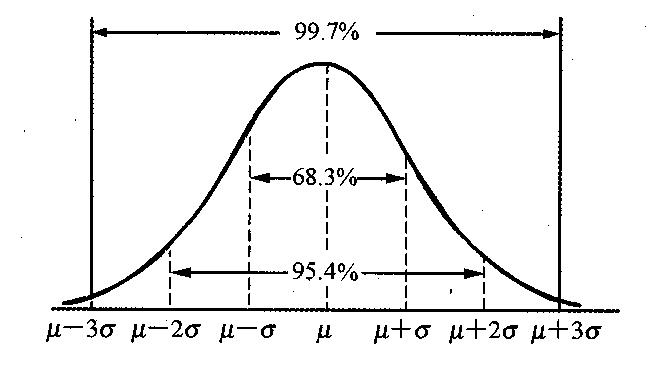

# 进度管理知识点汇总

在项目进度管理这一块，我们突然一下就接触到了不少的计算操作，而且接触到的工具概念也相比范围管理来说多了很多。因此，我们在这里进行一次小的总结。

## 活动顺序与逻辑关系

还记得什么是活动吧？活动就是 WBS 再次分解之后的内容。有了活动之后，我们最先要做的就是排列活动顺序。而在排列活动顺序中，我们更需要关注的是活动的逻辑关系和依赖关系。

逻辑关系有四种：结束-开始的关系（F-S型）、结束-结束的关系（F-F型）、开始-开始的关系（S-S型）、开始-结束的关系（S-F型）。

依赖关系也有四种：强制性依赖关系、选择性依赖关系、外部依赖关系、内部依赖关系。

## 箭线图法与虚活动

在箭线图法中，我们最主要关心的是箭线图、网络图、虚活动相关的定义。另外，箭线图也是可以转换成网络图的，这个大家可以自己练习一下。另外我们还要熟悉提前量、滞后量相关的概念。

## 估算工具

知道 德尔菲法 的评估流程，了解 参数估算 和 类比估算 的区别。另外还有 储备分析 。关于储备分析，主要就是 应急储备 和 管理储备 。

- 应急储备的特点：用来处理预期但不确定的事件（已知的已知）；是时间（成本）绩效基准的一部分；项目经理可以自由使用；作为预算分配（成本估算+应急储备=项目完工预算，项目完工预算+管理储备=项目总资金需求）；是挣值计算的一部分。

- 管理储备的特点：用来处理非预期且不确定的事件（未知的未知）；不属于时间（成本）绩效基准；动用之前一般需要获得批准；不作为预算分配；不是挣值计算的一部分。

最后，在估算工具中还有一个非常重要的 三点估算 ，或者叫 计划评审技术（PERT）。还记得那几个公式吗？

- 最可能时间（tM, OM）。基于最可能获得的资源、最可能取得的资源生产率、对资源可用时间的现实预计、资源对其他参与者的可能依赖关系及可能发生的各种干扰等，所估算的活动持续时间。

- 最乐观时间（tO, OT）。基于活动的最好情况所估算的活动持续时间。

- 最悲观时间（tP, OP）。基于活动的最差情况所估算的持续时间。

- 三角分布：tE = (tO + tM + tP) / 3 

- β分布：ti = (tO + 4 * tM + tP) / 6

- 方差：σi2 = (tP - tO)2 / 62

- 标准差：σi = (tP - tO) / 6

最后，通过这些公式，我们可以计算出那个正态分布的大概分布范围，所以那个分布曲线也是非常重要的一个曲线。

由这个曲线得到的三个结果会是非常重要的比率：

- 1σ 的范围在 68.3% 

- 2σ 的范围在 95.5%

- 3σ 的范围在 99.7%

同样的，PERT 相关的练习题也是大家需要重点练习的内容。

## 关键路径法计算活动图

上一课我们整个文章就是在讲这个关键路径法的计算。

- ES = max(紧前活动的EF)，也就是当前这个节点的最早开始时间是这个节点之前所有活动中最大的那个 EF 

- EF = ES + DU

- LF = min(紧后活动的LS)，这个指的是最迟完成时间的确定应该是这个节点后续的所有节点中最小的那个 LS 的值

- LS = LF - DU

- TF = LS - ES 或 LF - EF

- FF = min(紧后活动的ES) - EF 

如何正推，如果逆推，分别计算的是什么内容。这些想必不用我再多说了，这些公式是重点中的重点，整个考试中两大计算之一，重要程度相信不用我再多解释了。剩下的就是一停的刷题做题了。另外我们也再提供一些关键点：

- 最长的路径是 关键路径 。

- 关键路径可能有一条或者多条。

- 关键路径越多风险越大。

- 总时差 TF 决定进度安排灵活性。

- 自由时差 FF 决定后续活动安排灵活性。

## 关键链法、资源优化、进度压缩

关键链法的两个缓冲，资源优化的资源平衡和资源平滑、进度压缩的赶工和快速跟进。

最后还有一个就是我们缩短（压缩）工期的一些方法：

- 关键路径活动的调整（快速跟进）

- 非关键活动的调整

- 投入更多的资源以加速活动进程（赶工）

- 指派经验更丰富的人去完成或帮助完成项目工作

- 减少活动范围或降低活动要求

- 改进方法或技术提高生产效率

## 总结

这一课的内容就是整个进度管理的核心重点内容。当然，更具体的内容还需要大家在之前的课程中进行深入的学习了解。更重要的是，计算相关的内容一定要多刷题。

参考资料：

《信息系统项目管理师教程》

《某机构培训资料》

《项目管理知识体系指南 PMBOK》第六版