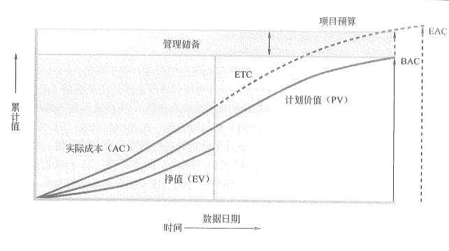
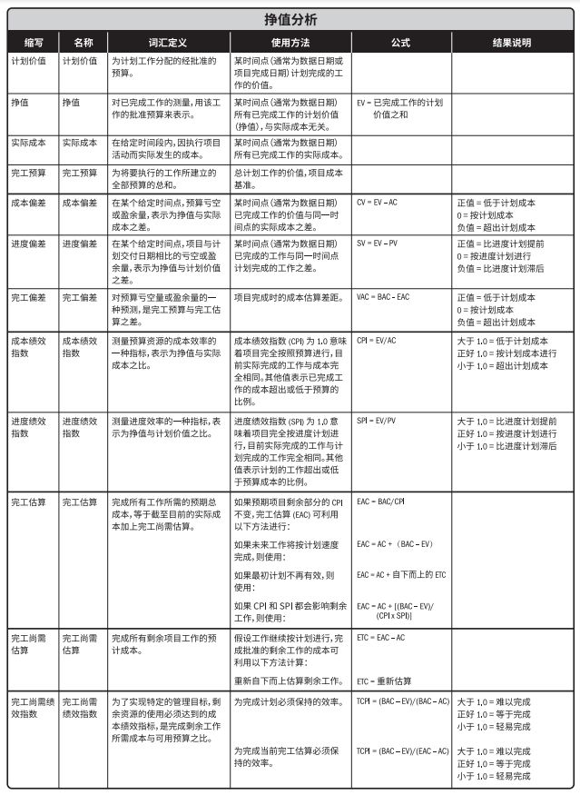

# 成本挣值计算

铺垫了那么久，不知道大家期待不期待。总算到了挣值计算这一课，这个名字很奇怪呀，什么叫做挣值？成本不就是我们的投资吗？这个挣值到底是要干嘛？带着这些疑问，我们就来看看挣值计算到底是在计算个啥。

## 挣值分析

挣值管理（EVM）是把范围、进度和资源绩效综合起来考虑，以评估项目绩效和进展的方法。它是一种常用的项目绩效测量方法。它把范围基准、成本基准和进度基准整合起来，形成绩效基准，以便项目管理团队评估和测量项目绩效和进展。

EVM 的原理适用于所有行业的所有项目。它针对每个工作包和控制账户，计算并监测以下三个关键指标。

- 计划价值（PV），也可以叫做 BCWS ，这两个英文缩写都表示的是计划价值。它就是为计划工作分配的经批准的预算。它的公式是 计划工作量 * 预算定额 。比如我们某个活动计算出来每天的各种人员工资、资源、材料的成本是 1000 元，需要实施 30 天，那么这个活动的 PV 就是 30000 元。项目总的计划价值，也就是所有活动汇总的工作量与预算的乘积就是项目的总计划价值，简称为 BAC 。

- 挣值（EV），另一个缩写是 BCWP ，是对忆完成工作的测量值，用分配给该工作的预算来表示。它的公式是 已完成工作量 * 预算定额 。同样还是上面那个任务，假设我们在第 10 天的时候实际完成了 12 天的工作量，那么我们的挣值 EV 就是 12000 ，明显的，我们做得比 PV 的要多，这是进度 提前 的一种标志。相反的情况下，如果我们的 EV 没有 PV 多，那就是项目处在 落后 状态下了。

- 实际成本（AC），另一个缩写是 ACWP ，是在给定时间段内，执行某工作而实际发生的成本。比如上面那个活动，实际我们在第 10 天的时候就消耗了 13000 元的成本，而我们的 EV 也就是实际挣出来的价值是 12000 ，这也就说明我们的实际成本 超支 了。相反，如果我们实际的成本小于挣值的话，则是有 节余 。

这三个指标是挣值计算的核心指标，你会发现一个问题，那就是它们都必须有一个 时间维度 。如果没有这个时间维度，那么挣值的计算就没有意义。PV 代表指定时间计划的价值，干没干活这个值都存在，是我们 估算成本 和 制定预算 的结果；EV 表示指定时间内我们实际上干了多少活，这些活值多少钱，事情发生了，但我们只看干的活的价值；AC 表示实际上在这段指定时间内我们到底花了多少钱，事情发生了，我们不看干了多少活，只看花了多少钱。

## 偏差分析

其实在上面我们通过 EV 和 AC 与 PV 的计算，就已经看出了利用这三个数值我们就可以知道大概的项目进度情况和成本情况。是不是很神奇，其实这些也是有公式的，分别是偏差公式和绩效指数。

- 进度偏差（SV），表示挣值与计划价值之差。它的公式是 SV = EV - PV 。前面我们讲 EV 的时候就讲过，EV 与 PV 的关系可以表示进度情况。所以现在这样相减之后，我们就可以根据减法的结果来确定进度情况，如果 SV 小于 0 时，进度是落后的，而当 SV 大于 0 时，进度是提前的。当它刚好等于 0 时，表示进度刚刚好。

- 成本偏差（CV），表示为挣值与实际成本之差。它的公式是 CV = EV - AC 。同样是我们在前面讲 AC 的时候就说过，EV 与 AC 的差值可以看出成本的情况。如果 CV 小于 0 ，那么成本就超支了，如果 CV 大于 0 ，表示目前还有节余。

- 进度绩效指数（SPI），表示为挣值与计划价值之比，也就是 SPI = EV/PV 。这个公式会获得一个进度系数，如果这个系数大于 1 则进度提前，如果小于 1 则进度落后。总体思想和 SV 的概念是一致的，不过后面我们学习到的一些其它公式会用到这种系数形式的数据方便计算。

- 成本绩效指数（CPI），表示为挣值与实际成本之比，也就是 CPI= EV/AC 。同样的，它和 CV 的思想是相同的，如果大于 1 表示有节余，如果小于 1 表示超支了。

这四个概念和公式也是非常重要的指标，我们可以看出，不管是 SV 还是 CV ，小于 0 都代表着不好的事情，大于 0 都代表着好事。同理，SPI 和 CPI 也是小于 1 都代表着不好的事，而大于 1 代表着进度和成本都不错。这也是一种记忆的方式，小于都坏事，大于受欢迎。

## 预测

随着项目不断前进，项目团队可以根据上面的项目绩效，来对完工估算（EAC）进行预测，这个预算的结果可能与完工预算（BAC）存在差异。又来新名词了，BAC 我们在前面已经说过了，就是所有活动 PV 汇总起来，也就是整个项目的预算就是 BAC 。而完工估算 EAC 则是我们在开始项目一段时间后，根据挣值分析的结果来估算出来的最终的花费是多少。理想状态下当然是 EAC = BAC 了。当然，都说了是理想状态了，能够这样正正好的情况也是少之又少的。

那么这个 EAC 要如何计算呢？这又要再牵扯出另一个名词了，剩余工作的完工尚需估算（ETC）。这又是什么鬼？它其实就是我们在执行一段项目工作之后，剩下的工作还需要多少成本。通过这个概念，我们先给出第一个 EAC 的公式。

- 1）假设项目经理以已完成工作的实际成本为基础，并根据已积累的经验来为剩余项目工作编制一个新估算的话，那么 EAC = AC + 自下而上的 ETC 。

这个公式的应用不多，如果题目中说明了是根据经验完全重新估算了 ETC 的话，那么它肯定会给出估算后的 ETC 和 AC ，让你简单地求一下 EAC 就好了，也就是相加一下。

除了这个方法外，我们还可以通过 CPI 和 SPI 等方式来计算各种风险情境下的挣值分析数据的 EAC 值。这几个方法会更重要一些，也是必须掌握的：

- 2）假设将按预算单价完成 ETC 工作，也就是说，后面的工作还是按我们之前 PV 的预算进行。这种方式是说不管目前的 EV 偏差是好是坏，都不管了，后面的继续按之前 PV 的计算。于是，后面的 ETC 实际上就是 BAC - EV 了，而 EAC 就是 AC + 这个 ETC 。完整的公式就是：EAC = AC+(BAC-EV) 。这种计算方式也叫做 **非典型偏差** 计算。比如，当前的 EV 是 1000 ， AC 是 1100 ，BAC 是 12000 ，那么 EAC 就是 1100 + （12000 - 1000）= 12100 ，最后预测出来总体成本花费要超支了 100 块。

- 3）假设以当前的 CPI 继续完成 ETC 工作，也就是说，后面的 ETC 预算以当前 EV 和 AC 的比率进行计算。这个就很好理解了，整个预算 BAC 与我们计算出的 CPI 的比值就是整体的 EAC 了。公式为：EAC = BAC/CPI 。这种计算方式也叫做 **典型偏差** 计算。比如，当前的 EV 是 1000 ， AC 是 1100 ，BAC 是 12000，那 EAC 就是 12000 / （1000/1100） = 13200 ，我们预测出来的 EAC 要超支了 1200 块。

-4）假设 SPI 与 CPI 将同时影响 ETC 工作，这个就说明两个指标都有可能对后续的工作造成影响，那么我们就需要将这两个指标同时代入计算。后续工作 BAC-AC 的变动会和 CPI 和 SPI 都产生影响，那么 ETC 也就等于 （BAC-EV）/（CPI*SPI）。最后计算 EAC 的公式就是 EAC = AC+[(BAC-EV)/(CPI\*SPI)]。比如，当前的 EV 是 1000 ， AC 是 1100 ，PV 是 1200 ，BAC 是 12000，那 EAC 就是 1000 + (12000-1000)/[(1000/1100)\*(1000/1200)] = 15520  ，我们预测出来的 EAC 要超支了 3520 块。为啥呢？因为我们的 CPI 和 SPI 都小于 1 了，进度落后，成本超支，两个一起作用后续的工作的话，那肯定是越来越惨了。

通过上面的学习，我们已经知道了一大堆名词、缩写和公式了，不知道大家能不能完美的区分它们。其实我们可以通过一下面这张图片，来更深入地理解挣值分析中的这些数据内容。

中间的那个竖线就是我们给定的时间节点。因此，挣值只是到这个时间节点，没有向后的内容。而 PV 是计划价值，是我们预先计算出来的，因此这条曲线是到终点的，终点的 PV 也就是整体项目的预算就是 BAC 。AC 实际成本也是截止到这个时间节点所发生的实际成本，也是没有后续的。但是我们可以通过上面的一些计算方法获得从时间节点到项目结束的预估成本，也就是 ETC 。当 AC 与 ETC 结合后，就会获得整个预估的总成本，也就是 EAC 了。相信这张图会让你对上面的这些概念有更深入的理解。同时，我们还能从图中看到一个特点，那就是管理储备是不包含在预算中的。这个在之前的文章中我们也讲过，也就是制定预算过程输出的成本基准，它就是我们的 BAC 。

## 完工尚需绩效指数

完工尚需绩效指数（TCPI）是一种为了实现特定的管理目标，剩余资源的使用必须达到的成本绩效指标，是完成剩余工作所需的成本与剩余预算之比。TCPI 是指为了实现具体的管理目标（如 BAC 或 EAC），剩余工作的实施必须达到的成本绩效指标。如果 BAC 已明显不再可行，则项目经理应该考虑使用 EAC 进行 TCPI 计算。经过批准后，就用 EAC 取代 BAC 。基于 BAC 的 TCPI 公式是： TCPI = (BAC/EV)/(BAC-AC) 。

如果累计 CPI 低于基准，那么项目的全部剩余工作都应立即按 TCPI（BAC） 执行，才能确保实际总成本不超过批准的 BAC 。至于所要求的这种绩效水平是否可行，就需要综合考虑多种因素（包括风险、进度和技术绩效）后才能判断。如果不行，就需要把项目未来所需的绩效水平调整为 EAC 的 TCPI 。基于 EAC 的 TCPI 公式是：TCPI = (BAC-EV)/(EAC-AC) 。

这两个东西又是啥玩意？讲得这么深奥，看着都头晕。其实很好理解，就是如果说，按现在的绩效指标要完成 BAC 的预算的效率如何。如果 BAC 确实不太实际了，那就再用 EAC 做为分母来计算以当前情况完成工作需要保持的效率。这两种公式的结果，如果小于 1 表示难以完成，大于 1 表示轻易完成，等于 1 的话就是正好完成啦。

这两个公式的例子就不单独给出了，我们在最后的例题中再详细的说明。

## 公式总结

怎么样？今天的公式嗨不嗨。其实总体来说还算过得去吧，都只是简单的加减乘除而已。只是有些概念可能需要你搞清楚。有的公式如果你理解了，其实会更好记忆。注意，这些公式，今天的课程内容， **全部都是重点**。

下面这张图是 PMBOK 第六版中的一个挣值计算汇总表。当然网上也有很多，不过更推荐的是你自己整理一份记在小本本上，没事的时候就拿出来看两眼，毕竟这个太重要了，图片后面我们也会简单地把公式都列出来一份（如果图片不太清晰的话）。之前我们就说过，下午的案例分析题中，必有一道计算，要么进度网络图、要么挣值分析，要么这两个结合起来。反正，这两货真的是你必须掌握的内容。

- CV = EV - AC

- SV = EV - PV

- VAC = BAC - EAC （这个我们没说，看图表说明吧，很好理解）

- CPI = EV/AC

- SPI = EV/PV

- EAC = BAC/CPI 或 AC+(BAC-EV) 或 AC+自下而上的ETC 或 AC+[(BAC-EV)/(CPI*SPI)]，根据实际情况决定，如果是做题，题目里注意关键词：典型、非典型、之前的、不按之前的等等。

- ETC = EAC - AC 或 重新估算 。

- TCPI = (BAC/EV)/(BAC-AC) 或 (BAC-EV)/(EAC-AC) ，同样，现实项目中根据实际情况，题目中则是把握关键字：继续计划、计划已经不可行了之类的。

## 例题

好了，和进度管理中的网络图（关键路径法）一样，不来个例题这些公式真的会让人感觉非常飘渺。那么我们就来一个例题吧。

财政基本建设管理信息系统是一套能够为财政服务，提供财政基本建设资金管理，财务监督、审核，为财政的基建科、预算科和国库科等相关部门提供数据互享的工程项目管理的应用系统。系统充分地体现财政部门对基本建设项目的管理，对国家预算安排的基本建设资金的使用的管理，反映财政部门对基本建设项目的管理，更好地实现财政的管理监督的职能作用。

张工是大型电子政务系统集成商信息技术有限公司(CSAI )的项目经理，目前正作为项目经理负责CSAI与某地财政局开发的基本建设管理信息系统项目，项目组成员包括项目经理1人、系统分析师1人、高级程序员3人、程序员3人、软件界面美工1人、测试人员2人、客户方技术人员2人。由于财政年度等因素，项目的计划工期为40周，预算成本为50万元。根据该项目的需求和进度等要求，项目具有工期紧、技术要求高、业务复杂等特点。为顺利实现项目进度和质量等目标，CSAI项目管理部门和高层领导对该项目格外重视，要求项目组每周汇报进度状态。

在项目的实施过程中，第19周时张工向公司经理报告项目的进展状态，在状态报告中经理列出了第18周(包含第18周)的项目状态数据，详细情况如下：

(1)截至项目状态日期，项目实际已完成的工作量为50%.

(2)截至项目状态日期，项目已完成工作量的实际成本(AC)为28万元。

(3)截至项目状态日期，项目的计划成本(PV)为26万元。

【问题1】(6分)

试确定项目截止到项目状态日期已完成工作量的挣值EV 。

【问题2】(6分)

预测项目结束时的总成本EAC 。

【问题3】(6分)

请对该项目在费用控制方面的执行状况进行分析。

【问题4】(7分)

项目经理在检查经费超支时发现，有一项任务F还没有开始实施，但为F任务购买设备的支票已经支付，其费用为4万元。另外，还有一张已经支付的支票，其费用为3万元，是作为整个H任务的硬件费用，但H任务在状态日期完成的工作量为40%.根据这一信息再预测项目结束时的总成本。

先读题，一定要把题读明白，然后我们开始套用上面表格中的公式把所有的数据计算出来。在这里不管有用没用的，就当做是练习，我们把所有的数据都计算好。

- BAC=50万，PV=26万，AC=28万，EV=25万，这四个是哪里来的？“预算成本为50万元”，这就是 BAC；然后在详细情况中，实际已完成工作量为50%，那么 EV 就是 50万*50% 结果为 25万；剩下的 AC 和 PV 都直接写出来了。

- CV=EV-AC=25-28=-3万，CPI=EV/AC=25/28=0.89，SV=EV-PV=25-26=-1万，SPI=25/26=0.96，不用多解释了吧，目前看来，进度落后，成本超支。

- EAC=BAC/CPI=50/0.89=56.18万，为什么用这个公式呢？因为题目里没给啥有用的信息，我们就假设后面的工作都会受到 CPI 的影响，也就是 **典型偏差** 来计算。如果题目中给出了是非典型的话，那么就用非典型的公式 AC+(BAC-EV)=28+(50-25)=53万。

- ETC=EAC-AC=56.18-28=28.17，VAC=EAC-BAC=56.17-50=6.17，这两个不多解释了。

- 如果以 BAC 来目标计算，TCPI=(BAC-EV)/(BAC-AC)=1.14，如果以 EAC 为目标来计算 TCPI=(BAC-EV)/(EAC-AC)=(50-25)/(56.17-25)=0.89，很明显，典型 EAC 来看的话，成功率会高些，而以之前的 BAC 为目标的话，可能项目完成的成功率就比较低了。注意，TCPI是大于1的更加难以完成。

问题1-3相信你已经没问题了。我们再来看一下问题4。仔细分析问题4，已经支付的支票其实就是 AC ，但是在我们统计的截止时间点，F任务还没开始，那么它的支出应该还不是算在当前时间点的，同理，H任务只完成了40%，那么其实还是60%是不算在当前的 AC 中的。因此，真实的 AC 就变成了 AC=28-4-3*0.6=22.2 。在这个情况下，CPI=25/22.2=1.13，典型的 EAC 就变成 50/1.13=44.24 。

这个例题也是选自 信管网 。它的原始链接和参考答案是：[https://www.cnitpm.com/pm/235.html](https://www.cnitpm.com/pm/235.html)

你会发现，在这个参考答案中，计算 EAC 的方式和我们的不一样。其实这也是一个小技巧，如果是典型偏差，并且知道当前的进度百分比情况之后，可以 AC/进度百分比 来计算整体的 EAC 。我们计算的结果和这个例题中的计算结果有些许的偏差，这是计算方式和单位转换的区别，很明显参考答案的计算方式更好计算一些，但为了大家熟悉公式，我在上面还是使用的传统公式。考试过程中你的步骤清晰明确，可以省略部分小数点，这个是不会有太大影响的。

记住，公式一定要列出来。然后 PV、EV、AC 一定要找到，如果这三个值有一个错了，剩下的计算你想对也不太可能。但是，只要列了公式，分数多少都会给一些，这个分绝不能丢。此外，时间点要确认好，时间点有利于我们找到 BAC 以及推算 EV 。我们选取的例题还是比较简单的，大家一定要多做题，多看解析，搞明白数据是怎么来的。在挣值分析的计算题中，真正的难点其实不是公式，而是如果找到正确的 PV、EV、AC 。

## 总结

好了，恭喜你，信管师两大计算专题我们算是学完了。剩下的就只是不断地练习了，今天的所有内容都是重点。

但是说实话，不管是网络图的关键路径法计算还是挣值计算，公式、推理都不难，难的是他们会变换各种题型让你找不准真实的数据，比如进度题给各种怪异的参数提升你画出基础网络图的难度，而挣值方面则让你很难看出 EV 是多少，或者现在的 PV 是多少。这些才是难点。

没别的办法，刷题吧。再次推荐：《信息系统项目管理师计算类试题真题详解》、《信息系统项目管理师2013至2018年试题分析与解答》。

另外，网络上的资源也不少，没事做两道，不费什么时间的。

参考资料：

《信息系统项目管理师教程》 

《某机构培训资料》

《项目管理知识体系指南 PMBOK》第六版

