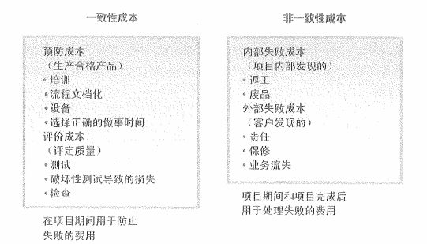

# 质量与质量管理过程

对于我们的项目管理理论相关的学习来说，质量是除了范围、进度、成本之外的另一个核心内容。还记得我们在学习敏捷的时候讲过的项目管理三角形吗？通过之前的课程，我们已经学完了它的三个支点。接下来，我们就要学习放在这个三角形中间的质量管理。

## 质量的定义

国际化标准组织（ISO）对质量（Quality）的定义是：“反映实体满足主体明确和隐含需要的能力的特性总和。”特性是指可区分的特征——可以是固有的或赋予的、定性的或定量的、有各种类别的（物理的、感官的、行为的、时间的、功能的等等。）而明确和隐含的需求则是指：

- 明确需求是指在标准、规范、图样、技术要求、合同和其他文件中用户明确提出的要求与需要。

- 隐含需求是指用户和社会通过市场调研对实体的期望以及公认的、不必明确的需求，需要对其加以分析研究。

### 质量与等级

在这里我们还需要了解一个重点的问题，那就是 质量 与 等级 的关系。质量作为实现的性能或成果，是“一系列内在特性满足要求的程度（ISO 9000）”。等级作为设计意图，是对用途相同但技术特性不同的可交付成果的级别分类。项目经理及项目管理团队负责权衡，以便同时达到所要求的质量与等级水平。质量水平未达到质量要求肯定是个问题，而低等级的产品事实上不是个问题。例如：

- 一个低等级（功能有限）、高质量（无明显缺陷，用户手册易读）的软件产品，该产品适合一般使用，可以被认可。

- 一个高等级（功能繁多）、低质量（有许多缺陷，用户手册杂乱无章）的软件产品，该产品的功能会因质量低劣而无效和/或低效，不会被使用者接受。

怎么理解这两个概念呢？之前我们都会拿苹果手机和安卓手机来举例子。当然，现在可能这个例子已经不是特别恰当了，但相信大家还是能体会到两者差别的。

苹果手机，是典型的低等级、高质量的代表。像是各种在安卓手机中早已实现的功能（屏下指纹、高刷等等），在苹果手机（iPhone13）上还是没有实现。但是，许多苹果和安卓都使用过的用户却会评价苹果手机要更经久耐用，而且用户体验感更好。

安卓手机，就像上面说的，它是高等级、低质量（现在已经不算是低质量了）的代表。当然，这个低质量的问题现在已经好很多了，如果时间再往前推7、8年的话，安卓阵营的机皇的质量感觉和苹果完全不在一个档次上。只是近些年来看，在相对价位的质量上，安卓阵营的品牌确实都已经是能够拿得出手了。

那么我们做互联网，做软件开发的话，哪种更好呢？我当然是更倾向于 低等级、高质量 。如果想要高质量，要么减少范围（功能），要么加人手（成本），要么调整进度。如果你想要范围（功能多），还不想加人手（成本），进度还不能延长，那么对不起，质量我就没法保证了。现在知道学习项目管理的好处了吧？对于向上沟通或者平行沟通来说，项目管理三角形可是神器哦。

### 项目质量

项目质量体现在性能和使用价值上，即项目的产品质量。项目质量是应顾客的要求进行的，不同的顾客有着不同的质量要求，其意图已反映在项目合同中。因此，项目合同通常是进行项目质量管理主要依据。项目质量管理的趋势包括：

- 客户满意：了解、评估、定义和管理需求，以便满足客户的期望。需要把“符合要求”（确保项目产出预定的成果）和“适合使用”（产品或服务必须满足实际需求）结合起来。

- 持续改进：由休哈特提出并经戴明完善的“计划-实施-改进-行动（PDCA）”循环是质量改进的基础。其实在敏捷以及我们的第二大章节介绍项目管理的时候，就提到过 PDCA 这个东西，可以说这玩意是整个项目管理的基础灵魂之一。除了 PDCA 之外，还有全面质量管理、六西格玛等等。

- 管理层的责任。项目的成功需要项目团队全员的参与。管理层在其质量职责内，肩负着为项目提供具有足够能力的资源的相应责任。一般来说，质量问题管理层要占85%的责任。

### 质量成本（预防）

大家可以思考一个问题，发生质量问题在什么时候是最划算的，或者说是解决质量问题代价最小的情况。估计不少人会说出来，那就是在产品出厂前被发现质量问题，这时候的代价肯定是最小的。而代价更小的则是提前预防出现质量问题。

**预防胜于检查**，预防错误的成本通常远低于在检查或使用中发现并纠正错误的成本。这也是质量成本（COQ）的概念，包括在产品生命周期中为预防不符合要求、为评价产品或服务是否符合要求以及因未达到要求（返工）而发生的所有成本。而失败成本则称为劣质成本，它通过分为内部（项目团队发现）和外部（客户发现）两类。不用我多说，客户发现是最麻烦的，就像很多汽车的召回一样。而内部发现成本略低一些，它主要通过 检查 来进行发现，可能会推迟交付，但真正最好的，则是预防。防患于未然的代价总是小于纠正所发现的错误的代价。

项目团队应该了解以下术语之间的差别：

- “预防”（保证过程不出现错误）与“检查”（保证错误不落到客户手中）。

- “属性抽样”（结果为合格与不合格）与“变量抽样”（在连续的量表上标明结果所处的位置，表示合格的程度）。

- “公差”（结果的可接受范围）与“控制界限”（在统计意义上稳定的过程或过程绩效的普通偏差的边界）

## 质量管理

质量管理（Quality Management）是指确定质量方针、目标和职责，并通过质量体系中的质量规划、质量保证和质量控制以及质量改进来使其实现所有管理职能的全部活动。其实质量管理就是为了实现质量目标而进行的所有质量性质的活动。在这里，我们看一下质量保证和质量控制的区别：

- 质量保证（QA）：质量管理的一部分，致力于增强满足质量要求的能力。也就是说，质量保证是为了提供足够的信任表明实体能够满足质量要求，而在质量体系中实施并根据需要进行全部有计划和有系统的活动。质量保证分为内部质量保证和外部质量保证，内部质量保证是企业管理的一种手段，目的是为了取得企业领导的信任，外部质量保证是在合同环境中，供方取信于需方信任的一种手段。

- 质量控制（QC）：质量管理的一部分，致力于满足需求。质量控制的目标是确保产品的质量能满足顾客、法律法规等方面所提出的质量要求，如适用性、可靠性、安全性等。质量控制的范围涉及产品质量形成全过程的各个环节，如设计过程、采购过程、生产过程、安装过程等，质量控制的工作内容包括作业技术和活动，也就是包括专业技术和管理技术两个方面。

质量保证和质量控制也是我们项目质量管理的两个重要过程，后面我们就会具体的学习到。除此之外，还有质量方针和质量目标也是需要我们了解的。

- 质量方针：指“由组织的最高管理者正式发布的该组织的质量宗旨和方向”。它体现了该组织（项目）的质量意识和质量追求，是组织内部的行为准则，也体现了顾客的期望和对顾客作出的承诺。质量方针是总方针的一个组成部分，由最高管理者批准。

- 质量目标：指“在质量方面所追求的目的”，是落实质量方针的具体要求，从属于质量方针，应与利润目标、成本目标、进度目标等相协调。质量目标必须明确、具体，尽量用定量化的语言进行描述，保证质量目标容易被沟通和理解。质量目标应分解落实到各部门及项目的全体成员，以便于实施、检查、考核。

质量管理的原则主要包括：以实用为核心的多元要求；系统工程；职工参与管理；管理层和一把手的重视；保护消费者权益；面向国际市场。它的流程主要是四个步骤：确立质量标准体系；对项目实施进行质量监控；将实际与标准对照；纠偏纠错。

接下来，我们再看看质量管理方面的一些理论及相关体系，这些也是管理学或者质量管理学中相关的必备知识。

### ISO 9000

这个大家应该多少都听说过吧，ISO 是国际标准化组织，9000 系列是对于产品质量发布一套标准体系组。注意，9000 不是一个具体的标准，而是一组标准。它用于帮助各种类型和规模的组织实施并运行有效的质量管理体系，增进顾客满意度。在这个标准系列下，主要包括：

- ISO 9001 ：规定质量管理体系要求，用于组织证实其具有提供满足顾客要求和适用的法规要求的产品的能力，目的在于增进顾客满意度。这是 **最基本** 的质量要求。

- ISO 9004 ：提供 **考虑** 质量管理体系的 **有效性** 和 **效率** 两方面的指南。该标准的目的是组织业绩改进和顾客及其他相关方满意。

- ISO 19011，提供 **审核** 质量和环境管理体系指南。

ISO 9000 有八条基本原则，这八条基本原则是我当时考试时考过的，印象非常深刻：

- 以顾客为中心

- 领导作用

- 全员参与

- 过程方法

- 管理的系统方法

- 持续改进

- 基于事实的决策方法

- 与供方互利的关系

怎么记呢？还是找关键字 “顾领全过系持决互” 。

### 全面质量管理（TQM）

全面质量管理（TQM）是一种全员、全过程、全企业的品质管理。它也被称为“三全”管理，以满足用户需求为导向，不断改善，最终达到用户的全面满足，以全员参与为基础，进行全过程的质量控制。由结构、技术、人员和变革推动者 4 个要素组成。

全面质量管理有 4 个核心特征：全员参加的质量管理、全过程的质量管理、全面方法的质量管理和全面结果的质量管理。

### 六西格玛（6σ）

由摩托罗拉公司提出的，代表的是六倍标准差，在质量上表示DPMO（100万个机会中出现缺陷的机会）少于3.4，一般企业的缺陷率大约为 3σ~4σ 。

它强调的是对组织过程满足顾客要求能力进行 **量化** ，并在此基础上确定改进目标和寻求改进的机会。核心是将所有的工作作为一种流程，采用量化的方法分析流程中影响质量的因素，找出最关键的因素加以改进从而达到更高的客户满意度，即采用 **DMAIC（确定、测量、分析、改进、控制）** 方法对组织的关键流程进行改进。

六西格玛的优越之外在于从项目实施过程中改进和保证质量，而不是从结果中检验控制质量。

### 软件过程改进和能力成熟度模型

软件过程改进帮助软件企业对其软件（制作）过程的改变（进）进行计划、（措施）制定以及实施。它的实施对象就是软件企业的软件过程，也就是软件产品的生产过程，当然也包括软件维护之类的维护过程，而对于其他的过程并不关注。

实施软件过程改进的最大利益在于，它能够极大的提高项目成功的概率。软件过程改进的原则包括：

- 注重问题

- 强调知识创新

- 鼓励参与

- 领导层的统一

- 计划不断地改进

关于能力成熟度模型的内容，其实就是 CMMI ，我们在之前的 **【信管1.9】软件工程（三）软件设计与过程管理**[https://mp.weixin.qq.com/s/VMpszytwXJ0kor1O82LuzA](https://mp.weixin.qq.com/s/VMpszytwXJ0kor1O82LuzA) 中已经进行过简单的介绍了，这里就不再重复赘述了。不记得的小伙伴可以回去再看下哦！

### 其它理论

除了教材中提到的上述理论和实践之外，我们再补充两个小知识点，大家知道就好，有兴趣的同学可以自己再查下详细的资料。

- 朱兰的质量螺旋曲线，提出了合适就是最好的观点。

- 克劳什比，提出了零缺陷理论，它的观点是一次做对的成本是最低的。

## 项目质量管理过程

<table>
    <tr>
        <th>所属过程组</th>
        <th>管理过程</th>
        <th>解释</th>
    </tr>
    <tr>
    <td>规划过程组</td>
        <td>规划质量管理</td>
        <td>识别项目及其产品的质量要求和/或标准，并书面描述项目将如何达到这些要求和/或标准的过程</td>
    </tr>
    <tr>
    <td>执行过程组</td>
        <td>实施质量保证</td>
        <td>审计质量要求和质量控制测量结果，确保采用合理的质量标准和操作性定义的过程</td>
    </tr>
    <tr>
    <td >监控过程组</td>
        <td>控制质量</td>
        <td>检测并记录执行质量活动的结果，从而评估绩效并建议必要变更的过程</td>
    </tr>
</table>

## 规划质量管理

规划质量管理是识别项目及其可交付成果的质量要求和标准，并准备对策确保符合质量要求的过程。本过程的主要作用是，为整个项目中如何管理和确认质量提供了指南和方向。

规划质量主要的活动包括：收集资料、编制项目的质量计划、学会使用工具和技术、形成项目质量计划书。它主要的作用是明确质量 **标准** 或 **策略** ；确定质量 **标准** 或 **关键因素** ；明确质量 **目标**，建立控制流程。

规划质量管理的输入中，我们要了解到对于质量管理的规划，干系人登记册和风险登记册都是非常重要的输入条件。另外再加上需求文件、三大基准等共同通过以下工具与技术来输出 质量管理计划 和 过程改进计划 。

- 成本效益分析法：对每个质量活动进行成本效益分析，就是要比较其可能的成本与预期的收益。达到质量要求的主要收益包括减少返工、提高生产率、降低成本、提升干系人满意度及提升赢利能力。

- 质量成本法：指在产品生命周期中发生的所有成本，包括为预防不符合要求、为评价产品或服务是否符合要求，以及因未达到要求而发生的所有成本。下面这个质量成本图很重要。比如培训是属于一致性成本还是非一致性？是属于预防还是评价成本？很容易出这种选择题。这个质量成本，就是我们前面提到过的 预防胜于检查 的具体实践。（一致性成本通常就是预防和评价，非一致性的会牵涉到改正，成本急剧上升。内部失败成本通常是自我发现的，成本还算可控；外部失败成本则是客户、用户发现的，问题就非常严重了）

- 标杆对照：将实际或计划的项目实践与可比项目的实践进行对照，以便识别最佳实践，形成改进意见，并为绩效考核提供依据。

- 实验设计（DOE），一种统计方法，用来识别哪些因素会对正在生产的产品或正在开发的流程的特定变量产生影响。可以在质量规划管理过程中使用，以确定测试的数量和类别，以及这些测试对质量成本的影响。

- 系统抽样：从目标总体中选取部分样本用于检查。

- 流程图：对一个过程的图形化表示，用来显示该过程中各个步骤之间的相互关系。

- 专有的质量管理方法：六西格玛、精益六西格玛、质量功能展开及 CMMI 。

- 其他质量规划工具：新、老七种质量工具（下次会讲）。

通过上述工具与技术，我们可以输出两个质量管理相关的计划以及一个质量测量指标：

- 质量管理计划：是项目管理计划的组成部分，描述如何实施组织的质量政策，以及项目管理团队准备如何达到项目的质量要求。质量管理计划可以是正式的，可以是非常详细的，也可以是高度概括的。其风格与详细程度取决于项目的具体需要。

- 过程改进计划：是项目管理计划的子计划或组成部分。详细说明对项目管理过程和产品开发过程进行分析的各个步骤，以识别增值活动。需要考虑的方面包括：

    - 过程边界。描述过程的目的、过程的开始和结束、过程的输入和输出、过程负责人和干系人。

    - 过程配置。含有确定界面的过程图形，以便于分析。

    - 过程测量指标。与控制界限一起，用于分析过程的效率。

    - 绩效改进目标。用于指导过程改进活动。

- 质量测量指标：专用于描述项目或产品属性，以及控制质量过程将如何对属性进行测量。

## 总结

今天的内容还是概念性的比较多，重点在于质量的定义、质量保证和质量控制的区别、ISO 9000、全面质量管理的三全、规划质量管理的那些工具与技术的概念等等。另外，质量成本的那张图非常重要，要能通过图中的名词反向说出这是属于哪种质量成本。

总之，质量管理非常重要，概念也非常繁多，同时，整个管理学领域也是有专门的质量管理的课程的，是一个非常大的分支课程。大家一定要掌握好哦，我们学习到的，其实只是质量管理的入门知识哦！

参考资料：

《信息系统项目管理师教程》 

《某机构培训资料》

《项目管理知识体系指南 PMBOK》第六版