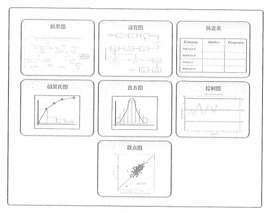
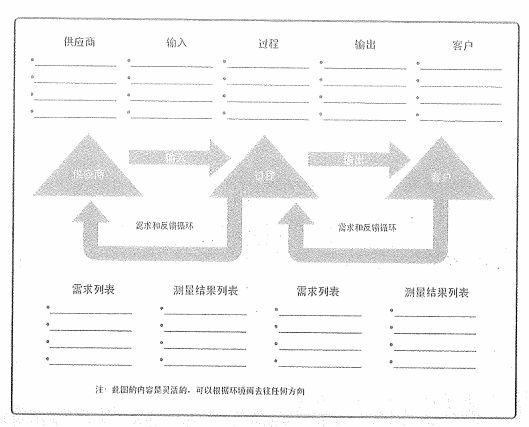
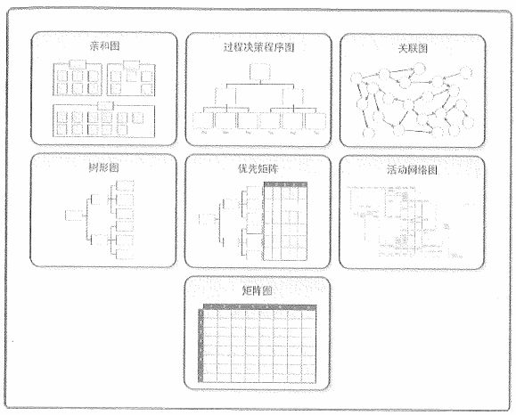

# 质量保证与质量控制

项目质量管理的两个核心过程就是实施质量保证和控制质量。关于它们两个的区别我们在上一课已经讲了，实施质量保证其实保证的是过程，就是我们的开发过程是不是遵循了质量计划，也就是说，这是保证过程有质量的一个过程。而控制质量则是针对结果，也就是我们项目的产出，各种可能的产品、服务之类的，努力提高产出结果的质量水平。

接下来，我们就一个一个地来看一下这两个过程是如何保证我们的过程和产品质量的。

## 实施质量保证

质量保证通过用规划过程预防缺陷，或者在执行阶段对正在进行的工作检查出缺陷，来保证质量的确定性。它主要是在事前、事中对内部和外部的各种活动过程实施质量保证，提供产品、系统和服务的质量保证服务，其实也就是为我们项目产出的结果提供保驾护航。另外，它并不是一种单纯的保证质量，更多的在于对这些活动过程的质量实施情况的评价。

质量保证着眼于项目使用的过程，旨在高效地执行项目过程，包括遵守和满足标准，向相关方保证最终产品可以满足他们的需求、期望和要求。同时，实施质量保证还与产品设计和过程改进有关，它是建立干系人信心的一个重要手段。

实施质量保证的活动包括：

- 制定质量标准

- 制定质量控制流程

- 提出质量保证所采用的方法和技术

- 建立质量保证体系

实施质量保证的内容包括：

- 要制定出切实可行的质量管理计划

- 应安排独立于项目组的 QA 人员负责 QA 工作

- 对软件开发的过程实施质量保证和审计

- 加强技术评审工作，注重对需求、设计等文档的技术评审

- 注重测试工作，应安排相对独立的测试人员

- 对发现的缺陷进行统计分析，确定最终的软件产品的质量

### 工具与技术

对于实施质量保证来说，我们主要关心的是两个工具与技术。

- 质量审计：又称质量保证体系审核，是对具体质量管理活动的结构性的评审。它的目标是识别全部正在实施的良好及最佳实践；识别全部违规做法、差距及不足；分享所在组织或行业中类似项目的良好实践；积极、主动地提供协助，以改进过程的执行，从而帮助团队提高生产效率；强调每次审计都应对组织经验教训的积累做出贡献。质量审计可以是事先安排，也可以随机进行，可由内部、外部、第三方组织实施质量审计。质量审计还确认已批准的变更请求，包括更新、纠正措施、缺陷补救和预防措施的实施情况。

- 过程分析：是指按照过程改进计划中概括的步骤来识别所需的改进。它也要检查在过程运行期间遇到的问题、制约因素，以及发现的非增值活动。过程分析包括 **根本原因** 分析——用于识别问题、探究根本原因，并制定预防措施的一种具体技术。

## 控制质量

质量控制是监督并记录质量活动执行结果，以便评估绩效，并推荐必要的变更过程。本过程的主要作用包括：

- 识别过程低效或产品质量低劣的原因，建议并采取相应措施消除这些原因。

- 确认项目的可交付成果及工作满足主要干系人的既定需求，足以进行最终验收。

控制质量的实施步骤主要是：选择控制对象；为控制对象确定标准或目标；制定实施计划，确定保证措施；按计划执行；对项目实施情况进行跟踪监测、检查，并将监测结果与计划或标准相比较；发现并分析偏差；根据偏差采取相应对策。在实施这些步骤的过程中，需要进行的活动包括：

- 保证由内部或外部机构进行监测管理的一致性。

- 发现与质量标准的差异。

- 消除产品与服务过程中性能不能被满足的原因。

- 审查质量标准以决定可以达到的目标、成本、效率问题。

- 确定是否可以修订项目的质量标准或项目的具体目标。

对于控制质量来说，我们最关心的是它的工具与技术，而其中最为核心的就是下面要介绍的七种质量工具。同时，这七种质量工具又分为新老两种。

### 老七种基本质量工具

老七种工具图相对新七种工具图来说更加重要，而且也更加常见。或许你已经在很多项目中见过其中的大部分图了，它们包括：因果图、流程图、核查表、帕累托图、直方图、控制图和散点图。老七种工具图是以数据来说明项目情况的，重视对开发过程的质量控制，所以应用更加普遍。大家可以先看一下下面的图示，然后我们一个一个来说。

- **因果图** ：又名 **鱼骨图** 或 **石川图**，它的创始人叫 石川馨 。它将问题陈述放在鱼骨的头部，作为起点，用来追溯问题来源，回推到可行动的 **根本原因** 。注意关键字，因果图就是做根本原因分析的。

- 流程图：这个图做开发的或者说做产品、运营的同学都不会陌生。也叫过程图，用来显示在一个或多个输入转化成一个或多个输出过程中，所需要的步骤顺序和可能的分支，它通过映射 SIPOC 模型中的水平价值链的过程细节，来显示活动、决策点、分支循环等。SIPOC 模型是下图这个样子的。

- 核查表，又称计数表，是用于收集数据的查对清单。它合理排列各种事项，以便有效地收集关于潜在质量问题的有用数据。在开展检查以识别缺陷时，用核查表收集属性数据就特别方便。用核查表收集的关于缺陷数量或后果的数据，又经常使用帕累托图来显示。

- **帕累托图** ：是一种特殊的垂直条形图，用于识别造成大多数问题的少数重要原因。在横轴上所显示的原因类别，作为有效的概率分布，涵盖 100% 的可能观察结果。它其实是非常出名的 2/8 法则的具体体现。什么是 2/8 法则呢？我们日常使用的软件或者其它一些产品，其实在大部分情况下，你只使用到它 20% 的功能，而另外 80% 的功能你可能根本都不知道。同样的，我们也会将我们使用软件的 80% 的时间消耗在那 20% 的功能上。比如说微信和手机，大部分人可能都不知道微信设置中早已有了青少年模式，也不知道你可以给你的微信好友添加名片、图片等各种备注的。而手机上的功能我相信很多人可能更不清楚了，如果你不做开发你会关心开发者模式吗？大部分情况下，你只需要会打电话，会发短信，会装微信就可以了。而我们在使用手机时，80%以上的注意力其实都消耗在了抖音、微信等几个有限的 App 上。从上述的内容可以看出，2/8 法则真的是无处不在的。

- 直方图：是一种特殊形式的条形图，用于描述集中趋势、分散程度和统计分布开关。与控制图不同，直方图不考虑时间对分布内的变化的影响。

- **控制图** ：可以判断某一过程处于控制之中还是处于失控状态。可用于监测各种类型的输出变量，也可用来监测成本与进度偏差、产量、范围变更频率或其他管理工作的成果。当一个过程的控制点超出了图中的上下控制界限，就认为当前过程的质量出现了问题。除了这个判断点之外，还有一个 **七点规则** ，那就是说在控制图中有连续七个点都低于或者高于平均值，或者都是朝一个方向上升或者下降的，就说明也出现了失控的情况。

- 散点图：可以显示两个变量之间是否有关系。就是我们最常见到的自变量和因变量的关系图，用于解释当自变量发生变化的时候因变量如何产生变化。

重点的图我们都加了标记，你不仅要认识它们，还要记住它们的概念和意义。另外，对于质量问题的识别来说，我们可以使用核查表、帕累托图，而对于质量问题的分析来说，我们可以使用直方图、散点图、控制图。而因果图和流程图是即可以用做分析，也可以用做问题识别的。

### 新七种基本质量工具

新七种工具是用文字、语言来明确问题，着重用来解决规划阶段的有关问题。相对来说它们的应用要少一些，大家可能在实际的项目工作中见到的也不多。同样的，它们也不是我们考试的重点，这些工具包括：亲和图、过程决策程序图（PDPC）、关联图、树形图、优先矩阵、活动网络图、矩阵图。

上述这些图中，你需要稍加关注的是亲和图和关联图的图示，当然，你能全记住更好。除此之外，我们还要大概知道 PDPC 是对于重大事故预测的，有助于制订应急计划。而关联图是阐述现象与问题的。亲和图与关联图有助于管理人员整理问题；树状图、矩阵图和优先矩阵用于展开方针目标；PDPC和活动网络图可以用于安排时间进度。

关于新七种工具的内容就是这些。不是特别重点的内容，大家以了解为主，知道有这么些东西，分得清哪些是新七种工具里的，哪里是老七种工具里的。

### 统计抽样

统计抽样是指从目标总体中抽取一部分相关样本用于检查和测量，以满足质量管理计划中的规定。在这里我们主要是弄清楚以下表格中的一些统计相关的名词是什么意思，它们非常简单，基本就是高中数学中统计相关的知识。

|  概念   | 解释  |
|  ----  | ----  |
| 概率  | 某件事发生的可能性大小 |
| 随机抽样  | 总体中的每个个体都有等同的机会（概率）被抽中。如果不借助外在工具，作为有意识的人，是无法做到随机的，哪怕他主观上想要随机 |
| 特殊抽样  | 结果是符合或不符合，一般用于产品检验，有一定规则 |
| 变量抽样  | 结果是在测量符合程度的连续坐标系统表示，有规则 |
| 预防 | 把错误排除在过程之外 |
| 检查  | 把错误排除在到达客户之前 |
| 特殊原因  | 产生异常事件 |
| 随机原因  | 产生正常过程偏差 |

### 检查

检查是指检验工作产品，以确定是否符合书面标准。检查的结果通常包括相关的测量数据，检查可以 在任何层次上进行。检查也称为审查、同行审查、审计或巡检等。

## 信息系统开发中的质量把控

最后我们再来学习一些扩展的内容，也就是在信息系统的开发中对产品质量的一些把控原则以及方案等。

### 技术评审与管理评审

技术评审的主要目标是发现任何形式表现的技术功能、逻辑或实现方面的错误，通过评审验证系统的需求，保证系统按预先定义的标准表示，已获得的系统是以统一的方式开发的，使项目更容易管理。

阶段管理评审依据定义好的每个开发阶段的开始和结束边界，检查该阶段的过程与工作成果是否符合质量标准。

我们要有效地利用评审机制来确保项目的质量。一般来说，软件项目的评审需要关注以下内容：

- 人员构成：参与评审的包括同行专家、上下级人员、专管领导、客户等

- 评审形式：主要是正式评审和非正式评审两种

- 评审过程：制定评审计划、会议准备、缺陷记录与跟踪、缺陷分类、原因分析、过程改进、更新详审数据库、结束评审

### 软件质量衡量指标

对于软件系统来说，我们衡量质量的指标主要包括六个方面：

- 功能性：适合性、准确性、互操作性、依从性和安全性

- 可靠性：成熟性、容错性和易恢复性

- 易使用性：易理解性、易学习性和易操作性

- 效率：时间特性和资源特性（速度快、占用硬件网络资源少）

- 可维护性：易分析性、易更改性、稳定性和易测试性

- 可移植性：适应性、易安装性、一致性和易替换性

怎么记？这六个质量特性有个口诀：“功能靠用小护翼（效、护、移）”。额，不算太污吧，不过确实很好记。

### 软件质量保证活动

软件质量保证活动与普通的质量保证活动其实差别不大，我们通过 人员、活动、工作内容三个方面来看一下。

软件质量保证人员的素质包括要有较强的沟通能力；要熟悉软件工程过程；要能应对繁重的工作；要能客观、公正且有责任心。

软件质量保证的活动主要包括：制定软件质量保证计划；参与开发该软件的软件过程描述；评审各项软件工程活动；审计指定的软件工作产品；记录并处理偏差；报告。

最后就是软件质量保证的工作内容：

- 与软件质量保证计划直接相关的工作，包括项目计划的制定，定义各阶段的检查重点

- 参与项目的阶段性评审和审计，并给出明确的结论

- 对项目日常活动与规程的符合性进行检查，尽早发现问题，把问题控制在最小的范围之内

- 对配置管理工作的检查和审计，保证所有人都是开发过程产品的有效版本

- 跟踪问题的解决情况，可以直接向高层经理汇报

### 提高信息系统项目质量

提高信息系统项目质量的过程其实也适用于所有的产品，不仅限于信息系统相关的产品。

- 强有力的领导（包括制定公司质量管理方针、选择质量标准或制定质量要求、制定质量控制流程、提出质量保证所采取的方法和技术、提供相应的资源）

- 建立组织级项目管理体系

- 建立组织级质量管理体系

- 建立项目级激励制度

- 理解质量成本（一致性成本（预防和评估）、非一致性成本（内部和外部））

- 提高项目文档质量

- 发展和遵从成熟度模型

## 总结

老七种工具是今天的重点内容，其它的谈不上重点不重点的，但也不至于完全不用看，反正多记住一些总没坏处。项目质量管理的内容就全部完成了，整个项目管理体系中最核心的 范围、进度、成本、质量 我们就都学完了。当然，并不是说剩下的内容就不重要了，只是说没有这四个的作用和影响大而已，毕竟很多人只要听说过 PMP 多少都会知道这四个知识领域。千万不要松懈，信管师的学习内容还有很多，同志们还要继续努力加油呀！

参考资料：

《信息系统项目管理师教程》 

《某机构培训资料》

《项目管理知识体系指南 PMBOK》第六版