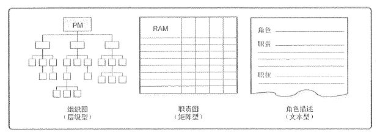

# 项目人力资源管理概念及过程

不管你做什么事，要成就什么事业，要做什么项目，这一切，都是由人来完成的。因此，人力资源对于项目管理来说，是非常重要的一个管理过程。同时，人力资源管理也是整个管理学中的一个重要分支，不管是本科的专业课程还是考研之后的研究方向，人力资源管理都是非常热门的一个专业。

毕竟，你的事业离不开人，即使你只是一个打工仔，你也有同事有上级有下级，这些，也是你的圈子，也是你的人力资源，一样需要管理。人力资源管理的目标其实就是明确需要的人（企业看战略、项目看活动），找到合适的人（态度合适、能力OK、性格匹配）。

总结人力资源管理的一句话，那就是：用好身边的人，留住优秀的人。

## 团队与领导

回到项目管理上来，项目团队（Project Team）由为完成项目而承担不同角色与职责的人员组成，这些人员可能是全职或兼职的，可能随项目进展而增加或减少。

项目管理团队（Project Management Team），注意，和上面的项目团队不是一个概念哈。它是负责项目管理和领导活动的团队，也称为核心团队或领导团队。这个团队可以由整个项目团队分担，也可以由项目经理独自承担。

### 领导和管理

管理者，负责某件事情的管理或实现某个目标。而领导者则是确定方向、统一思想、激励和鼓舞。在项目管理中，项目经理同时具有领导者和管理者的双重身份。这一点是需要大家注意的，领导和管理是两个不同的概念。现代企业管理中，其实更推崇的是领导力，也就是让领导占据管理者更多的时间，成为管理的主要活动。而将管理更多地放到制度和流程中，让制度和流程来约束管理。

### 冲突的竞争

冲突（Conflict）是指两个或两个以上的社会单元在目标上互不相容或互相排斥，从而产生心理上的或行为上的矛盾。

竞争（Competition）的双方则具有同一个目标，不需要发生势不两立的争夺。

从表面上来看，竞争是利于冲突的，我们也是推崇良性竞争的。并不是所有的冲突都是有害的，“一团和气”的集体不一定是一个高效率的集体。项目经理对于有害的冲突要设法加以利用，要鼓励团队成员良性竞争。关于冲突管理方面的内容，我们后面还会说到。

## 人力资源管理过程

<table>
    <tr>
        <th>所属过程组</th>
        <th>管理过程</th>
        <th>解释</th>
    </tr>
    <tr>
    <td>规划过程组</td>
        <td>规划人力资源管理</td>
        <td>识别和记录项目角色、职责、所需技能、报告关系，并编制人员配备管理计划</td>
    </tr>
    <tr>
    <td rowspan="3">执行过程组</td>
        <td>组建项目团队</td>
        <td>确认人力资源的可用情况，并为开始项目活动而组建团队</td>
    </tr>
    <tr>
        <td>建设项目团队</td>
        <td>提高工作能力，促进团队成员互动，改善团队整体氛围，以提高项目绩效</td>
    </tr>
    <tr>
        <td>管理项目团队</td>
        <td>跟踪团队成员工作表现，提供反馈，解决问题并管理团队变更，以优化项目绩效</td>
    </tr>
</table>

## 规划人力资源管理

首先，我们就来学习一下规划人力资源管理这个过程中需要了解的内容。规划人力资源管理是识别和记录项目角色、职责、所需技能、报告关系，并编制人员配备管理计划的过程。这个过程主要的收益是：建立项目角色与职责、项目组织图，以及包含人员招募和遣散时间表的人员配备管理计划。

在这个过程中，我们主要关心的是它的工具技术以及输出的人力资源管理计划。其中主要的工具和技术包括：组织图和职位描述、人际交往以及组织理论，而输出的就是一份人力资源管理计划，我们一个一个来看一下。

### 组织图和职位描述

我们可以采用多种格式来记录团队成员的角色与职责，一般分为三种：

- 层次型：主要体现为一个类似于 WBS 的结构，也就是 组织分解结构（OBS），它不是根据项目的可交付成果进行分解，而是按照组织现有的部门、单元或团队排列，并在每个部门下列出其所负责的项目活动或工作包。上图最右边的就是 OBS 组织图，OBS 通常用来展示组织项目中的权力形势。除了 OBS 之外，还有一个资源分解结构（RBS），这个 RBS 和我们后面学习风险时要学习到的 风险分解结构 的英文简称是一样的，大家要注意区分。资源分解结构是按资源类别和类型，对团队和实物资源的层级列表，用于规划、管理和控制项目工作。

- 矩阵型：体现的工具是 责任分配矩阵（RAM），用来显示分配给每个工作包的项目资源的表格。RAM 的一种常用表格叫做 RACI（Responsible 负责、Accountable 批准、Consult 咨询、Inform 告知）矩阵。在 RACI 矩阵中，需要注意的一点是，一个任务通常只有一个 R ，也就是负责人，而其它角色都可能会有多个。就像下面这个详细的 RACI 矩阵图一样。通常 RACI 的任务是由 WBS 映射过来的。项目经理不放入 RACI 中。如果团队是由内部和外部人员组成，RACI 矩阵对明确划分角色和职责特别有用。

- 文本型：直接使用文字描述团队成员的职责，通常以概述的形式，提供诸如职责、职权、能力和资格等方面的信息。这种文件有多种名称，如职位描述、角色-职责-职权表等等。

### 人际交往与组织理论

人际交往就是在组织、行业或职业环境中与他人的正式或非正式互动。包括主动写信、行业会议、非正式对话、午餐会和座谈会等等。它在项目初始时特别有用，并可在项目期间及项目结束后有效促进项目经理的职业发展。

组织理论阐述个人、团队和组织部分的行为方式。有效利用组织理论中的通用知识可以节约编制人力资源管理计划的时间、成本及人力投入，提高规划工作的效率。

### 人力资源管理计划

人力资源管理计划提供了关于如何定义、配备、管理及最终遣散项目人力资源的指南。主要包括：

- 角色与职责：角色、职权、职责、能力

- 项目组织图

- 人员配备管理计划：人员招募、资源日历、人员遣散计划（释放资源）、培训需要、认可与奖励、合规性、安全

在大多数项目中，项目人力资源计划编制过程主要作为项目最初阶段的一部分。但是，这一过程的结果应当在项目全生命周期中经常地复查，以保证它的持续适用性。还记得这个叫什么吗？滚动式规划。如果最初的项目人力资源计划不再有效，就应当立即修正。

项目人力资源计划编制过程总是与沟通计划编制过程紧密联系，因为项目组织结构会对项目的沟通需求产生重要影响。在编制人力资源计划时，要注意到与项目成本、进度、质量及其他因素相互影响，同时也应注意到其他项目对同类人员的争夺，所以项目要有备选人员。

## 组建项目团队

组建项目团队是确认人力资源的可用情况，并为开展项目活动而组建团队的过程。本过程的主要收益是：指导团队选择和职责分配，组建一个成功的团队。

在这个过程中，同样我们比较关注的是它的工具与技术。

- **预分派**：如果项目团队成员是事先选定的，他们就是被预分派的。预分派可在下列情况下发生：在竞标过程中承诺分派特定人员进行项目工作；项目成功取决于特定人员的专有技能；或者，项目章程中指定了某些人员的工作分派。

- 谈判：通过谈判完成人员分派。包括与职能经理、其他项目管理团队、外部组织、卖方、供应商、承包商等等。

- 招募：如果执行组织不能提供为完成项目所需的人员，就需要从外部获得所需的服务，这可能包括雇佣独立咨询师，或把相关工作分包给其他组织。

- **虚拟团队**：可定义为具有共同的目标、在完成角色任务的过程中很少或没有时间面对面工作的一群人。现代沟通技术（如电子邮件、电话会议、社交媒体、网络会议和视频会议等）使虚拟团队成为可行的方案。虚拟团队可以让在组织内部地处不同地理位置的员工之间组成团队；为项目团队增加特殊技能，即使相应的人员不在同一地理区域；将在家办公的员工纳入团队 。当然，虚拟团队也有一些缺点，例如：可能产生误解，有孤立感，团队成员之间难以分享知识和经验，采用通信技术的成本。

- 多标准决策分析：在组建项目团队过程中，经常需要使用团队成员选择标准。通过多标准决策分析制定选择标准，并据此对候选团队成员进行定级或打分。可用的标准包括：可用性、成本、经验、能力、知识、技能、态度、国际因素等。

组建项目团队过程的输出主要是项目人员分派和资源日历。项目人员分派就是把团队成员分派到全程的项目岗位上。而资源日历就是记录每个项目团队成员在项目上的工作时间段（包含节假日）。

## 总结

通过今天的学习，想必你对项目人力资源管理也有了进一步的认识。今天的重点包括：领导和管理的区别、OBS、RACI，以及组建项目团队中的那几个工具与技术，特别是预分派、招幕和虚拟团队的概念。内容不是特别多，但是都是小考点，还是需要关注的。

参考资料：

《信息系统项目管理师教程》 

《某机构培训资料》

《项目管理知识体系指南 PMBOK》第六版