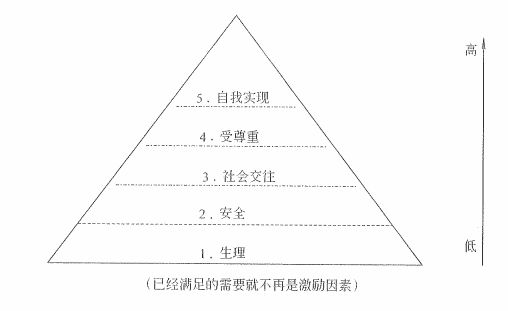
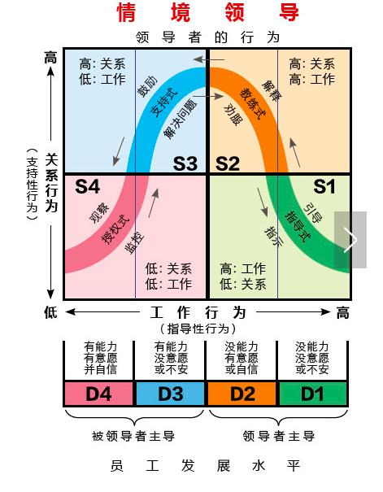

# 建设与管理项目团队

在经过制定人力资源管理计划之后，我们就有了人力资源计划文档，然后通过组建团队也让团队有了正式的成员，接下来要干什么呢？当然就是在项目的开发过程中不断地建设团队和管理团队了。这两个部分的内容也是我们项目人力资源管理这个知识领域中的重点。

## 建设项目团队

建设项目团队是提高工作能力，促进团队成员互动，改善团队整体氛围，以提高项目绩效的过程。这个过程的主要收益是：改进团队协作，增强人际技能，激励团队成员，降低人员离职率以及提升整体的项目绩效。

项目经理在合理化环境和富有文化多样性的项目中，应该利用文化差异，去了解它们，尊重它们，能够入乡随俗地融入到团队中，在整个项目生命周期中致力于发展和维护团队。

建设项目团队的目标是：

- 提高项目团队成员的个人技能，以提高他们完成项目活动的能力，与此同时降低成本、缩短工期、改进质量并提高绩效

- 提高项目团队成员之间的信任感和凝聚力，以提高士气，降低冲突，促进团队合作

- 创建动态的、团结合作的团队文化，以促进个人与团队的生产率、团队精神和团队协作，鼓励团队成员之间交叉培训和切磋以共享经验和知识

从上面的目标可以看出，其实我们要做到的就是让个人绩效和团体绩效都能够有一定程度的提高。最终让我们的团队能够有明确的目标，成员清楚自己的工作对项目的贡献；团队的组织结构能够清晰、岗位明确；有成文或习惯的工作流程和方法，而且流程简明有效；项目经理能够对团队成员有明确的考核和评价标准，工作结果公正公开，赏罚分明；大家共同制定并遵守组织纪律；能够协同工作，善于总结学习。

### 团队发展阶段

在学习建设项目团队的工具与技术之前，我们还要了解一个非常重要的团队发展理论。优秀的团队从来都不是一蹴而就的，一般要依次经历 5 个阶段。这 5 个阶段也叫做 **塔克曼阶梯理论** 。具体内容包括：

- **形成**阶段（Forming），刚刚成立项目团队，成员之间 相互独立 。

- **震荡**阶段（Storming），团队开始执行任务，往往会遇到一些超出预期的困难。个体之间会出现争执，互相指责。这个阶段是 冲突最多 的阶段。

- **规范**阶段（Norming），经过一段时间的磨合后，大家开始协同工作，并调整各自的习惯和行为来支持团队。在这个阶段，成员之间开始有信任，也就是我们常说的开始 打配合 了。

- **发挥**阶段（Performing），默契程度进一步加强，团队能够像一个组织有序的单位那样工作。成员之间相互依靠，可以平衡高效地解决问题。这个阶段的团队 业绩最好，产出最高 。

- 解散阶段（Adjourning），所有工作完成后，团队解散。

塔克曼模型的这五个阶段通常是按顺序进行的，不过，团队也有可能会停滞在某个阶段或退回到较早阶段，比如说不管现在团队处于什么阶段，只要有新同事加入，那么就直接退回到了震荡阶段。而如果团队成员曾经共事过，彼此非常熟悉，那么也有可能直接跳过前两个阶段而进入到规范阶段。

某个阶段持续时间的长短，取决于团队的活力、团队规模和项目管理团队的领导力。项目经理应该对团队活力有较好的理解，以便有效地带领团队经历所有阶段。

### 工具与技术

建设项目团队的工具与技术主要包括人际关系技能、培训、团队建设活动、基本规则、集中办公、认可与奖励、人事测评工具。我们一个一个来简单了解学习一下。

人际关系技能（interpersonal Skills）有时也被称为“软技能”（Soft Skills），是因富有情商，并熟练掌握沟通技巧、冲突解决方法、谈判技巧、影响技能、团队建设技能和团队引导技能，而具备的行为能力。它主要包括：领导力、激励、沟通、影响力、谈判、建立信任、冲突管理、有效决策、教练技术、团队建设等等。

培训，包括旨在提高项目团队成员能力的全部活动，可以是正式或非正式的，方式包括课堂培训、在线培训、计算机辅助培训、在岗培训（由其他项目团队成员提供）、辅导以及训练。注意，在项目管理的理论中，成员如果能力不足的话，首先考虑培训，而不是辞退。所有的题，一定要往大好人的方向选择和考虑哦！

团队建设活动，既可以是状态审查会上的五分钟议程，也可以是为改善人际关系而设计的、在非工作场所专门举办的事业提升活动。非正式的沟通和活动有助于建立信任和良好的工作关系，这是一种持续的过程。

基本规则，用基本规则对项目团队成员的可接受行为做出明确规定，对诸如行为规范、沟通方式、协同工作、会议礼仪等规则进行讨论。规则一旦建立，全体项目团队成员都必须遵守。

集中办公，之前我们说过的虚拟团队是可以分布在各地进行办公的，而集中办公是指把部分或全部项目团队成员安排在同一个物理地点工作，以增强团队工作能力。集中办公既可以是临时的，也可以贯穿整个项目。

认可与奖励，主要就是利益相关的内容。通过对行为的认可与奖励来激励人们，获得成就感和新的技能来迎接新的挑战。相关的激励理论我们专门开辟了一节来讲，一会大家就能看到。

人事测评工具，能让项目经理和项目团队洞察成员的优势和劣势。评估团队成员的偏好和愿望，团队成员如何处理和整理信息，团队成员如何制订决策，以及团队成员喜欢如何与人打交道。有各种工具，如态度调查、细节评估、结构化面谈、能力测试及焦点小组讨论。这些工具有利于增进团队成员间的理解、信任、忠诚和沟通，在整个项目期间不断提高团队成效。

### 输出：团队绩效评价

建设项目团队的主要输出就是对于团队的绩效评价，这些评价包括正式或非正式的。有效的团队建设策略和活动团队绩效，从而提高实现项目目标的可能性。评价团队有效性的指标可包括：

- 个人技能的改进，从而使成员更有效地完成工作任务、

- 团队能力的改进，从而使团队更好地开展工作

- 团队成员离职率的降低

- 团队凝聚力的加强，从而使团队成员公开分享信息和经验，并互相帮助，来提高项目绩效

## 激励理论

这里我们将激励理论单独抽成一个小节，因为激励理论比较重要，而且内容也非常多。在这里，我们将学习到几种经典的激励理论，同时这些理论也是组织行为学中非常经典的理论。是学习管理学的同学都必须要了解的内容。

### 马斯洛需求层次理论

马斯洛的需求层次理论非常出名，估计你在刷微博、刷抖音的时候会经常看到。它有一个非常经典的三角形金字塔图示。

从图中可以看出，这个金字塔从下到上分别是生理、安全、社会交往、受尊重以及自我实现这五个需求层次。这些层次是一步步递进的，他认为当下层的需求被满足后，就不会再形成激励因素，人们会寻找更高层次的需求。而在不同的层次，我们就需要满足不同的需求，才能够达到激励的作用。

- 生理需求：最低的需求，就是满足衣食住行。常见的激励方式就是提供员工宿舍、工作餐，基本的工资、补贴、奖金等。

- 安全需求：包括对人身安全、生活稳定、不失业以及免遭痛苦、威胁或疾病的需求。一般包括五险一金、长期劳动合同、意外保险、失业保险等。

- 社会交往的需求：包括对友谊、爱情以及隶属关系的需求。当生理和安全需求满足后，社交需求就会突显出来。如果这些需求得不到满足，会影响人们的精神，导致缺勤、低生产率。常见的激励措施包括定期员工活动、聚会、比赛、俱乐部等。

- 受尊重的需求：自尊心和荣誉感。荣誉来自别人，自尊来自自已。这个层次下的激励措施包括荣誉性的奖励、形象地位提升、成为导师等等。

- 自我实现的需求：实现自己的潜力，发挥个人能力到最大程度，使自己越来越成为自己所期望的人物。这个层次的激励包括给予更多空间让他负责、参与决策、参与管理等。

非常经典，非常出名的理论，牢牢记住，马斯洛大神。不过，他的这个理论其实也早已受到很多心理学家的质疑，原因就在于这个需求层次是在一定的假设前提下完成的。一是人要生存；二是人的需求按重要性从低到高；三是只有低端需求满足后才会追求更高一级。

很明显，并不是所有人都是这样的，比如一些人在追求自我实现的道路上可能任何需求都不用，就像让我们有现在美好生活的那些革命先烈。也有些人可以跳过某些层次，比如很多白手起家的创业者可能在创业过程中并没有过受尊重的体会，而是在自我实现的目标达成之后才受到了尊重。而像我们这些普通人，最多只是达到社会交往的层次，有家有室有点朋友，即使这样，有可能一次失业也会导致半年找不到工作，一下子又掉回安全和生理都无法满足的状态（真实经历），但这样的情况下我还是在不停的学习，最终目标反而是在自我实现上，从头到尾也没想过能获得什么荣誉，只是想写些东西把我知道的分享出来而已。所以说，这个理论还是有些问题的，现实中的层次并没有那么严格，也不是从下到上的依次满足，而且还有可能掉回去，也有可能同时在多个层次上。

但是，注意了，这个理论太出名了，太经典了，也确实有一定限度的参考意义。就像前面所说的，管理学的必学内容哦！

### 赫茨伯格双因素理论

这个理论又叫激励因素理论，是由 赫茨伯格 提出的。他定义了两种完全不同的因素影响着人们的工作行为：

- 保健因素：这些因素是与工作环境或条件有关的，能防止人们产生不满意感的一类因素，包括工作环境、工资薪水、公司政策、个人生活、管理监督、人际关系等。当保健因素不健全时，人们就会对工作产生不满意感。你可以把保健因素看成是 马斯洛需求层次 底层三个层次的汇总，也就是 保健因素=生理+安全+社会 。

- 激励因素：这些因素是与员工的工作本身或工作内容有关的、能促使人们产生工作满意感的一类因素，是高层次的需要，包括成就、承认、工作本身、责任、发展机会等。当激励因素缺乏时，人们就会缺乏进取心，对工作无所谓，但一旦具备了激励因素，员工则会感觉到强大的激励力量而产生对工作的满意感，所以只有这类因素才能真正激励员工。我们也可以把激励因素看成是 马斯洛需求层次 的顶部的那两个高层次的需求，也就是 激励因素=受尊重+自我实现 。

保健因素可以消除不满，而激励因素可以产生满意。在我们的管理过程中，不能一直只关注保健因素，过分地关注只是进一步让员工的不满减少，但不能促进他工作积极性和工作效率的提高。管理者要想持久而高效地激励员工，必须改进员工的工作内容，进行精神激励，给予表扬认可以及成长、发展、晋升的机会。

### X理论和Y理论

这两个理论其实是一个理论，也可以叫做（X-Y理论），是由 麦格雷戈 提出的。我们要一个一个来看 X 和 Y 分别代表什么。

X 理论，对人性有如下假设：

- 人天性好逸恶劳，只要有可能就会逃避工作

- 人生来就是以自我为中心，漠视组织的要求

- 人缺乏进取心，逃避责任，甘愿听从指挥，安于现状，没有创造性

- 人们通常容易受骗，易受人煽动

- 人们天生反对改革

- 人的工作动机就是为了获得经济报酬

很明显，X 理论的出发点是人性本恶，都是非常负面的一些看法。所以，崇尚 X 理论的领导者认为，在领导工作中必须对员工采取强制、惩罚和解雇等手段强迫员工努力工作，对员工应当严格监督、控制和管理。

Y 理论，对人性的假设和 X 理论完全相反：

- 人天生并不是好逸恶劳，他们热爱工作，从工作得到满足感和成就感

- 外来的控制和处罚对人们实现组织的目标不是一个有效的办法，下属能够自我确定目标，自我指挥和自我控制

- 在适当的条件下，人们愿意主动承担责任

- 大多数人具有一定的想象力和创造力

- 在现代社会中，人们的智慧和潜能只是部分地得到了发挥，如果给予机会，人们喜欢工作，并渴望发挥其才能

崇尚 Y 理论的管理者对员工采取以人为中心、宽容的及放权的领导方式，使下属目标和组织目标很好地结合起来，常用的激励办法包括将员工个人目标与组织目标相融合，扩大员工的工作范围，尽可能安排有意义并且有挑战性的工作，使员工达到自我激励。

### 期望理论

期望理论是由 弗鲁姆 提出的，通过考察人们的努力行为与其所获得的最终奖酬之间的因果关系来说明激励过程，并以选择合适的行为达到最终的奖酬目标的理论。它认为一个目标对人的激励程度受两个因素的影响：

目标效价：指实现该目标对个人有多大价值的主观判断。如果实现该目标对个人来说很有价值，个人的积极性就高；反之，积极性则低。

期望值：指个人对实现该目标可能性大小的主观估计。只有个人认为实现该目标的可能性很大，才会去努力争取实现，从而在较高程度上发挥目标的激励作用。

## 管理项目团队

管理项目团队是跟踪团队成员工作表现，提供反馈，解决问题并管理团队变更，以优化项目绩效的过程。本过程的主要收益是：影响团队行为，管理冲突，解决问题，并评估团队成员的绩效。

实施项目团队管理后，应将项目人员配备管理计划进行更新，可以提出变更请求，更新人力资源管理计划，实现问题的解决，同时为组织绩效评估提供依据，为组织的数据库增加新的经验教训。

在管理项目团队的过程中，我们同样是关注它的工具与技术，主要包括：观察和交谈、项目绩效评估、冲突管理、影响力、管理技巧以及人际关系技能。其中人际关系技能我们之前已经讲过了，只需要重点再看一下其它几个工具与技术即可。

### 观察与交谈

通过观察与交谈，随时了解项目团队成员的工作和态度。可以用于监督项目进展，了解成员成就和团队内部的人际关系。并针对项目问题进行 资源负荷 分析以及 资源平衡 的优化。

### 项目绩效评估

在项目过程中进行绩效评估的目的是：澄清角色与职责、向团队成员提供建设性反馈、发现未知或未决问题、制订个人培训计划，以及确立未来目标。能够带来的好处包括：

- 技能的改进，从而使成员更高效地完成分派的任务

- 能力和情感方面的改进，从而提高团队能力，帮助团队更好地共同工作

- 团队成员流动率降低

- 增加团队的凝聚力

### 冲突管理

在项目环境中，冲突不可避免。不一致的需求、对稀缺资源的竞争、沟通不畅、进度优先级排序以及个人工作风格差异等多种因素都可能成为冲突的起源。说白了，计划与现实、人与人的期望、人与人利益的矛盾，任何一点的不可调和都会产生冲突。在项目管理中，最主要的冲突是进度、优先级、资源、技术、管理过程、成本、个人几个方面，项目中的冲突根源在于 项目的高压环境、责任模糊、存在多个上级、新科技的使用 等等。

如果管理得当，意见分歧有利于提高创造力和改进决策。假如意见分歧成为负面因素，应该首先由项目团队成员负责解决。如果冲突升级，项目经理应该提供协助，促成满意的解决方案，采用直接和合作的方式，尽早并通常在私下地解决冲突。

有 5 种冲突解决方法是需要我们重点关注的：

- **撤退/回避**：从实际或潜在冲突中退出，将问题推迟到准备充分的时候，或者将问题推给其他人解决。这是一种 让步 的做法，可以 临时 让冲突双方 降温 。

- **缓和/包容**：强调一致、淡化分歧，为维持和谐与关系而单方面退让一步。最简单的四个字就可以概括它，那就是 求同存异 。

- **妥协/调解**：寻找能让各方都在一定程度上满意的方案。这是一种 折中 的方案，可能各方都会有损失，所以需要大家 各让一步 。

- **强迫/命令**：以牺牲其他方为代价，推行某一方的观点，这种方案只提供一方赢的结果，是一种 强权 方案。

- **合作/解决问题**：综合考虑不同的观点和意见，采用合作的态度和开放式对话引导各方达成共识和承诺。很明显，它是最好的一种解决冲突的方式，可以让 多数 人共赢，需要 面对面 的一起 找原因 。

### 影响力

在项目环境中，项目经理对团队成员通常没有或仅有很小的命令职权，所以他们适时影响相关方的能力，对保证项目成功非常关键。影响力是影响行为、改变事情的过程和方向，克服阻力的方式，其中权力是影响力的一部分。权力会让人们进行原本并不愿意进行的事情，一般包括五种权力：

- 职位权力：来源于管理者在组织中的职位和职权，是一种合法权力。

- 惩罚权力：使用降职、扣薪、惩罚、批评、威胁等负面手段的能力，要谨慎使用。

- 奖励权力：给予下属奖励的能力。包括加薪、升职、福利、休假、礼物、口头表扬、认可、特殊的任务以及其他奖励员工满意行为的手段。

- 专家权力：来源于个人专业的技能。

- 参照权力：由成为别人学习参照榜样所拥有的力量。是由于他人对你的认可和敬佩从而愿意模仿和服从你的权力，是一种个人魅力。

对于这五种权力来说，职位、惩罚、奖励可以看作是组织赋予的职能权力，而专家和参照权力则是由个人本身散发出来的影响力。

### 管理与领导技巧

最后我们再了解一点管理与领导的技巧。首先是我们上面说过的惩罚权力，大家都知道这个权力是不能随便滥用的，是需要遵循一些规则的，比如说：

- 即时进行

- 罚要罚到胆战心惊，赏要赏到心花怒放

- 惩罚是以制度去惩罚

- 总结教训，获得经验成长才是最终目的

另外，比较经典的管理风格有四种，分别是民主式（大家一起决策）、自由（随便整）、独裁（一人拍板）和官僚式（上下严明）这几种。而领导的方式，比较经典的是情境式的领导方式，分为 支持式、教练式、授权式和指导式 这四种。注意，一个是管理风格，一个是领导风格。具体的领导风格我们在之前敏捷系列的课程中有过深入的讲解。在这边，大家了解下下面这张图就好了。

## 总结

今天的内容不少吧，重点也比较多，最重要的有三个方面，分别是激励理论、冲突解决方式和团队发展阶段。其它的内容其实也很重要，各种工具与技术都是选择题所偏爱的。而重点的这三个呢？选择、简答都很爱出，背下来吧。

项目人力资源管理的内容就到此为止了，怎么样，不比 范围、进度、成本、质量 的东西少吧。继续继续，学习的内容还有很多，不要止步于此哦！

参考资料：

《信息系统项目管理师教程》 

《某机构培训资料》

《项目管理知识体系指南 PMBOK》第六版