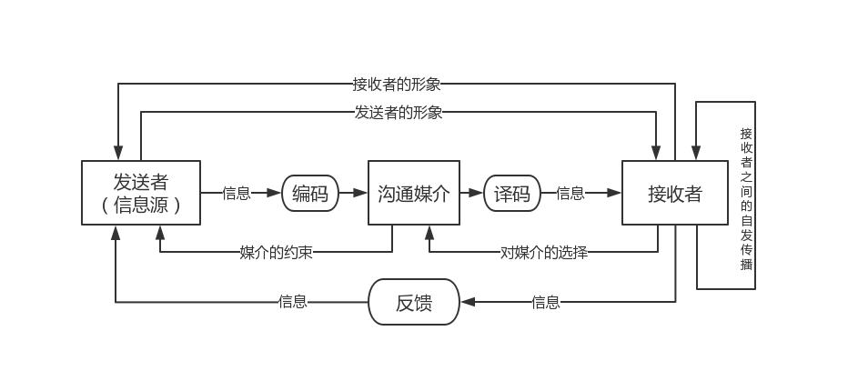
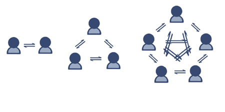
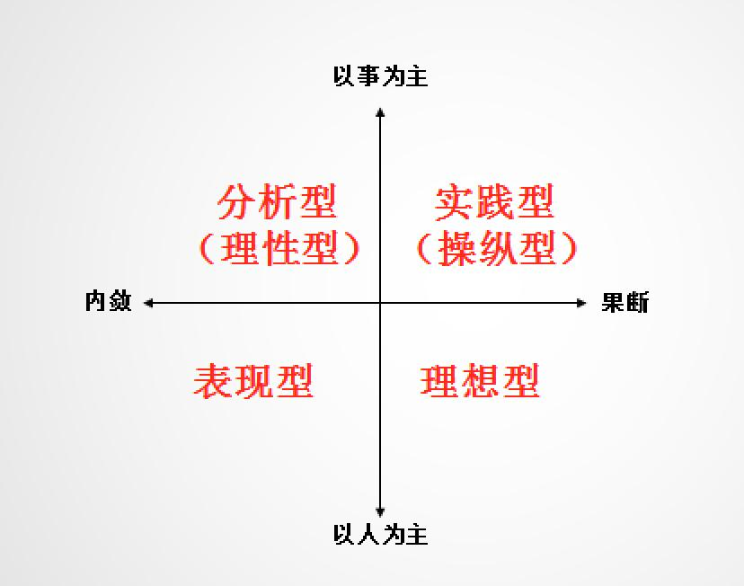

# 项目沟通及过程

沟通这个东西，可以说是整个项目成功失败最关键的因素。9成以上失败的项目在最后总结的时候，沟通不畅或者信息对接问题都会占据前三甲。其实只要是做项目，那么必须有团队，有团队有人，那么沟通就是不可避免的。反过来想想，沟通决定项目成败也就是显而易见了。

## 沟通与沟通模型

沟通，就是人们分享信息、思想和情感的过程。与 IT 项目成功有关的最重要的四个因素是：主管层的支持、用户参与、有经验的项目经理和清晰的业务目标。其中，参与的每个成员都应该具备 技术技能 以及 沟通与社交的技能 。如果你不太清楚沟通与社交的技能，别急，后面我们会介绍的。

### 沟通模型

在我们 信管师 这一系列课程的第一课中，我们就学习过 信息 这个概念。其实，它和我们的沟通模型非常像。不记得的小伙伴可以回去再看一下哦。

- 编码：把思想或想法转化为他人理解的语言。

- 信息和反馈信息：编码过程所得到的结果。

- 媒介：用来传递信息的方法。

- 噪声：干扰信息传输和理解的一切因素。

- 解码：把信息还原成有意义的思想或想法。

基本的沟通模型包含5个基本状态：已发送、已收到、已理解、已认可、已转化为积极的行动。没有反馈的沟通是无效的沟通，这一点很重要。知道为什么钉钉要有未读已读的提示了吧，虽说你很烦，但你的领导非常需要这种功能。这也是钉钉能够在企业市场上成为最强的 IM 工具的原因。

### 沟通方法与渠道

沟通的方式可以面对面、信件、电话、视频等等，方法包括参与技术讨论、征询、推销、叙述等，这都是小学的知识了，没什么可以多说的。我们主要来看看沟通的渠道。

沟通的渠道，或者说种类有很多，对于个人来说，包括个人和非个人两种沟通，个人沟通就是两个人互相交流，而非个人沟通就是通过媒体（网站、电视等）、大会活动等与你进行沟通。这个不是我们学习的重点，我们的重点是在于组织中的沟通。组织中的沟通可以按多种维度来进行分类，包括（但不限于）：

- **内部沟通**：也叫对内沟通，针对项目内部或组织内部的相关方。讲求效率与准确度，可能以非正式的形式出现。

- **外部沟通**：也叫对外沟通，针对外部相关方，如客户、供应商、其他项目、组织、政府、公众等等。强调的是信息的充分和准确，通常是正式的对外沟通。

- **正式沟通**：报告、正式会议（定期或临时）、会议议程和记录、相关方简报和演示。多以会议的形式体现。

- **非正式沟通**：采用电邮、社交媒体、网站，以及非正式临时讨论的一般活动。非正式沟通的场合比较多，即使中午一起吃盒饭也是一种非正式的沟通。

- **层级-向上/下沟通**：向上就是针对高层、向下就是针对工作团队和其他成员。向上向下沟通也可以叫做垂直沟通，沟通的信息传播速度快，准确度高。

- **层级-横向沟通**：也叫水平沟通，针对项目经理或团队的同级人员。特点是复杂程度高，往往不受当事人的控制。

- **官方沟通**：年报，呈交客户、用户、监管机构或政府部门的报告等。通常是正式的沟通形式。

- **非官方沟通**：采用灵活的手段，来建立和维护项目团队及其相关方对项目情况的了解和认可，并在他们之间建立强有力的关系。很明显，这个肯定是走的非正式的沟通方式。

- **书面与口头沟通**：口头（用词和音调变化）及非口头（肢体语言和行为），社交媒体、网站等进行的发布。书面的特点是清晰、二义性少，以及可以作为备忘录，也可以作为双方沟通的证据，缺点是缺乏人性化。口头沟通则较为人性化。之前我们就说过，在沟通过程中，接收到的信息语言占 7% ，声音声调占 38% ，肢体占到 55% ，因此，面对面的口头沟通其实是效率最高的一种沟通形式。但书面沟通的优点也不能抹去，合适的场景使用合适的沟通方式才是我们正确的选择。

沟通渠道大概就是这些类型。你要清楚地知道我们的沟通一定是内外有别的、非正式沟通有利于关系融洽、采用对方能接触的沟通风格才能有效沟通。另外还有书面沟通和面对面沟通的区别特点，其中，书面沟通还有一个 5C 原则大家可以了解一下：

- 正确的语法和拼写

- 简洁的表述和无多余的字

- 清晰的目的和表述（适合读者的需要）

- 连贯的思维逻辑

- 受控的语句和想法承接

这个 5C 原则需要我们后面要讲的沟通原则来配合才能发挥效果。

另外我们再来了解一下沟通渠道的计算。这个沟通渠道的意思就是人与人之间要沟通的连接数量，比如说两个人互相沟通只需要一条渠道就可以，而三个人则需要 3 条沟通渠道。大概是下面这个样子。

它的计算公式是 n*(n-1)/2 ，其中 n 代表的就是人数。如果出现这样的题，千万别懵了哈，沟通渠道、沟通数量代表的都是这个计算。

### 沟通障碍

在沟通过程中最怕的是什么？那就是双方理解的不一致，而这些问题都是由于沟通过程中出现的障碍导致的。有可能是认知障碍，双方对工作内容的认知不同，也有可能是语义障碍，理解错了对方的意思。我们从最通用的角度来看，沟通中的障碍一般包括：

- 缺乏清晰的沟通渠道

- 发送者与接收者存在物理距离

- 沟通双方彼此技术语言不通

- 分散注意力的环境因素（噪声）

- 有害的态度（敌对、不信任）

- 权利游戏、滞留信息、隐藏议程与敌对情绪等

### 沟通原则

在沟通过程中，我们可以秉承一些沟通原则，只要遵循这些原则，就可以为我们带来高效的沟通，它们包括：

- 沟通内外有别

- 非正式沟通有利于关系融洽

- 采用对方能接受的沟通

- 沟通升级原则：四个步骤，和对方沟通；和对方上级沟通；和自己上级沟通；自己的上级和对方上级沟通。

### 人际沟通风格（类型）

人际沟通的风格，或者说类型的话主要是分别四种：

- 实践型：比较强势，很有主见，注重结果，有强烈灌输的欲望，不喜欢讲情感，喜欢命令别人

- 理想型：比较温和，注重双方交流，讲话礼貌，注重团队，注重气氛

- 表现型：热情，爱说话，肢体语言夸张，语速快，容易配合

- 理性型：注重过程，重视数据，注重细节，防御性强，与陌生人熟悉的过程比较长，注重条理、具体的内容

从对人对事和主动（果断）被动（内敛）的角度，可以将这四个类型形成一个这样的坐标图

### 发展趋势和新兴实践

最后在沟通相关的概念和理论中，我们再来看一下沟通管理的发展趋势和新兴实践，这些内容是 PMP 第六版中新加的，都是敏捷中比较提倡的实践。包括但不限于：

- 将相关方纳入项目评审范围

- 让相关方参加项目会议

- 社交工具的使用日益增多

- 多面性的沟通方法

## 项目沟通管理过程

<table>
    <tr>
        <th>所属过程组</th>
        <th>管理过程</th>
        <th>解释</th>
    </tr>
    <tr>
    <td>规划过程组</td>
        <td>规划沟通管理</td>
        <td>根据干系人的信息需要和要求及组织的可用资产情况，制订合适的项目沟通方式和计划的过程</td>
    </tr>
    <tr>
    <td>执行过程组</td>
        <td>管理沟通</td>
        <td>根据沟通管理计划，生成、收集、颁发、储存、检索及最终处置项目信息的过程</td>
    </tr>
    <tr>
    <td>监控过程组</td>
        <td>控制沟通</td>
        <td>在整个项目生命周期中对沟通进行监督和控制的过程，以确保满足项目干系人对信息的需求</td>
    </tr>
</table>

## 总结

今天我们学习的内容其实是以沟通的概念为主的，其中涉及的沟通渠道是今天的重点内容。其它的沟通原则、障碍什么的也是需要了解的内容，这些虽说机率不高，但也有可能会出一些选择简答之类的题目。最后，我们了解了一下项目沟通管理的过程，非常简单的三个过程，我们下次再详细讲解。

参考资料：

《信息系统项目管理师教程》 

《某机构培训资料》

《项目管理知识体系指南 PMBOK》第六版

