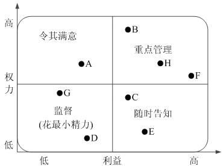
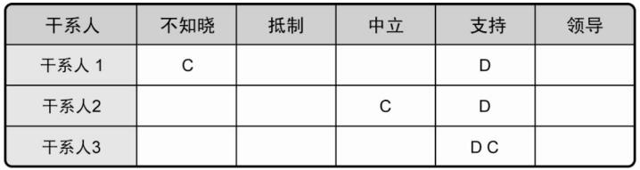

# 项目干系人管理

干系人，这三个字我们已经很早就见过了，相信你对它一定不会陌生。在我们的教材中，它是和项目沟通管理放在一起的，在同一个章节中讲完了，我们也遵循教材的顺序，将它和沟通放在一起。其实，在 PMP5 之前，也就是 PMP 前四版中，是没有项目干系人管理这个知识领域的。它本身就是从项目沟通管理中分出来的一个知识领域。而在 PMP 第六版时，又给它改了个名字叫做项目相关方管理，其实意思都是一样的。

正因为它是从沟通管理中分出来的，所以我们的教材也将它和沟通放在了一起。同时，本身这个知识领域里面的内容就比较简单，知识点也比较少，所以学习起来还是非常轻松的。

## 项目干系人管理

项目干系人管理是指对项目干系人需求、希望和期望的识别，并通过沟通上的管理来满足其需要、解决其问题的过程。项目干系人管理将会赢得更多人的支持，从而能够确保项目取得成功。项目干系人管理可以带来以下好处：

- 将会赢得更多的资源。

- 快速频繁的沟通将能够确保对项目干系人需要、希望和期望的完全理解

- 能够预测项目干系人对项目的影响，尽早进行沟通和制订相应的行动计划，以免受到项目干系人的干扰

## 项目干系人管理过程

<table>
    <tr>
        <th>所属过程组</th>
        <th>管理过程</th>
        <th>解释</th>
    </tr>
    <tr>
    <td>启动过程组</td>
        <td>识别干系人</td>
        <td>识别所有受项目影响的人员或组织，并记录其利益，参与情况和对项目成功的影响的过程</td>
    </tr>
    <tr>
    <td>规划过程组</td>
        <td>规划干系人管理</td>
        <td>基于干系人潜在影响的分析，制定管理策略，调动干系人参与</td>
    </tr>
    <tr>
    <td>执行过程组</td>
        <td>管理干系人</td>
        <td>提升干系人支持，把干系人的抵制降到最低，提高项目成功的机会</td>
    </tr>
    <tr>
    <td>监控过程组</td>
        <td>控制干系人参与</td>
        <td>维持并提升干系人参与活动的效率和效果</td>
    </tr>
</table>

## 识别干系人

识别能影响项目决策、活动或结果的个人、群体或组织，以及被项目决策、活动或者结果影响的个人、群体或者组织，并分析和记录他们的相关信息的过程。这些信息包括他们的利益、参与度、互相依赖、影响力及对项目成功的潜在影响。

干系人都包括哪些人呢？正常来说，只要是和项目有任何利益关系的人都是项目干系人。最经典的问题是，你做装修施工或者盖楼，影响了周边邻居，他们是不是干系人？当然是，而且是利益受损的干系人，同样是需要你来管理的。不过对于信息系统来说，干系人的范围可能不会那么大，主要包括：客户、用户、高层领导、项目团队成员、社会人员及其他。比较重要的就是前四项。另外需要注意的是，客户与用户的区别。客户是买产品的人，但他不一定用产品，而用户是真正使用产品的人。有时候，客户和用户可能是同一个人，但有时候，并不一定是同一个人。比如说，CRM系统是由甲方的采购部门采购的，由甲方的技术部门评估审核的，但是，真正使用系统的是一线的销售业务人员。客户是采购部门及审核部门的，而用户则是销售业务部门，这就是客户和用户的区别。

在这个过程中，我们会输出一个干系人登记手册。其实就是标明这个干系人的基础信息，并将他们进行基础简单的分类，以便制定管理策略。一般包括基本信息（姓名、职位、联系方式等）、评估信息（需求、期望、潜在影响力等）以及干系人的分类（关键/非关键、内部/外部、支持者/中立者/反对者等）。

很明显，关键干系人是我们要重点管理的对象，因为它们对项目的成功失败有着非常重要的影响，也因此他们被称为关键干系人。评估关键干系人对不同情况能做出的反应及应对，以便策划如何对他们施加影响，提高他们的支持和减轻他们的潜在负面影响。

为了完成这样一个干系人登记手册，就需要运用一个非常重要的技术工具，那就是干系人分析。这个工具主要是用于识别干系人的利益、期望和影响，一般会使用四种模型：

- 权利/利益方格。根据干系人的职权大小和对项目结果的关注（利益）程度进行分类。

- 权利/影响方格。干系人的职权大小以及主动参与（影响）项目的程度进行分类。

- 影响/作用方格。干系人主动参与（影响）项目的程度及改变项目计划或者执行的能力进行分类。

- 凸显模型。根据干系人的权力（施加自己意愿的能力）、紧迫程度和合法性对干系人进行分类。

在这四个模型中，最重要的是权利/利益方格，它是以利益为横轴，权利为纵轴所绘制出来的一个坐标图，如下所示。

在这个方格中，我们需要关注的是对于不同的人应该采取怎样的管理方式。

- 权利大、利益大的：重点管理，这个不用多说了，有权有利益的，投资人、老板呗

- 权利大、利益小的：令其满意，一般是高层管理人员或者乙方领导层，有权利，但是可能并不直接参与你的项目，对他们来说没有多少利益，因此，为了项目的顺利进行，只需要让他们对项目满意即可

- 权利小、利益大的：利益相关方，小投资方、受项目影响的人（施工周边邻居）、乙方团队成员等，对他们要随时告知项目的情况

- 权利小、利益小的：花最小的精力进行简单的监督就可以了，行政、人事、临时雇佣的打杂人员等

## 规划干系人管理

基于干系人的需求、利益及对项目成功的潜在影响的分析，制定合适的管理策略，以有效调动干系人参与整个项目生命周期的过程。它是一个反复的过程，干系人的状态也是在不断的变化的，所以这个过程应该由项目经理定期开展。

其实把握住上面概念的核心，就是规划干系人管理的这个过程就是根据干系人登记手册中的信息，根据他们的影响情况来制定相应的策略。在这个过程中，我们同样关心的是这个过程中的一个重要工具与技术，那就是分析技术。在这个技术中，有一个非常重要的内容就是干系人参与度评估矩阵。它将干系人当前参与项目的水平与我们期望他应该参与的水平进行比较，从而用于对干系人进行分类。

干系人的参与水平可以分为：

- 不知晓。不知道项目及其潜在的影响。

- 抵制。知道项目及其潜在影响，但抵制项目工作或成果可能引发的任何变更。此类干系人不会支持项目工作或项目成果。

- 中立。了解项目，但既不支持，也不反对。

- 支持。了解项目及其潜在影响，并且会支持项目工作及其成果。

- 领导。了解项目及其潜在影响，而且积极地参与以确保项目取得成功。

同样拿盖楼装修来说，团队成员肯定是支持者，另外如果你是公益项目政府机关可能也会是支持者，这个和利益相关性很大。而投资人、项目经理、发起人、主管等都是领导，不需要多解释。周边居民怕噪音或者污染的自然也就是抵制者了。而隔了两三条街的邻居，可能会了解到这个项目，但对他们的生活暂时还没有影响，所以他们是中立的。最后，我只是上班路过，虽然项目施工可能带来堵车等问题，但我完全不知道是为什么，这就是不知晓。没错，我也是干系人。

在上面这个图中，我们将干系人一一列出来，然后再将这五个参与水平横向列出。用 C 表示每个干系人当前的参与水平，用 D 表示我们期望他能够达到的参与水平。很明显，第一个和第二个干系人都还没有达到我们想让他们支持的水平。当然，我们项目团队肯定是希望所有人都支持我们的项目开发的。相对来说，软件信息系统项目在这一块还是略好一些，至少抵制不会那么强烈，不像施工噪音之类的工程项目。

## 管理干系人

在整个项目生命周期中，与干系人进行沟通和协作，以满足他的需求与期望，解决实际出现的问题，并促进干系人合理参与项目活动的过程。此过程的作用是帮助项目经理提升来自干系人的支持，并把干系人的抵制降到最低，从而显著提高项目成功的机会。

管理干系人的参与包括以下活动：

- 调动干系人适时参与项目，以获得或确认他们对项目成功的持续承诺

- 通过协商和沟通管理干系人的期望，确保项目目标实现

- 处理尚未成为问题的干系人关注点，预测干系人未来可能提出的问题。需要尽早识别和讨论这些关注点，以便评估相关的项目风险

- 澄清和解决已经识别出的问题

在管理干系人参与的过程中，需要特别注意两个原则，一个是对客户有利的原则，另一个平衡各方利益的原则。

## 控制干系人参与

全面监督项目干系人之间的关系，调整策略和计划，以调动干系人参与的过程。本过程的作用是，随着项目和环境变化，维持并提升干系人参与活动的效率和效果。

## 总结

项目干系人管理的内容就是这么多，很轻松吧。重点就在于权利/利益方格与干系人参与的那五个等级。当然，每个过程的概念内容你也要了解。同样的，简答、论文都是以这些过程为主的。

参考资料：

《信息系统项目管理师教程》 

《某机构培训资料》

《项目管理知识体系指南 PMBOK》第六版